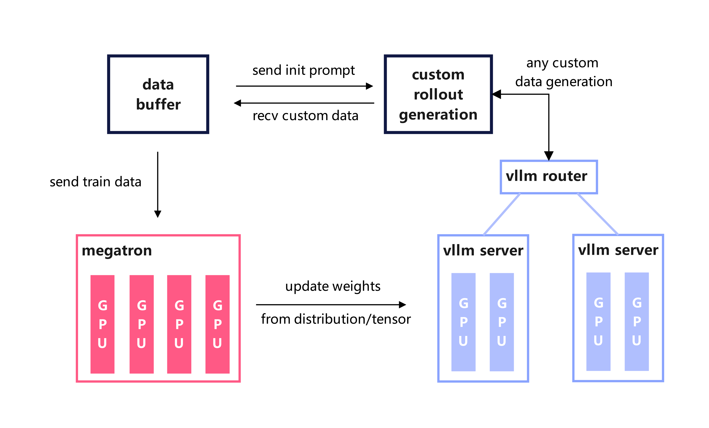
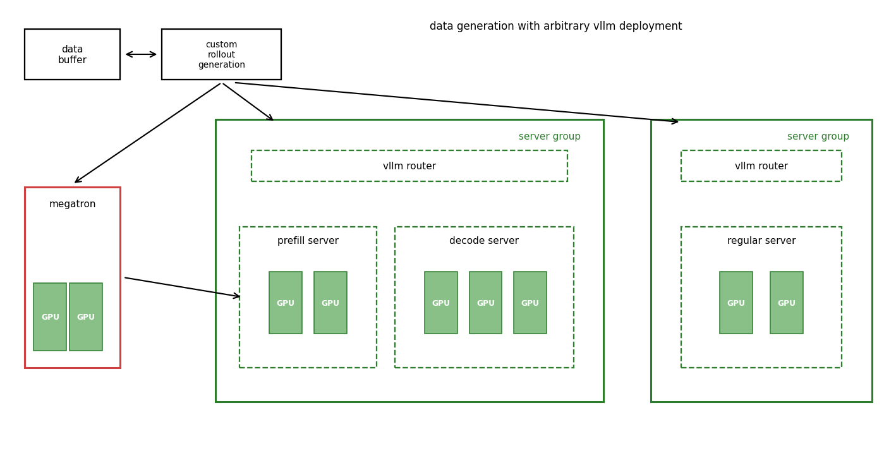

# vLLM Config: Advanced Engine Deployment

`--vllm-config` is a YAML-based configuration system for fine-grained control over vLLM engine deployment in vime. It enables **multi-model serving**, **Prefill-Decode (PD) disaggregation**, **heterogeneous server groups**, and can even serve as a **standalone vLLM launcher** for complex inference topologies.

---

## Architecture Overview

In the default setup (without `--vllm-config`), vime deploys a single model behind a single router with uniform server groups:



With `--vllm-config`, the vLLM deployment expands into a multi-model, multi-router topology:



**Key design principles:**

- **Each model gets its own router.** Models are isolated at the routing layer, allowing independent load balancing and fault tolerance.
- **Server groups within a model can be heterogeneous.** Different groups can have different TP sizes, worker types (prefill/decode/regular), and vLLM engine argument overrides.
- **Weight sync is per-model.** Only models with `update_weights: true` receive weight updates from training. Frozen models (reference, reward, etc.) are served as-is.

---

## Config Format

The config file is a YAML document with a top-level `vllm` key containing a list of model definitions:

```yaml
vllm:
  - name: <model_name>              # Required. Unique identifier for this model.
    model_path: <path>              # Optional. HF checkpoint path. Defaults to --hf-checkpoint.
    update_weights: <bool>          # Optional. Whether to sync weights from training. Auto-inferred.
    num_gpus_per_engine: <int>      # Optional. Default TP size for all groups in this model.
    server_groups:                  # Required. List of server group configurations.
      - worker_type: <type>         # Required. One of: regular, prefill, decode, placeholder.
        num_gpus: <int>             # Required. Total GPUs allocated to this group.
        num_gpus_per_engine: <int>  # Optional. TP size override for this group.
        overrides: <dict>           # Optional. vLLM EngineArgs field overrides.
```

### Field Reference

#### Model-Level Fields

| Field | Type | Default | Description |
|-------|------|---------|-------------|
| `name` | `str` | **Required** | Unique name for this model (e.g., `"actor"`, `"ref"`, `"reward"`). Used as the key in `args.vllm_model_routers`. |
| `model_path` | `str` | `args.hf_checkpoint` | HuggingFace checkpoint path. All server groups within a model must use the same model path. |
| `update_weights` | `bool` | Auto | Whether this model receives weight updates from training. When not set, automatically inferred: `true` if `model_path` matches `--hf-checkpoint`, `false` otherwise. |
| `num_gpus_per_engine` | `int` | `args.rollout_num_gpus_per_engine` | Default TP size for server groups in this model. Individual groups can override. |
| `server_groups` | `list` | **Required** | List of `ServerGroupConfig` entries defining the engine topology. (`engine_groups` is accepted as a backward-compatible alias.) |

#### Server Group Fields

| Field | Type | Default | Description |
|-------|------|---------|-------------|
| `worker_type` | `str` | **Required** | Engine type: `regular` (standard), `prefill` (PD prefill worker), `decode` (PD decode worker), or `placeholder` (reserve GPU slots without launching engines). |
| `num_gpus` | `int` | **Required** | Total number of GPUs for this group. Must be > 0. |
| `num_gpus_per_engine` | `int` | Model's `num_gpus_per_engine` | TP size override. Number of GPUs per engine instance. |
| `overrides` | `dict` | `{}` | vLLM `EngineArgs` field overrides. Applied on top of `--vllm-*` CLI args with highest priority. |

### Worker Types

| Type | Description | Use Case |
|------|-------------|----------|
| `regular` | Standard vLLM engine | Default mode, handles both prefill and decode |
| `prefill` | PD disaggregation prefill worker | Dedicated to prompt processing; paired with `decode` workers |
| `decode` | PD disaggregation decode worker | Dedicated to token generation; paired with `prefill` workers |
| `placeholder` | Reserves GPU slots, no engine created | Reserve GPUs for training co-location or future use |

---

## Usage Patterns

### 1. Basic Single-Model Deployment

The simplest config replicates the default behavior:

```yaml
# vllm_basic.yaml
vllm:
  - name: default
    server_groups:
      - worker_type: regular
        num_gpus: 8
```

```bash
python train.py \
  --vllm-config vllm_basic.yaml \
  --rollout-num-gpus 8 \
  --rollout-num-gpus-per-engine 2 \
  ...
```

This creates 4 engines (8 GPUs ÷ 2 GPUs/engine) behind a single router.

### 2. PD Disaggregation

Separate prefill and decode phases onto dedicated server groups for better throughput in multi-turn and agentic workloads:

```yaml
# vllm_pd.yaml
vllm:
  - name: actor
    server_groups:
      - worker_type: prefill
        num_gpus: 4
        num_gpus_per_engine: 2    # 2 prefill engines, TP=2
      - worker_type: decode
        num_gpus: 12
        num_gpus_per_engine: 4    # 3 decode engines, TP=4
```

```bash
python train.py \
  --vllm-config vllm_pd.yaml \
  --rollout-num-gpus 16 \
  ...
```

**Why PD disaggregation?** In multi-turn scenarios, prefill and decode have different compute characteristics. Prefill is compute-bound (processes the entire prompt), while decode is memory-bandwidth-bound (generates tokens one-by-one). Disaggregating them allows:
- Using smaller TP for prefill (higher throughput per GPU)
- Using larger TP for decode (lower latency)
- Independent scaling of prefill vs. decode capacity

> **Note:** PD disaggregation uses vllm-router with `pd_disaggregation=True`.

### 3. Multi-Model Serving

Deploy multiple models simultaneously, each behind its own router:

```yaml
# vllm_multi_model.yaml
vllm:
  - name: actor
    update_weights: true              # receives weight updates from training
    server_groups:
      - worker_type: regular
        num_gpus: 8
        num_gpus_per_engine: 4

  - name: ref
    model_path: /path/to/ref_model    # different model checkpoint
    update_weights: false              # frozen, no weight updates
    server_groups:
      - worker_type: regular
        num_gpus: 4
        num_gpus_per_engine: 2

  - name: reward
    model_path: /path/to/reward_model
    update_weights: false
    server_groups:
      - worker_type: regular
        num_gpus: 4
        num_gpus_per_engine: 2
```

```bash
python train.py \
  --vllm-config vllm_multi_model.yaml \
  --rollout-num-gpus 16 \
  --hf-checkpoint /path/to/actor_model \
  --rollout-function-path my_rollout.generate_rollout \
  ...
```

**Accessing models in custom rollout functions:**

```python
from vime.rollout.vllm_rollout import get_model_url
from vime.utils.http_utils import post

async def my_generate(args, sample, sampling_params):
    # Route to the actor model (default)
    actor_url = get_model_url(args, "actor", "/generate")
    output = await post(actor_url, {"text": sample.prompt, "sampling_params": sampling_params})
    
    # Route to the reference model
    ref_url = get_model_url(args, "ref", "/generate")
    ref_output = await post(ref_url, {"text": sample.prompt, "sampling_params": sampling_params})
    
    # Route to the reward model (e.g., OpenAI-compatible API)
    reward_url = get_model_url(args, "reward", "/v1/chat/completions")
    reward_output = await post(reward_url, {...})
    
    ...
```

The `get_model_url()` helper reads from `args.vllm_model_routers`, a dict mapping model names to `(ip, port)` tuples that is automatically populated after engine startup.

### 4. Multi-Model with PD Disaggregation

Combine multi-model and PD disaggregation for maximum flexibility:

```yaml
# vllm_full.yaml
vllm:
  - name: actor
    update_weights: true
    server_groups:
      - worker_type: prefill
        num_gpus: 4
        num_gpus_per_engine: 2
      - worker_type: decode
        num_gpus: 8
        num_gpus_per_engine: 4

  - name: ref
    model_path: /path/to/ref_model
    update_weights: false
    server_groups:
      - worker_type: regular
        num_gpus: 4
        num_gpus_per_engine: 2
```

### 5. Placeholder Groups for GPU Reservation

Use `placeholder` groups to reserve GPU slots without creating engines. This is useful for co-located training where some GPUs need to be reserved for training:

```yaml
vllm:
  - name: actor
    server_groups:
      - worker_type: regular
        num_gpus: 6
        num_gpus_per_engine: 2
      - worker_type: placeholder
        num_gpus: 2                   # reserve 2 GPUs (no engines created)
```

### 6. Per-Group ServerArgs Overrides

Use `overrides` to apply vLLM `ServerArgs` fields to specific server groups without affecting others:

```yaml
vllm:
  - name: actor
    server_groups:
      - worker_type: regular
        num_gpus: 8
        num_gpus_per_engine: 4
        overrides:
          mem_fraction_static: 0.85
          context_length: 32768
          chunked_prefill_size: 4096
          enable_torch_compile: true
```

Overrides take **highest priority**, overriding both the base `--vllm-*` CLI args and model-level defaults. This is especially useful for:
- Different memory configurations per group
- Different context lengths for prefill vs. decode
- Enabling experimental features on specific groups

### 7. Standalone vLLM Launcher

While `--vllm-config` is designed for vime's training pipeline, it also works as a powerful launcher for pure inference scenarios using the `--rollout-external` pattern or by configuring vime to focus solely on serving.

**Using external engines with a pre-launched topology:**

For complex production deployments, you may want to pre-launch vLLM engines independently and connect them to vime:

```bash
# Step 1: Launch vLLM engines externally
vllm serve /path/to/model --port 10090 ...
vllm serve /path/to/model --port 10091 ...

# Step 2: Connect vime to external engines
python train.py \
  --rollout-external \
  --rollout-external-engine-addrs host1:10090 host2:10091 \
  ...
```

> **Note:** `--vllm-config` and `--rollout-external` are mutually exclusive. Use `--vllm-config` when you want vime to manage the full engine lifecycle; use `--rollout-external` when engines are pre-deployed.

---

## Router Configuration

Each model in the config gets its own independent router (vllm-router by default).

### Router Policies

You can configure the routing policy:

```bash
--router-policy round_robin     # Simple round-robin
--router-policy consistent_hash # Session affinity for multi-turn
--router-policy cache_aware     # Cache-aware routing (default)
```

### Session-Affinity Routing for Multi-Turn Agents

For multi-turn dialogues and agentic workloads, session affinity ensures that all requests belonging to the same conversation are routed to the same backend worker. This significantly improves prefix cache hit rates because the worker already has the conversation history cached.

vime automatically assigns each sample a unique `session_id` (stored in `sample.session_id`). When the router policy is `consistent_hash`, this ID is passed as the `x-session-id` header, and vllm-router uses it to deterministically route all turns of the same session to the same worker.

```bash
--router-policy consistent_hash
```

**How it works:**

1. Each sample is assigned a unique `session_id` via UUID
2. On each request, vime passes `x-session-id: <session_id>` in the HTTP header
3. vllm-router's consistent-hash policy maps this key to a specific worker
4. Subsequent turns reuse the same `session_id`, ensuring they hit the same worker

---

## Resolution Rules

When the config is loaded, vime applies the following resolution cascade:

1. **GPU per engine fallback:** Group `num_gpus_per_engine` → Model `num_gpus_per_engine` → `args.rollout_num_gpus_per_engine`
2. **Model path fallback:** Group `overrides.model_path` → Model `model_path` → `args.hf_checkpoint`
3. **Weight update inference:** If `update_weights` is not set:
   - `true` if the effective model path matches `--hf-checkpoint`
   - `false` otherwise (with a warning)
4. **Total GPU validation:** The sum of all `num_gpus` across all groups across all models must equal `--rollout-num-gpus`.

---

## Mutual Exclusion

`--vllm-config` is mutually exclusive with:

| Flag | Conflict Reason |
|------|----------------|
| `--prefill-num-servers` | PD disaggregation is configured via `server_groups` in the YAML |
| `--rollout-external` | External engines have their own topology; config manages the lifecycle internally |

---

## Complete Example: Multi-Model Agentic Training

Below is a complete example showing a multi-model setup for agentic RL training with PD disaggregation on 32 GPUs:

**Config file (`vllm_agent.yaml`):**

```yaml
vllm:
  - name: actor
    update_weights: true
    server_groups:
      - worker_type: prefill
        num_gpus: 4
        num_gpus_per_engine: 2
        overrides:
          chunked_prefill_size: 8192
      - worker_type: decode
        num_gpus: 12
        num_gpus_per_engine: 4
        overrides:
          mem_fraction_static: 0.88

  - name: ref
    model_path: /data/models/Qwen3-32B
    update_weights: false
    server_groups:
      - worker_type: regular
        num_gpus: 8
        num_gpus_per_engine: 4

  - name: reward
    model_path: /data/models/reward-model
    update_weights: false
    server_groups:
      - worker_type: regular
        num_gpus: 8
        num_gpus_per_engine: 4
```

**Launch command:**

```bash
python train.py \
  --vllm-config vllm_agent.yaml \
  --hf-checkpoint /data/models/Qwen3-8B \
  --rollout-num-gpus 32 \
  --rollout-function-path my_agent.rollout.generate_rollout \
  --custom-rm-path my_agent.reward.reward_func \
  --advantage-estimator grpo \
  --n-samples-per-prompt 8 \
  ...
```

**Custom rollout function (`my_agent/rollout.py`):**

```python
from vime.rollout.vllm_rollout import get_model_url
from vime.utils.http_utils import post

async def generate_with_models(args, sample, sampling_params):
    """Generate using actor, score with reward model, compare with reference."""
    
    # Generate from actor
    actor_url = get_model_url(args, "actor", "/generate")
    actor_output = await post(actor_url, {
        "text": sample.prompt,
        "sampling_params": sampling_params,
        "return_logprob": True,
    })
    
    # Get reference logprobs for KL penalty
    ref_url = get_model_url(args, "ref", "/generate")
    ref_output = await post(ref_url, {
        "text": sample.prompt + actor_output["text"],
        "sampling_params": {"max_new_tokens": 0, "temperature": 0},
        "return_logprob": True,
    })
    
    # Score with reward model
    reward_url = get_model_url(args, "reward", "/v1/chat/completions")
    reward_output = await post(reward_url, {
        "model": "reward",
        "messages": [{"role": "user", "content": sample.prompt + actor_output["text"]}],
    })
    
    # ... process outputs and return Sample
```

---

## FAQ

### Q: Can I mix PD and regular groups in the same model?

No. PD disaggregation requires that a model's server groups are either all prefill/decode pairs or all regular. Mixing `regular` with `prefill`/`decode` in the same model is not supported.

### Q: What happens if `num_gpus` is not divisible by `num_gpus_per_engine`?

For multi-node engines (where `num_gpus_per_engine > num_gpus_per_node`), the division is based on the local GPU count per node. For example, with 8 GPUs/node and `num_gpus_per_engine: 16`, each engine spans 2 nodes.

### Q: Can different server groups within a model use different model paths?

No. All server groups within a model must share the same `model_path`. This is validated during `resolve()`. If you need different models, define them as separate model entries.

### Q: How do I access the router address for a specific model at runtime?

Use `get_model_url(args, "model_name", "/endpoint")` from `vime.rollout.vllm_rollout`. It reads from `args.vllm_model_routers`, which is a dict `{ model_name: (ip, port) }` populated automatically.

### Q: Can I use `--vllm-config` without training (inference only)?

While `--vllm-config` is designed for vime's training loop, you can effectively use it for inference-only scenarios by configuring a rollout-only run. For fully standalone vLLM serving, consider using vLLM's native `vllm serve` directly or the `--rollout-external` mode for connecting to pre-deployed engines.

### Q: What is the relationship between `--vllm-config` and `--prefill-num-servers`?

`--prefill-num-servers` is the legacy way to enable PD disaggregation (it creates a single model with prefill + decode groups). `--vllm-config` is the newer, more flexible approach. They are mutually exclusive. We recommend migrating to `--vllm-config` for all new deployments.
