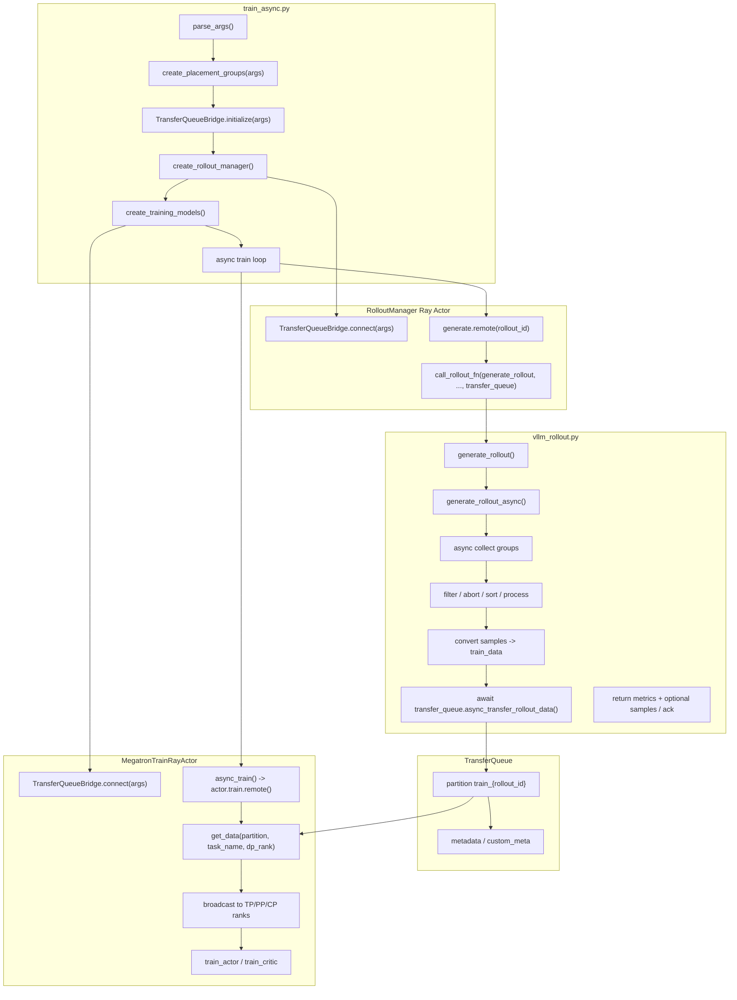
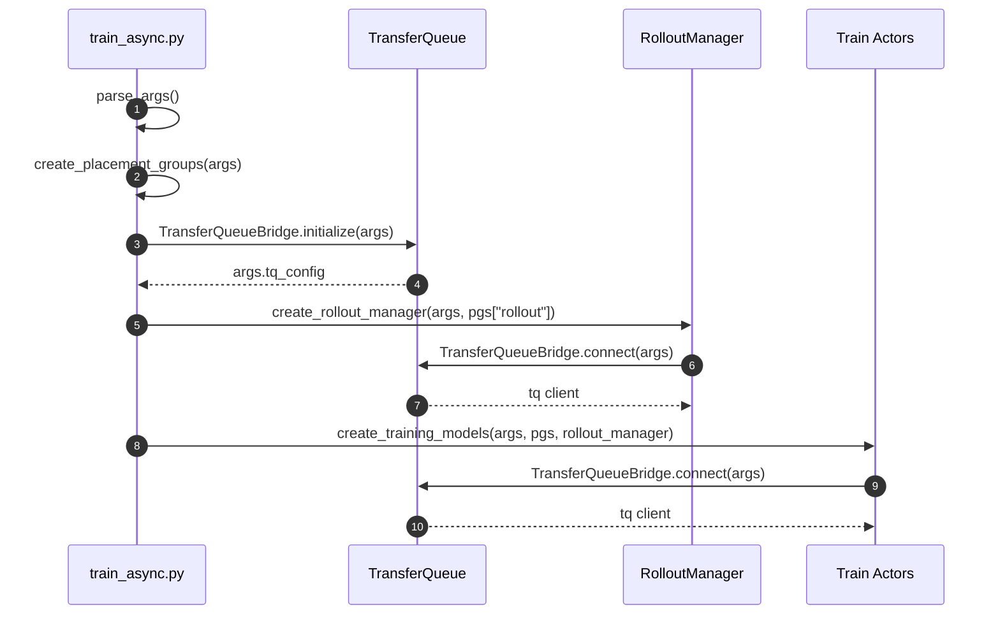
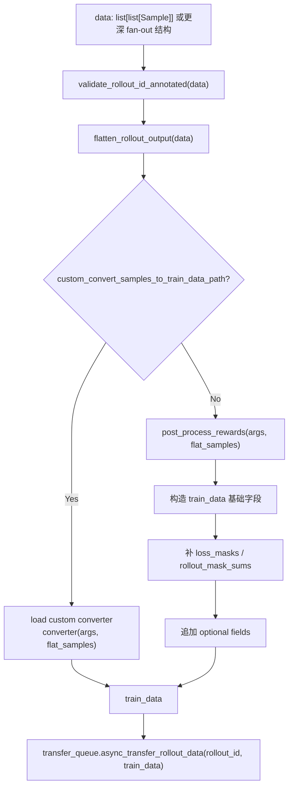
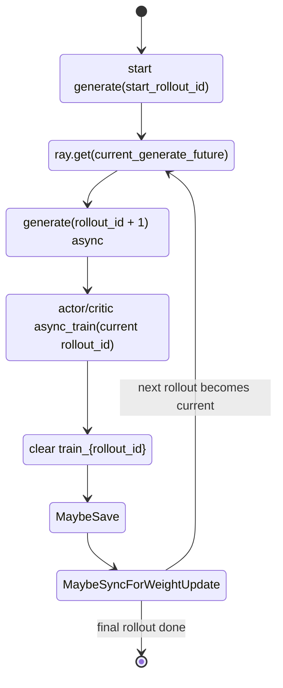
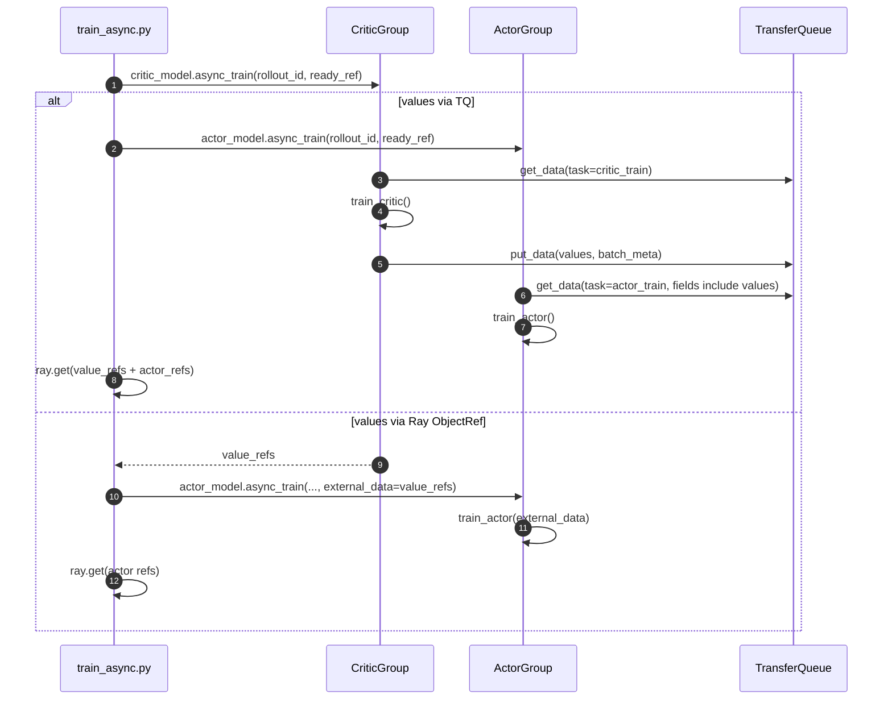
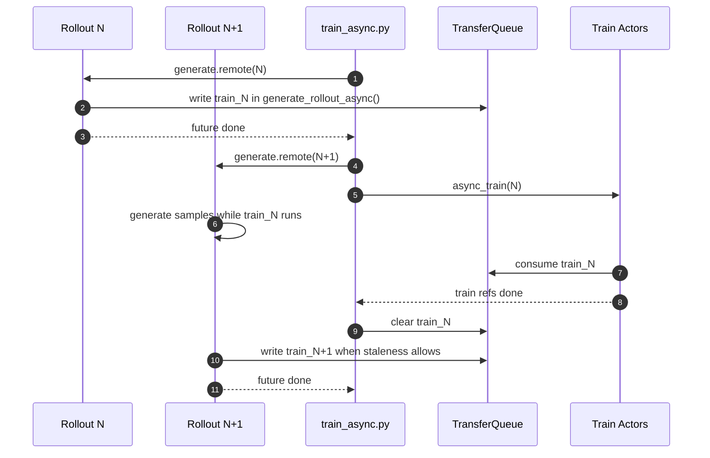

# async_train 接入 TransferQueue 架构设计

本文描述 `train_async.py` / `RayTrainGroup.async_train()` 接入 TransferQueue 的目标架构。设计重点是：rollout 侧写入 TQ 的位置下沉到 `vime/rollout/vllm_rollout.py::generate_rollout_async()`，而不是放在 `RolloutManager.generate()` 的后处理阶段。

这样做的目标是让默认 vLLM rollout 的异步生成流程在拿到可训练 batch 后立即完成 TQ 入队，使 `train_async.py` 的双缓冲训练只等待 “partition 已写入” 这个轻量完成信号，训练端再按 `rollout_id`、`task_name`、`dp_rank` 从 TQ 消费数据。

## 1. 背景

当前 VIME 有两条相关链路：

1. 同步训练链路 `train.py`
   - `RolloutManager.generate()` 生成 samples。
   - `RolloutManager._convert_samples_to_train_data()` 转换 train data。
   - TQ 开启时由 `RolloutManager.generate()` 调用 `transfer_queue.transfer_rollout_data()`。
   - actor/critic 通过 `MegatronTrainRayActor.train()` 中的 `_get_rollout_data_from_transfer_queue()` 消费。

2. 异步训练链路 `train_async.py`
   - 先启动第 N 个 rollout。
   - 训练第 N 个 rollout 时，提前启动第 N+1 个 rollout。
   - 在 `update_weights_interval` 边界等待正在生成的 rollout 完成，再更新 rollout 权重。

`train_async.py` 的目标是训练和 rollout 并行，但当前还没有完整接入 TQ 的初始化、critic values TQ 分支、partition 清理和回压顺序控制。

## 2. 设计目标

### 2.1 功能目标

1. `train_async.py` 支持 `--enable-vime-transfer-queue`。
2. TQ 初始化顺序与同步 `train.py` 一致：Ray placement group 创建后、RolloutManager 和 train actors 创建前完成。
3. rollout 写入 TQ 的位置放在 `generate_rollout_async()` 内部。
4. `RolloutManager.generate()` 在 TQ 模式下只负责调用 rollout function、保存 debug 数据、记录日志和返回 partition ready 信号，不再负责 TQ 写入。
5. `RayTrainGroup.async_train()` 保持现有接口，TQ 开启时 `rollout_data_ref` 可为 `None` 或轻量 ack；实际训练数据由 train actor 从 TQ 拉取。
6. PPO critic values 支持与同步路径一致的两种模式：
   - 满足约束时，critic values 通过 TQ 写回。
   - 不满足约束时，values 继续通过 Ray ObjectRef `external_data` 传递。
7. partition 在 actor/critic 消费完成后立即清理，且清理必须早于任何可能阻塞等待下一 rollout future 的操作。

### 2.2 非目标

1. 不改变 Megatron actor 的核心训练逻辑。
2. 不要求所有自定义 rollout function 立即迁移到 TQ 内部写入；默认 `vllm_rollout.generate_rollout_async()` 先支持。
3. 不在本设计里扩展 `context_parallel_size > 1` 下的 critic values TQ 回写。
4. 不改变 evaluation 数据流，eval 不写 TQ。

## 3. 总体架构



## 4. 模块职责

| 模块 | 目标职责 | TQ 接入点 |
| --- | --- | --- |
| `train_async.py` | 异步训练编排、rollout prefetch、权重更新边界控制 | 初始化 TQ、启动/等待 rollout future、触发 `async_train()`、清理 partition |
| `RolloutManager` | Ray actor 生命周期、vLLM server 管理、日志/debug 保存、调用 rollout function | 持有 `self.transfer_queue` 并传给默认 rollout function；TQ 模式不再写数据 |
| `vllm_rollout.generate_rollout_async()` | 默认 vLLM 异步采样、动态过滤、partial abort、样本排序、样本级处理 | 在最终 batch 就绪后转换 train data 并写入 TQ |
| `TransferQueueBridge` | TQ facade，屏蔽外部 package、TensorDict、partition、metadata 细节 | 增加 coroutine-safe 写入接口，复用现有读取和 critic 回写 |
| `RayTrainGroup.async_train()` | fan-out 到所有 Megatron train actor | 保持参数兼容，TQ 模式下 `rollout_data_ref` 不承载实际训练数据 |
| `MegatronTrainRayActor` | 真正训练 actor/critic | TQ 模式从 `TransferQueueBridge.get_data()` 拉取数据，critic 可写回 values |

## 5. 初始化流程

### 5.1 目标初始化顺序



### 5.2 `train_async.py` 必要调整

`train_async.py` 需要像同步 `train.py` 一样引入：

```python
from vime.utils.transfer_queue import TransferQueueBridge
```

并在 placement group 创建后、tracking 和 Ray actors 创建前调用：

```python
pgs = create_placement_groups(args)
TransferQueueBridge.initialize(args)
init_tracking(args)
```

原因：

1. `RolloutManager.__init__()` 会调用 `TransferQueueBridge.connect(args)`。
2. `MegatronTrainRayActor.init()` 也会调用 `TransferQueueBridge.connect(args)`。
3. 两者都依赖 driver 预先写入的 `args.tq_config`。

如果缺少这一步，actor 进程会在 `connect()` 中报错：

```text
args.tq_config is missing. TransferQueueBridge.initialize(args) must run before actors start.
```

## 6. rollout 写入 TQ 的位置

### 6.1 目标位置

TQ 写入应位于：

```text
vime/rollout/vllm_rollout.py
  generate_rollout()
    run(generate_rollout_async(..., transfer_queue))
      generate_rollout_async()
        collect samples
        filter samples
        abort unfinished requests
        sort samples
        run rollout_sample_filter / rollout_all_samples_process
        convert samples to train_data
        transfer_queue.async_transfer_rollout_data(rollout_id, train_data)
```

也就是 `generate_rollout_async()` 已经确定最终训练 batch 之后、返回 `RolloutFnTrainOutput` 之前。

### 6.2 为什么不放在 `RolloutManager.generate()`

| 位置 | 优点 | 问题 |
| --- | --- | --- |
| `RolloutManager.generate()` | 当前同步 TQ 路径实现简单；可复用 manager 内 `_convert_samples_to_train_data()` | 写入发生在 rollout function 外部，默认 vLLM async 流程无法表达“batch ready 即写入”；manager 同时承担生成调用、转换、TQ 写入、日志等多重职责 |
| `generate_rollout_async()` | 数据生成、过滤、partial abort、排序和入队都在同一个异步上下文完成；更符合 async_train 的 producer/consumer 模型 | 需要把 train_data 转换逻辑从 RolloutManager 抽成共享 helper；需要 async-safe TQ 写入接口 |

本设计选择 `generate_rollout_async()`，因为 async_train 的核心收益来自 rollout producer 和 train consumer 解耦。producer 侧应在拥有完整 batch 的第一时间完成入队，而不是把入队作为 RolloutManager 的外部后处理。

### 6.3 写入时机细节

推荐写入点位于以下逻辑之后：

1. `while len(data) < target_data_size` 收集到足够 group。
2. `abort(args, rollout_id)` 回收 partial rollout 的 aborted samples。
3. `assert len(data) == args.rollout_batch_size`。
4. 按 sample index 排序 `data` 和 `all_samples`。
5. `state.reset()`。
6. 执行 `rollout_sample_filter_path`。
7. 执行 `rollout_all_samples_process_path`。

推荐写入点位于以下逻辑之前：

1. `return RolloutFnTrainOutput(...)`。
2. `generate_rollout()` 将 `aborted_samples` 放回 data source。

原因：

- dynamic filter 丢弃的 samples 不应进入 TQ。
- aborted partial samples 应回到 data source，不应进入当前训练 batch。
- `rollout_sample_filter_path` 可能修改 `loss_mask`、`remove_sample` 或其他训练字段，必须先执行。
- `rollout_all_samples_process_path` 可能基于所有生成样本做统计或副作用，也应在写入前完成。

## 7. train_data 转换职责下沉

### 7.1 当前问题

当前 samples -> train_data 的逻辑在 `RolloutManager._convert_samples_to_train_data()` 中，包括：

- reward post-process
- `loss_masks`
- `rollout_ids`
- `rollout_mask_sums`
- optional fields
  - `rollout_log_probs`
  - `rollout_routed_experts`
  - `metadata`
  - `multimodal_train_inputs`
  - `teacher_log_probs`
  - `round_number`

如果 TQ 写入移到 `generate_rollout_async()`，该函数不能直接调用 RolloutManager 的私有方法。因此需要抽出共享转换层。

### 7.2 推荐新增共享 helper

建议新增：

```text
vime/rollout/train_data.py
```

提供：

```python
def flatten_rollout_output(data: list) -> list[Sample]:
    ...

def validate_rollout_id_annotated(data: list) -> None:
    ...

def post_process_rewards(args, samples: list[Sample]) -> tuple[list, list]:
    ...

def convert_samples_to_train_data(args, samples: list[Sample]) -> dict[str, list]:
    ...
```

迁移后：

- `RolloutManager._convert_samples_to_train_data()` 只作为兼容 wrapper。
- `vllm_rollout.generate_rollout_async()` 在 TQ 写入前直接调用共享 helper。
- 自定义 reward post-process 和 custom convert function 仍通过 `args.custom_reward_post_process_path`、`args.custom_convert_samples_to_train_data_path` 加载，不依赖 RolloutManager 实例状态。

### 7.3 转换流程



## 8. async-safe TQ 写入接口

### 8.1 当前同步接口

当前 `TransferQueueBridge.transfer_rollout_data()` 是同步方法，内部调用：

```python
metadata = run(client.async_put(...))
run(self._require_client().async_set_custom_meta(metadata))
```

`run()` 会把 coroutine 提交到后台 event loop 并阻塞当前线程。它不会直接触发 “事件循环已运行” 异常，但在 `generate_rollout_async()` 内部调用同步阻塞接口会暂停当前 asyncio loop，不利于后续扩展，也会让回压等待使用 `time.sleep()`。

### 8.2 推荐接口

建议在 `TransferQueueBridge` 增加 coroutine-safe 方法：

```python
async def async_transfer_rollout_data(self, rollout_id: int, train_data: dict[str, Any]) -> None:
    client = self._require_client()
    await self.async_wait_for_staleness()
    train_data = self.normalize_train_data(train_data)
    rollout_batch = self.dict_to_tensordict(train_data, batch_size=len(train_data["tokens"]))
    metadata = await client.async_put(data=rollout_batch, partition_id=self.partition_id(rollout_id))
    await self.async_set_total_length_custom_meta(metadata, train_data["total_lengths"])
```

同时保留同步接口：

```python
def transfer_rollout_data(...):
    return run(self.async_transfer_rollout_data(...))
```

回压也需要 async 版本：

```python
async def async_wait_for_staleness(self) -> None:
    while True:
        partitions = await client.async_get_partition_list()
        train_partitions = [p for p in partitions if str(p).startswith(TRAIN_PARTITION_PREFIX)]
        if len(train_partitions) <= max_staleness:
            return
        await asyncio.sleep(poll_interval)
```

这样同步路径和异步路径共用同一套真实实现。

## 9. `generate_rollout_async()` 目标伪代码

```python
async def generate_rollout_async(args, rollout_id, data_source, transfer_queue=None):
    assert args.rollout_global_dataset

    state = GenerateState(args)
    dynamic_filter = load_function(args.dynamic_sampling_filter_path) if args.dynamic_sampling_filter_path else None
    metric_gatherer = MetricGatherer()

    data = []
    all_data = []

    while len(data) < args.rollout_batch_size:
        while state.remaining_batch_size < args.rollout_batch_size:
            samples = data_source(args.over_sampling_batch_size)
            state.submit_generate_tasks(samples)

        done, state.pendings = await asyncio.wait(state.pendings, return_when=asyncio.FIRST_COMPLETED)
        for task in done:
            group = task.result()
            all_data.append(group)

            dynamic_filter_output = call_dynamic_filter(dynamic_filter, args, group)
            if not dynamic_filter_output.keep:
                metric_gatherer.on_dynamic_filter_drop(reason=dynamic_filter_output.reason)
                state.remaining_batch_size -= 1
                continue

            if len(data) < args.rollout_batch_size:
                data.append(group)

    aborted_samples = await abort(args, rollout_id)

    data = sort_groups_by_sample_index(data)
    all_samples = sort_groups_by_sample_index(all_data)
    state.reset()

    if args.rollout_sample_filter_path is not None:
        load_function(args.rollout_sample_filter_path)(args, data)

    if args.rollout_all_samples_process_path is not None:
        load_function(args.rollout_all_samples_process_path)(args, all_samples, data_source)

    if TransferQueueBridge.enabled(args):
        validate_rollout_id_annotated(data)
        flat_samples = flatten_rollout_output(data)
        train_data = convert_samples_to_train_data(args, flat_samples)
        await transfer_queue.async_transfer_rollout_data(rollout_id, train_data)

    return RolloutFnTrainOutput(samples=data, metrics=metric_gatherer.collect()), aborted_samples
```

注意：上面仍返回 `samples=data`，是为了保留 RolloutManager 的 debug 保存和 rollout metrics 计算能力。如果后续要进一步减少 manager 内存占用，可以扩展 `RolloutFnTrainOutput` 增加 `samples=None` 或 `tq_written=True`，但这需要同步调整日志与 debug 行为。

## 10. `RolloutManager.generate()` 目标行为

### 10.1 TQ 模式

TQ 模式下，`RolloutManager.generate()` 不再写 TQ：

```python
def generate(self, rollout_id):
    start_time = time.time()
    self.rollout_id = rollout_id
    self.health_monitoring_resume()

    data, metrics = self._get_rollout_data(rollout_id)

    self._save_debug_rollout_data(data, rollout_id, evaluation=False)
    _log_rollout_data(rollout_id, self.args, data, metrics, time.time() - start_time)

    if self.args.debug_rollout_only:
        return

    if TransferQueueBridge.enabled(self.args):
        # generate_rollout_async() 已经完成写入。
        # 返回 None 或轻量 ack，driver 只用 ray.get(future) 等待 partition ready。
        return None

    train_data = self._convert_samples_to_train_data(data)
    return self._split_train_data_by_dp(train_data)
```

### 10.2 非 TQ 模式

非 TQ 模式保持旧行为：

1. rollout function 返回 samples。
2. `RolloutManager._convert_samples_to_train_data()` 转换。
3. `_split_train_data_by_dp()` 生成每个 DP rank 的 Ray ObjectRef。
4. `train_async.py` 把这些 refs 传给 `async_train()`。

### 10.3 rollout function 参数兼容

当前默认 `vllm_rollout.generate_rollout()` 需要接收 `transfer_queue`。但其他自定义 rollout function 可能仍是旧签名：

```python
def generate_rollout(args, rollout_id, data_source, evaluation=False):
    ...
```

为了避免全局破坏，建议 `call_rollout_fn()` 或 `RolloutManager._get_rollout_data()` 做签名兼容：

1. 如果 rollout function 接受 `transfer_queue` 参数，则传入 `self.transfer_queue`。
2. 如果不接受，则按旧签名调用。
3. 如果 TQ 开启但 rollout function 不支持内部写入，则可以 fallback 到 `RolloutManager.generate()` 写 TQ，或者显式报错要求迁移。

推荐策略：

- 默认 `vllm_rollout`：内部写 TQ。
- 自定义 rollout function：短期允许 manager fallback；长期通过文档要求支持 `transfer_queue`。

## 11. `train_async.py` 训练循环设计

### 11.1 双缓冲状态机



### 11.2 关键顺序

每个 rollout step 的顺序应为：

1. 等待当前 rollout future 完成，确保当前 `train_{rollout_id}` 已写入。
2. 立即启动下一轮 rollout future，让 generation 与当前训练重叠。
3. 启动当前 rollout 的 actor/critic `async_train()`。
4. 等待训练 refs 完成。
5. 清理当前 TQ partition。
6. 保存 checkpoint / dataset state。
7. 如到达 `update_weights_interval`，等待下一轮 rollout future 完成，暂停 prefetch，然后 update weights。
8. eval。

第 5 步必须早于第 7 步。否则在 `max_staleness=0` 时可能出现阻塞环：

```text
rollout N+1 生成完毕，准备写 train_{N+1}
-> wait_for_staleness() 发现 train_N 未清理，于是等待
driver 到权重更新边界，ray.get(rollout N+1 future)
-> driver 等 rollout N+1 完成
-> rollout N+1 等 train_N 清理
-> driver 尚未执行 train_N 清理
```

因此 TQ partition 清理需要紧跟训练完成，而不是放到等待下一 rollout future 之后。

### 11.3 目标伪代码

```python
def train(args):
    assert not args.colocate
    configure_logger()

    pgs = create_placement_groups(args)
    TransferQueueBridge.initialize(args)
    init_tracking(args)

    rollout_manager, num_rollout_per_epoch = create_rollout_manager(args, pgs["rollout"])
    actor_model, critic_model = create_training_models(args, pgs, rollout_manager)
    actor_model.update_weights()

    def clear_tq_partition(rollout_id):
        if TransferQueueBridge.enabled(args):
            ray.get(rollout_manager.clear_transfer_queue_partition.remote(rollout_id))

    current_ready_ref = None
    next_future = rollout_manager.generate.remote(args.start_rollout_id)

    for rollout_id in range(args.start_rollout_id, args.num_rollout):
        if next_future is not None:
            current_ready_ref = ray.get(next_future)
            next_future = None

        if rollout_id + 1 < args.num_rollout:
            next_future = rollout_manager.generate.remote(rollout_id + 1)

        actor_trains_this_step = (not args.use_critic) or rollout_id >= args.num_critic_only_steps

        if args.use_critic:
            value_refs = critic_model.async_train(rollout_id, current_ready_ref)
            if actor_trains_this_step:
                if critic_values_via_tq_for_all_roles:
                    actor_refs = actor_model.async_train(rollout_id, current_ready_ref)
                    ray.get(value_refs + actor_refs)
                else:
                    ray.get(actor_model.async_train(rollout_id, current_ready_ref, external_data=value_refs))
            else:
                ray.get(value_refs)
        else:
            ray.get(actor_model.async_train(rollout_id, current_ready_ref))

        clear_tq_partition(rollout_id)

        save_if_needed()

        if (rollout_id + 1) % args.update_weights_interval == 0:
            if next_future is not None:
                current_ready_ref = ray.get(next_future)
                next_future = None
            actor_model.update_weights()

        eval_if_needed()
```

这里的 `current_ready_ref` 在 TQ 模式下通常是 `None` 或轻量 ack；在非 TQ 模式下仍是旧的 `rollout_data_refs`。

## 12. critic values 路径

### 12.1 TQ values 条件

critic values 通过 TQ 回写要求：

```text
enable_vime_transfer_queue == True
use_critic == True
context_parallel_size == 1
```

并且 base args、actor args、critic args 都满足：

```python
TransferQueueBridge.critic_values_via_transfer_queue(args)
and TransferQueueBridge.critic_values_via_transfer_queue(actor_model.args)
and TransferQueueBridge.critic_values_via_transfer_queue(critic_model.args)
```

### 12.2 async_train 中的分支



与同步 `train.py` 一样，TQ values 路径允许 critic 和 actor 并发启动。actor 读取字段包含 `values`，如果 critic 尚未写回，actor 会在 TQ metadata 侧等待。

## 13. partition 生命周期



### 13.1 `max_staleness` 对 async_train 的影响

| `max_staleness` | 行为 |
| --- | --- |
| `0` | 同一时间最多保留当前未清理 partition。N+1 rollout 可以先生成 samples，但最终 TQ 写入会等 train_N 清理。适合最小内存占用。 |
| `1` | 允许 train_N 未清理时写入 train_N+1。更符合 async prefetch，训练进入 N+1 时数据已经在 TQ。 |
| `>1` | 允许 rollout 更深度领先训练。吞吐更高，但 storage、样本新鲜度和权重版本管理风险更高。 |

对于 `train_async.py` 的默认双缓冲模型，推荐 `max_staleness=1` 以发挥 TQ prefetch 的收益；如果显存/CPU 内存压力大，可以使用 `0`，但要接受最后写入阶段的等待。

## 14. 数据一致性与权重版本

### 14.1 update weights 边界

`train_async.py` 当前在 `update_weights_interval` 边界等待正在生成的 rollout 完成，然后调用 `actor_model.update_weights()`。TQ 接入后仍需保持这个语义：

```text
下一轮 rollout future 完成
-> 对应 partition 已经写入 TQ
-> 才允许 update_weights()
```

原因是 vLLM generation 期间更新权重可能导致同一 rollout batch 内样本使用不同 actor 权重。

### 14.2 样本权重版本

`Sample.weight_versions` 会从 rollout engine meta 中记录权重版本。TQ 路径不应丢失该字段。如果训练侧需要消费权重版本，需要通过：

```bash
--transfer-queue-extra-data-fields weight_versions
```

或在默认 train data 字段中显式加入相应字段。否则它只存在于 debug samples 中，不会进入训练 batch。

### 14.3 debug 与日志

由于 TQ 写入发生在 `generate_rollout_async()` 内部，`RolloutManager.generate()` 仍建议保留 samples 返回，用于：

- `_save_debug_rollout_data()`
- `_log_rollout_data()`
- fault tolerance / trace 排查

若未来希望避免 samples 在 manager 内继续保留，可以扩展 `RolloutFnTrainOutput`：

```python
@dataclass
class RolloutFnTrainOutput:
    samples: list[list[Sample]] | None
    metrics: dict[str, Any] = None
    tq_written: bool = False
    debug_samples: list[list[Sample]] | None = None
```

短期不建议这么做，避免一次性影响现有日志、debug 和自定义 rollout function。

## 15. 字段契约

### 15.1 TQ 必需字段

写入 TQ 前 train data 至少需要：

| 字段 | 说明 |
| --- | --- |
| `tokens` | prompt + response token ids |
| `response_lengths` | response token 数 |
| `loss_masks` | response 位置 loss mask |
| `rewards` | 训练用 reward |

`TransferQueueBridge.normalize_train_data()` 会补齐：

| 字段 | 补齐方式 |
| --- | --- |
| `total_lengths` | `len(tokens)` |
| `raw_reward` | 缺省时复制 `rewards` |
| `truncated` | 缺省为 0 |
| `sample_indices` | 缺省为 batch 内顺序 |

### 15.2 推荐保留字段

为保持与原训练路径一致，默认转换应保留：

- `rollout_ids`
- `rollout_mask_sums`
- `raw_reward`
- `truncated`
- `sample_indices`
- `rollout_log_probs`
- `rollout_routed_experts`
- `metadata`
- `multimodal_train_inputs`
- `teacher_log_probs`
- `round_number`

其中训练端实际会请求哪些字段，由 `TransferQueueBridge.default_train_data_fields()` 和 `actor_train_data_fields()` 决定。

### 15.3 fan-out / compact rollout 契约

如果 `custom_generate_function_path` 将一个输入 sample fan-out 成多个训练 sample，则同一组 sibling 必须设置相同 `Sample.rollout_id`。在写 TQ 前需要运行 `validate_rollout_id_annotated(data)`。

否则 loss reducer 可能把一个 rollout 的多个 sibling 当成多个独立 rollout 计数，导致 loss denominator 错误。

## 16. 兼容性策略

### 16.1 默认 rollout function

默认 `vime.rollout.vllm_rollout.generate_rollout` 目标签名：

```python
def generate_rollout(args, rollout_id, data_source, transfer_queue=None, evaluation=False):
    ...
```

`generate_rollout_async()` 目标签名：

```python
async def generate_rollout_async(args, rollout_id, data_source, transfer_queue=None):
    ...
```

当 `TransferQueueBridge.enabled(args)` 为 true 时，`transfer_queue` 必须是已连接 client 的 `TransferQueueBridge` 实例。

### 16.2 自定义 rollout function

短期兼容路径：

1. 如果自定义函数不接受 `transfer_queue`，仍可按旧路径返回 samples。
2. `RolloutManager.generate()` 检测 TQ 开启且 rollout function 未内部写入时，fallback 到 manager 层写入。
3. 输出 warning，提示迁移到内部写入。

长期推荐路径：

1. 自定义 rollout function 接受 `transfer_queue=None`。
2. 在生成最终 batch 的 coroutine 内部调用 `await transfer_queue.async_transfer_rollout_data(...)`。
3. 返回 `RolloutFnTrainOutput(samples=..., metrics=...)` 供日志使用。

### 16.3 fully_async_rollout

`vime.rollout.fully_async_rollout` 是另一种更深度的 fully-async 数据生成方式。它目前通过后台线程持续生成，然后 `_generate_rollout_async()` 收集完成 group。

该路径若要接入同样设计，应在 `_generate_rollout_async()` 收集够 target batch 后写 TQ，而不是在 `RolloutManager.generate()` 写入。这样可以保持 “rollout function 自己拥有最终 batch，因此自己入队” 的一致边界。

## 17. 故障与恢复

### 17.1 rollout 失败

如果 `generate_rollout_async()` 在写 TQ 前失败：

- `rollout_manager.generate.remote()` future 失败。
- driver 在 `ray.get(current_future)` 处得到异常。
- 不应启动当前 rollout 的 `async_train()`。
- partition `train_{rollout_id}` 不存在，无需清理。

如果写 TQ 成功后返回前失败：

- partition 已存在。
- driver 可能收到失败 future。
- 建议在异常处理里尝试清理 `train_{rollout_id}`，避免 stale partition 影响后续回压。

### 17.2 train 失败

如果 actor/critic 训练失败：

- driver 在 `ray.get(train_refs)` 得到异常。
- 默认应保留 partition 以便 debug，或在 finally 中清理，取决于故障恢复策略。
- 若选择自动清理，需要确保 debug dump 已经完成。

### 17.3 staleness 阻塞排查

如果 rollout 卡在写 TQ 阶段，优先检查：

1. 当前未清理 `train_` partition 数量。
2. `max_staleness` 是否过小。
3. driver 是否在等待下一 rollout future 之前已经清理当前 partition。
4. actor/critic 是否仍在等待 values 或训练未完成。

## 18. 实施清单

### 18.1 必改项

| 文件 | 改动 |
| --- | --- |
| `train_async.py` | 调用 `TransferQueueBridge.initialize(args)`；增加 TQ partition 清理；复用同步 `train.py` 的 critic values TQ 分支；保证清理早于等待下一 rollout future。 |
| `vime/rollout/vllm_rollout.py` | `generate_rollout()` 和 `generate_rollout_async()` 接收 `transfer_queue`；在 `generate_rollout_async()` 最终 batch ready 后写 TQ。 |
| `vime/ray/rollout.py` | 将 `self.transfer_queue` 传给支持该参数的 rollout function；TQ 模式下不再在 manager 层写入，或仅作为 fallback。 |
| `vime/utils/transfer_queue.py` | 增加 `async_transfer_rollout_data()`、`async_wait_for_staleness()`、`async_set_total_length_custom_meta()`；同步接口复用 async 实现。 |
| `vime/rollout/train_data.py` | 抽取 samples -> train_data 转换、flatten、rollout_id 校验逻辑。 |

### 18.2 推荐测试

| 测试 | 验证点 |
| --- | --- |
| 单步 async + TQ + GRPO | `generate_rollout_async()` 写入 `train_0`，actor 从 TQ 消费，训练完成后清理。 |
| 两步 async + `max_staleness=0` | N+1 rollout 可生成但写入等待，train_N 清理后继续，无死锁。 |
| 两步 async + `max_staleness=1` | N+1 rollout 可在 train_N 未清理时写入，训练进入下一步无需等待生成。 |
| PPO + critic values via TQ | actor/critic 并发启动，critic 写回 `values`，actor 等到 `values` 后训练。 |
| PPO + CP > 1 fallback | values 经 Ray ObjectRef 传递，训练样本仍经 TQ。 |
| custom rollout old signature | 不接受 `transfer_queue` 的函数仍可运行或给出明确错误。 |
| dynamic filter / partial rollout | 被过滤和 aborted samples 不进入当前 TQ partition。 |

## 19. 推荐最终数据流

```mermaid
flowchart LR
    DS["data_source.get_samples()"] --> GEN["generate_and_rm_group() tasks"]
    GEN --> DONE["completed groups"]
    DONE --> FILTER["dynamic filter"]
    FILTER --> FINAL["final data groups"]
    FINAL --> ABORT["abort unfinished requests"]
    ABORT --> SORT["sort / sample filter / all samples process"]
    SORT --> CONVERT["convert_samples_to_train_data()"]
    CONVERT --> WRITE["generate_rollout_async(): await TQ write"]
    WRITE --> ACK["RolloutManager.generate future done"]
    ACK --> DRIVER["train_async.py"]
    DRIVER --> TRAIN["RayTrainGroup.async_train()"]
    TRAIN --> READ["MegatronTrainRayActor reads TQ"]
    READ --> STEP["train_actor / train_critic"]
    STEP --> CLEAR["driver clears train_{rollout_id}"]
```



## 20. 小结

async_train 接入 TQ 的核心不是简单把同步 `train.py` 的 TQ 写入逻辑复制到 `train_async.py`，而是重新划清 producer/consumer 边界：

```text
generate_rollout_async()
  = 默认 vLLM rollout producer
  = 负责生成最终训练 batch
  = 负责把 batch 写入 TransferQueue

train_async.py
  = 调度器
  = 负责等待 partition ready、启动 async_train、清理 partition、控制权重更新边界

MegatronTrainRayActor
  = consumer
  = 负责按 rollout_id/task_name/dp_rank 从 TQ 获取训练数据
```

按照这个边界实现后，TQ partition 成为 async rollout 与 async train 之间唯一的数据同步点。`RolloutManager.generate()` 不再承担数据面写入职责，只保留 Ray actor 管理、日志/debug 和兼容 fallback。这样既能复用现有 TQ 训练端消费逻辑，又能让默认 `vllm_rollout` 的 asyncio producer 在最自然的位置完成入队。
