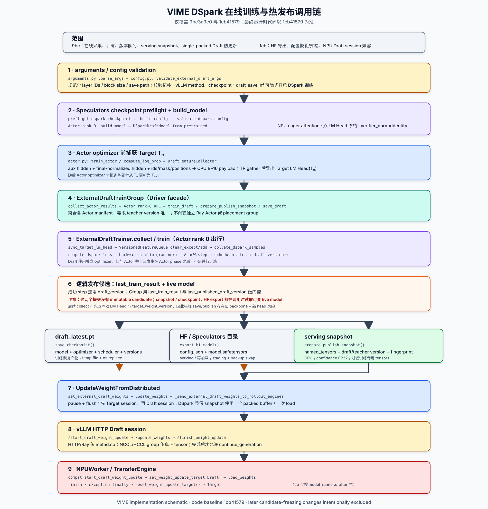

# DSpark 在线训练与热发布：简明代码导读

本文采用统一格式介绍 DSpark 实现：

```text
模块职责
文件路径
方法名(): 方法作用
```

仅覆盖以下两个 VIME commit，最终行为以 `1cb41579` 为准：

- `9bc3a9e072643b2e1b6ae4a87c938308f942a61e`：接入 DSpark 数据采集、在线训练与热更新；
- `1cb41579514fb2d612022f773ad0ca150869f172`：增加 HF 导出、checkpoint 兼容预检和 NPU Draft session 兼容。



## 1. 完整调用顺序

```text
arguments / config validation
    ↓
Speculators checkpoint preflight + build_model
    ↓
Actor pre-update hidden / LM Head capture
    ↓
ExternalDraftTrainGroup
    ↓
ExternalDraftTrainer.collect / train
    ↓
逻辑 candidate
    ├── draft_latest.pt
    ├── HF config.json + model.safetensors
    └── serving snapshot
            ↓
UpdateWeightFromDistributed
            ↓
vLLM HTTP Draft session
            ↓
NPUWorker / TransferEngine 切换至 Draft、加载、恢复 Target
```

> 重要：这两个 commit 中还没有真正的 immutable candidate。checkpoint、HF export 和 serving snapshot
> 都在各自执行时读取 live Draft model。

## 2. 主要模块与方法

### 2.1 参数注册与配置校验

`vime/utils/arguments.py`

- `add_external_draft_training_arguments()`：注册 external Draft 的开关、模型路径、特征采集、Draft 优化、DSpark loss、发布和保存参数。
- `parse_args()`：分别解析 vLLM 与 Megatron/VIME 参数，合并后进入统一校验。
- `vime_validate_args()`：应用 custom YAML 覆盖，再调用 external Draft 参数校验。

`vime/backends/speculative_training/config.py`

- `external_draft_enabled()`：读取 `enable_external_draft_training` 总开关。
- `_speculative_config()`：将 `vllm_speculative_config` 的 JSON 字符串规范化为字典。
- `_activate_dspark_training_for_export()`：当设置 `draft_save_hf` 且 vLLM method 为 DSpark 时，自动开启 Draft 训练并补齐 algorithm/model path。
- `parse_int_list()`：把整数、逗号字符串或 JSON list 解析为无重复的整数列表。
- `load_draft_checkpoint_config()`：从本地目录或 Hugging Face model ID 读取 `config.json`，并缓存到 `args`。
- `resolve_feature_layer_ids()`：解析 Target hidden-state 层号，并将 vLLM 的 `target_layer_ids` 转回 VIME 捕获层号。
- `resolve_dspark_block_size()`：从 CLI 或 checkpoint 解析 DSpark block size。
- `make_dspark_vllm_compatible_config()`：生成同时兼容 Speculators 训练端和 vLLM serving 端的 hybrid config。
- `ensure_local_dspark_vllm_config()`：必要时通过临时文件和 `os.replace()` 原地升级本地 legacy `config.json`。
- `should_run_draft_interval()`：判断当前 rollout 是否命中 collect/train/publish/save interval。
- `validate_external_draft_args()`：校验模型身份、训练拓扑、vLLM method、acceptance、checkpoint、interval 与保存路径，并在 Ray/NPU 分配前执行本地 preflight。

关键行为：

- 不设置 `draft_save_hf` 不会阻止显式开启的 DSpark 训练；
- 在当前两个 commit 中，设置 `draft_save_hf` 且 method=dspark 会隐式打开训练；
- local legacy checkpoint 的 `config.json` 可能在参数校验阶段被改写；
- `1cb41579` 的 `Dockerfile.npu` 默认 `SPECULATORS_REF=main`，部署时可显式指定 `af3f1795495b5393c7c9aed3f1d55a42d47878ae`。

### 2.2 DSpark 权重训练

`vime/backends/speculative_training/backends/dspark.py`

- `collate_dspark_samples()`：将多个 `DraftFeatureSample` 拼装成适用于 DSpark 的 single-sequence packed batch，并屏蔽每个 document 末尾不能形成完整 block 的位置。
- `dspark_trainer_kwargs()`：把 VIME 的 CE/TV、position decay、anchor、confidence 和 DPACE 参数转换为 Speculators trainer kwargs。
- `_model_device_type()`：判断 DSpark 模型当前位于 CPU、CUDA 还是 NPU。
- `_load_eager_speculators_loss()`：从 Speculators 加载指定 loss 的 eager 实现。
- `_replace_fused_losses_for_npu()`：在 NPU 训练前，将 `loss_config` 中的 TV/NLA fused loss 替换为 eager loss。
- `compute_dspark_loss()`：执行 DSpark forward，取得 `(draft_tokens, loss, metrics)`，并把 Speculators metrics 归一成 VIME 使用的统计量。
- `sync_dspark_lm_heads()`：将当前 Target LM Head 权重同步到 DSpark 的 `lm_head` 与 `verifier_lm_head`；reduced-vocab 模式下先选择对应词表行。

调用关系：

```text
ExternalDraftTrainer.train
  → collate_dspark_samples
  → compute_dspark_loss
  → backward
  → clip_grad_norm
  → AdamW.step
  → scheduler.step
```

### 2.3 Speculators checkpoint preflight 与模型构建

`vime/backends/speculative_training/factories/speculators_dspark.py`

- `_checkpoint_tensor_shapes()`：读取 safetensors 或 PyTorch bin 中的 tensor shape，不在 Driver 上构建完整模型。
- `_ensure_transformer_config()`：从 checkpoint wrapper、Target config 或最小 Qwen3 信息恢复 nested transformer config。
- `_normalize_qwen_rope_config()`：统一新旧 RoPE 配置字段。
- `_recover_transformer_layout()`：从权重 shape 恢复层数、hidden/intermediate、attention heads 和 vocab 等结构。
- `_recover_missing_layout()`：恢复 aux hidden 数量、Draft vocab、Markov rank 和 confidence-head layout。
- `_validate_checkpoint_layout()`：根据最终配置反算关键 tensor shape，并检查 checkpoint 是否匹配。
- `_build_config()`：串联配置读取、字段恢复、Pydantic 构造、layer ID 对齐和 tensor-layout 校验。
- `_validate_dspark_config()`：检查 dense Qwen3、RoPE、vanilla Markov、Target/Draft hidden size、confidence head、mask token 和 proposal capacity。
- `preflight_dspark_checkpoint()`：在 Driver 上导入 Speculators、构建 typed config 并做结构校验，不占用 NPU。
- `_load_pretrained_model()`：调用 `DSparkDraftModel.from_pretrained()`，并将 size mismatch 包装成更明确的诊断信息。
- `build_model()`：在 Actor rank 0 真正加载 DSpark，应用 NPU eager attention、`verifier_norm=Identity`、双 LM Head 冻结、BF16 主体与 FP32 confidence head。

调用关系：

```text
Driver parse_args
  → preflight_dspark_checkpoint
  → _build_config
  → _validate_dspark_config

Actor rank 0 init
  → ExternalDraftTrainer
  → _load_draft_model
  → build_model
  → DSparkDraftModel.from_pretrained
```

### 2.4 Actor 更新前特征采集

`vime/backends/megatron_utils/actor.py`

- `train_actor()`：按 collect interval 决定是否采集，并保证 hidden states 与 LM Head 在 Actor optimizer step 前导出。
- `compute_log_prob()`：执行 no-grad forward，并将 `DraftFeatureCollector` 传入 Megatron forward 流程。
- `_export_draft_target_lm_head()`：TP gather Target output weight，去除 padded-vocab rows，并在 global rank 0 生成 CPU BF16 Ray ObjectRef。
- `collect_external_draft_features()`：在 Actor rank 0 解析 LM Head/feature refs，先同步 Head，再把样本送入 Draft trainer queue。
- `train_external_draft()`：调用 Actor rank-0 `ExternalDraftTrainer.train()`。
- `prepare_external_draft_publish_snapshot()`：生成 serving snapshot 并放入 Ray Object Store。
- `save_external_draft()`：调用 trainer 保存 `draft_latest.pt`。
- `export_external_draft()`：调用 trainer 导出 HF/Speculators 两文件目录。
- `set_external_draft_weights()`：暂存待发布的 Draft snapshot 与版本。
- `update_weights()`：将 pending Draft snapshot 交给 weight updater，并执行 Target/Draft 热更新。

`vime/backends/speculative_training/feature_collector.py`

- `DraftFeatureCollector.__init__()`：为选定的 Target transformer layers 注册 forward hooks，并为 output layer 注册 pre-hook。
- `begin_microbatch()`：记录当前 microbatch 与样本索引，清空上一个 microbatch 的捕获状态。
- `end_microbatch()`：检查 hook 完整性，执行 sequence-parallel gather、TP export-rank 过滤、hidden 拼接和样本切片。
- `_maybe_collect_sample()`：按 sample rate、窗口模式、样本数和 token 上限生成单个 `DraftFeatureSample`。
- `pop_payloads()`：返回当前 rollout 收集到的 payload，并清空 collector 内部缓存。
- `abort_microbatch()`：forward 异常时丢弃当前 microbatch 状态。
- `close()`：移除全部 hooks。

特征时序：

```text
Target Tn no-grad forward
  → aux hidden + final-normalized hidden
  → Target LM Head(Tn)
  → Actor backward / optimizer
  → Actor training replica becomes Tn+1
```

### 2.5 特征数据结构与版本队列

`vime/backends/speculative_training/feature_schema.py`

- `DraftFeatureSample.from_payload()`：将 Ray payload 反序列化为强类型样本。
- `DraftFeatureSample.validate()`：校验 schema、algorithm/layout、tensor shape、窗口、positions、Target version 和 layer IDs。
- `DraftFeatureSample.to_payload()`：将 ids/mask/hidden 转为规定 dtype 的 CPU contiguous tensors。
- `VersionedFeatureQueue.add()`：只接收 expected Target version 的样本，并维护有界 FIFO。
- `VersionedFeatureQueue.take()`：按 Target version 取 batch；`repeat=True` 时循环复用而不消费样本。
- `VersionedFeatureQueue.clear_except()`：Target version 变化时清除全部旧 teacher 数据。

每个样本主要包含：

```text
input_ids / loss_mask / position_ids / hidden_positions
aux_hidden_states / final_hidden_states
rollout_id / target_weight_version / sample/window metadata
aux_layer_ids / algorithm / hidden_layout / schema_version
```

### 2.6 Driver 侧 Draft 控制面

`vime/backends/speculative_training/draft_group.py`

- `ExternalDraftTrainGroup.__init__()`：复用 `actor_group._actor_handlers[0]`，不创建新的 Ray actor 或 GPU placement group。
- `create()`：读取 Draft checkpoint 的下一 rollout ID，用于与 Actor resume 位置对齐。
- `collect_actor_results()`：聚合各 Actor manifest，检查 Target version 一致性，并把 feature/head refs 交给 Actor rank-0 trainer。
- `train_draft()`：同步等待 Draft 训练结果，并写入 `last_train_result`。
- `prepare_publish_snapshot()`：检查最近训练是否成功、版本是否尚未发布，再请求 Actor rank 0 生成 snapshot。
- `mark_published()`：所有 Actor update 成功后，更新 Driver 内存中的 `last_published_draft_version`。
- `save_draft()`：按参数调用 native checkpoint 和可选 HF export，并校验导出完成信息。
- `release()`：Draft trainer 与 Actor 同生命周期，因此无需单独销毁 Ray actor。

调度特点：只有当前 rollout 收到有效样本且命中 train interval 时才训练；collect/train interval 不同时，真实训练点是两者的交集。

### 2.7 Actor rank-0 Draft Trainer

`vime/backends/speculative_training/draft_trainer.py`

- `_load_draft_model()`：选择自定义 factory；DSpark 未指定 factory 时默认调用 `speculators_dspark.build_model()`。
- `_architecture_fingerprint()`：基于少量 config 字段和 parameter 名称/shape 生成结构 fingerprint。
- `_load_target_embedding()`：从 Target HF checkpoint 读取 embedding，并初始化 Draft embedding。
- `ExternalDraftTrainer.__init__()`：构建 Draft model、optimizer、scheduler、版本队列和恢复状态。
- `sync_target_lm_head()`：同步 Target LM Head、更新 Target version，并清除旧 version 队列。
- `collect()`：解析 feature payload，并按 expected Target version 入队。
- `train()`：取样、collate、forward、backward、梯度裁剪和 optimizer step；至少一步成功后递增 `draft_version`。
- `prepare_publish_snapshot()`：从 live model 导出 CPU serving tensors，并添加 Draft/Target version、fingerprint 和 algorithm metadata。
- `save_checkpoint()`：将 live model、optimizer、scheduler、版本和 rollout ID 保存为 `draft_latest.pt`。
- `export_hf_model()`：将 live model 导出为 `config.json + model.safetensors`，再通过 staging/backup 目录切换发布。
- `export_speculators_model()`：兼容别名，直接调用 `export_hf_model()`。
- `_load_checkpoint_if_present()`：恢复 model、optimizer、scheduler、Draft version、Target version 和 last rollout。

Draft 的“独立训练”是指独立模型与 optimizer；实际仍与 Actor rank 0 共进程、共设备，并在 Actor phase 后串行运行。

### 2.8 逻辑 candidate、checkpoint、HF 与 serving snapshot

`vime/backends/speculative_training/draft_trainer.py`

- `_cpu_contiguous_state_dict()`：将完整 Draft state materialize 为 CPU contiguous tensors，避免 safetensors 直接处理 NPU storage。
- `_publish_dtype()`：把 `bf16/fp16/fp32` 配置映射为 PyTorch dtype。
- `_dspark_training_only_tensor()`：识别 serving 端不需要的 `verifier_lm_head`、`verifier_norm` 和 `t2d`。
- `prepare_publish_snapshot()`：生成供热更新使用的 named-tensor envelope。
- `save_checkpoint()`：生成用于继续训练的 `draft_latest.pt`。
- `export_hf_model()`：生成供重新加载或部署使用的两文件 HF 目录。

三类产物：

| 产物 | 作用 | 是否读取冻结 candidate |
| --- | --- | --- |
| `draft_latest.pt` | 继续 Draft 训练 | 否，保存时读取 live model |
| `config.json + model.safetensors` | 重新加载或部署 | 否，导出时读取 live model |
| serving snapshot | 热更新 vLLM Draft | 否，prepare 时读取 live parameters |

因此 `last_train_result` 只是逻辑发布门控，不是冻结权重。后续 collect 可以在 `draft_version` 不变时同步新的双 LM Head，
错峰 publish/save 时可能形成“旧 backbone + 新 Head”。

### 2.9 Driver 主循环编排

`train.py`

- `train()`：创建 rollout、Actor/Critic 和 Draft 控制面，并编排 generate、Actor train、Draft collect/train/save/publish。
- `_log_draft_result()`：将 collect/train/publish 的数值结果写入统一 tracking。
- 内部 `save()`：保存 Actor/Critic checkpoint；Draft 保存由独立的 Draft save cadence 处理。

单个 rollout 的关键顺序：

```text
rollout generate
  → Actor train + pre-update feature capture
  → Draft collect/train
  → prepare Draft serving snapshot
  → Actor checkpoint / Draft checkpoint / optional HF export
  → stage Draft snapshot
  → Actor Target weight update + Draft weight update
  → mark_published
```

未显式设置 `draft_save_interval` 时，Draft 跟随 Actor save；显式 interval 命中或最后一个 rollout 时也会保存。

### 2.10 Draft snapshot 暂存与分发

`vime/ray/actor_group.py`

- `set_external_draft_weights()`：把同一 Draft version 发给所有 Actor rank，但仅 global rank 0 接收 snapshot ObjectRef。

`vime/backends/megatron_utils/update_weight/update_weight_from_distributed.py`

- `UpdateWeightFromDistributed.set_external_draft_weights()`：在下一次 Target weight update 前暂存 Draft payload/version。
- `UpdateWeightFromDistributed.update_weights()`：pause/flush 后先更新 Target，再开启 Draft session，最后恢复 generation。
- `_send_external_draft_weights_to_rollout_engines()`：识别 DSpark envelope，校验 tensors，并选择 single-packed 或普通 bucket 发送。
- `update_weights_from_distributed()`：通过 Ray/HTTP 发送 names/dtypes/shapes 等 metadata，通过 NCCL/HCCL 发送真实 tensors。

DSpark 强制一次完整 packed load：

```text
packed = true
packed_buffer_size_bytes = sum(all tensor bytes)
packed_num_buffers = 1
```

这样 rollout worker 对整份 DSpark snapshot 只调用一次 `load_weights()`，代价是更高的发送端与接收端峰值内存。

### 2.11 vLLM HTTP Draft session

`vime/backends/vllm_utils/vllm_engine.py`

- `_make_request()`：统一发送 vLLM 控制面 POST；headless worker 不发 HTTP。
- `pause_generation()`：调用 `/pause` 暂停 generation。
- `flush_cache()`：调用 `/reset_prefix_cache` 清理 prefix cache。
- `start_weight_update()`：调用 `/start_weight_update` 开始 Target update session。
- `start_draft_weight_update()`：调用 `/start_draft_weight_update`，要求 worker 将 TransferEngine 目标切到 Draft。
- `update_weights_from_distributed()`：将 names、dtype names、shapes 和 packed 参数提交到 `/update_weights`。
- `finish_weight_update()`：调用 `/finish_weight_update` 结束当前 session。
- `continue_generation()`：调用 `/resume` 恢复 rollout。

HTTP 只传 metadata，真正权重通过 NCCL/HCCL collective 传输。

### 2.12 NPUWorker / TransferEngine 切换 Draft 并恢复 Target

`vime/backends/megatron_utils/update_weight/update_weight_from_tensor.py`

- `_VLLMHijack._patch_npu_worker()`：定位 NPUWorker，并保证兼容 patch 只安装一次。
- `_VLLMHijack._patch_one_worker()`：保存原 worker 方法，并根据运行时能力安装 Draft session 兼容逻辑。
- `_patched_start_weight_update()`：保留 Target update 行为，并兼容不同 vLLM-Ascend 方法签名。
- `_patched_start_draft_weight_update()`：找到 `model_runner.drafter` 中的 Draft model，调用 `set_weight_update_target()` 后开始接收权重。
- `_patched_update_weights()`：Draft load 异常时恢复 Target transfer pointer 并清理 session 标记。
- `_patched_finish_weight_update()`：无论 finish 成功或失败，都在 `finally` 中恢复 Target pointer。
- `vLLMWorkerExtension.__new__()`：NPU worker 启动时应用 worker 与 rotary compatibility patch。

完整切换过程：

```text
start_draft_weight_update
  → TransferEngine target = Draft
  → initialize_layerwise_reload(Draft)
  → HCCL receive single-packed snapshot
  → Draft.load_weights(all tensors once)
  → finalize_layerwise_reload(Draft)
  → reset_weight_update_target()
  → TransferEngine target = Target
```

“恢复 Target”只恢复 TransferEngine 的 model/config 指针，不会回滚已经写入 Draft 的 tensor。

## 3. 版本关系

同轮 collect、train、publish 时：

```text
监督 hidden / LM Head = Target Tn
Actor optimizer 后发布的 Target = Tn+1
新 serving Draft = trained against Tn
```

因此通常存在一步 teacher lag。由于这两个 commit 没有冻结 candidate 或 version-gap gate，错峰 cadence 下差距可能更大。

## 4. 四个关键限制

1. `candidate` 只是版本门控，不是不可变权重对象。
2. Target 与 Draft 是顺序发布，不是原子 pair transaction；Draft 失败时 Target 可能已经更新。
3. Draft version 与 fingerprint 不会下发到 vLLM worker 做 readback 校验。
4. Driver preflight 不等于真实 Speculators/vLLM reload；远端 checkpoint 和 runtime loader 仍需端到端验证。
