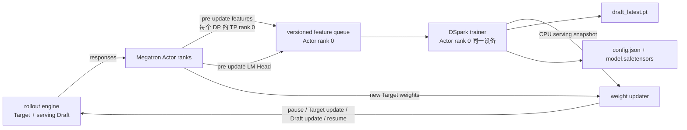

# VIME DSpark 在线增量训练设计

> 状态：MVP 已实现并完成代码级回归；本地 vLLM/vLLM-Ascend 源码契约已审查，真实 NPU 作业仍待端到端验收
>
> 覆盖提交：`9bc3a9e0`（DSpark Draft training）、`1cb41579`（Draft model save）
>
> 本地运行时源码基线：`vllm@568afb3a1380`、`vllm-ascend@30b44103d376`
>
> Speculators 构建 pin：`af3f1795495b5393c7c9aed3f1d55a42d47878ae`
>
> 最后更新：2026-08-19
>
> 适用范围：Megatron Actor、独立 Qwen3 DSpark checkpoint、vLLM/vLLM Ascend rollout

## 1. 摘要

VIME 在 RL 训练循环内维护两套不同职责的模型：

- Actor/Target 使用 RL loss 更新，是最终生成分布的定义者；
- DSpark Draft 使用当前 Target 的 hidden state 和 LM Head 做监督蒸馏，目标是提高投机 token 的接受长度；
- Draft 不接收 reward、advantage、PPO 或 GRPO 梯度，因此这里是“伴随 RL 的在线持续蒸馏”，不是 Draft 与 Actor 的联合 RL；
- rollout engine 始终由 Target 验证 Draft token。使用标准无损 rejection sampling 时，Draft 质量或版本滞后影响接受率和吞吐，不应改变 Target 输出分布。

两个提交的职责如下。

| 提交 | 核心能力 | 最终实现边界 |
| --- | --- | --- |
| `9bc3a9e0` | DSpark 特征采集、原生 loss、在线优化、热发布、`draft_latest.pt` 保存/恢复 | Actor rank 0 单卡串行训练；独立 dense Qwen3 Draft |
| `1cb41579` | HF/Speculators 两文件导出、checkpoint preflight/兼容、Ascend 热更新加固 | 可回滚目录交换；一个 packed snapshot 完成 DSpark 更新 |
| 本次精简 | 收紧 checkpoint 契约、修正训练开关、删除推断式兼容代码和冗余测试 | 只接受可验证的规范 schema；不再从 tensor shape 或 Target 默认值猜配置 |

本次精简的原则是：checkpoint schema 与依赖版本必须成为显式契约，运行时不负责修复含义不确定的模型元数据。这样删除了大量 shape recovery、RoPE 猜测、Pydantic 校验后回写和对应白盒测试，同时保留训练、发布、恢复以及 staging + 可回滚目录交换导出的核心能力。

## 2. 目标与非目标

### 2.1 目标

- 在不修改 Actor RL loss 的前提下，持续训练独立 DSpark Draft；
- 从 Actor 的 pre-update forward 复用 token、辅助层 hidden state、final hidden state 和 LM Head；
- 严格隔离不同 Target 版本的特征；
- 使用 Speculators 原生 DSpark forward、loss、Markov head 和 confidence head；
- 在同一次 generation pause 中依次更新 Target 与 Draft；
- 保存可恢复训练状态，并导出 vLLM 与 Speculators 都可读取的模型目录；
- 在 Ray/NPU 资源分配前尽可能完成参数与本地 checkpoint 校验；
- 让“是否训练 Draft”只由显式开关控制。

### 2.2 非目标

- 不在 vLLM inference model 上执行 backward；
- 不把 reward 或 policy-gradient loss 施加到 Draft；
- 不支持 DeepSeek-V4 `mtp.*` 内嵌 DSpark、Gemma、MoE Draft 或不同 hidden width；
- 不自动从权重 shape、Target 配置或默认常量恢复缺失的 Draft 架构；
- 不提供 dedicated Draft Ray worker、Draft DDP 或 Actor/Draft 并行优化；
- 不提供 validation gate、Target/Draft pair transaction、checksum manifest 或自动回滚；
- 不保证启用投机推理一定提升吞吐。

## 3. 支持矩阵与硬约束

### 3.1 模型与运行时

| 项目 | 支持 | 说明 |
| --- | --- | --- |
| 本次设计与改动范围 | DSpark | EAGLE3 是既有路径，不在本文改动范围内 |
| DSpark backbone | dense Qwen3 | `transformer_layer_config.model_type` 必须精确为 `qwen3` |
| checkpoint | 独立 Speculators DSpark | 必须有明确 discriminator、config 和权重 |
| Target/Draft hidden width | 相同 | 当前 Speculators `fc` 构造不支持跨宽度 |
| Markov head | `vanilla` | `gated`、`rnn` 不进入当前 serving 契约 |
| confidence head | 可选 | 开启时必须 `confidence_head_with_markov=true` 且 `markov_rank>0`；当前 Ascend 动态 verify-length 仅在 MRV1 有明确实现 |
| vocabulary mapping | 全词表可省略；裁剪 vocab 时必需 | reduced-vocab checkpoint 必须在 serving checkpoint 内含有效成对 `t2d`/`d2t`；Qwen3 DSpark 禁止 trainer-only mapping override |
| vLLM acceptance | 只允许标准 rejection sampling | 本地 vLLM 还实现了 `synthetic`/`block`，但 VIME External Draft validation 只允许 `rejection_sample_method=standard`；旧 typical/top-k 配置同样被拒绝 |

### 3.2 训练拓扑

当前 External Draft MVP 要求：

- `--train-backend=megatron`；
- disaggregated rollout，不能使用 `--colocate`；
- 必须提供 `--hf-checkpoint` 或 `--draft-target-embedding-path`；
- 必须提供 vLLM speculative config，`method=dspark`，其中 `model` 必填且必须与 `--draft-model-path` 字符串完全相同；
- `num_speculative_tokens` 必须显式提供、为正且不超过 checkpoint 的 proposal capacity；本文 Qwen3 hybrid 只有 `block_size`、没有 vLLM 用于默认推导的 `n_predict`；
- `pipeline_model_parallel_size=1`；
- `context_parallel_size=1`；
- `virtual_pipeline_model_parallel_size=1`；
- `--update-weight-mode=full`；
- `--update-weight-transport=nccl`，Ascend 内部实际使用对应 HCCL engine；
- 不得用自定义 `--vllm-worker-extension-cls` 替换 VIME extension；当前本地 Ascend
  `NPUWorker` 依赖该 extension 补齐 Draft update session；
- 不启用 `--debug-rollout-only`、`--debug-train-only`、`--release-train`、`--keep-old-actor`、MTP training 或 routing replay；
- Draft trainer 只创建在 Actor global rank 0，并以 `distributed=False` 运行。

`--draft-num-nodes` 与 `--draft-num-gpus-per-node` 仅为旧脚本兼容而保留，当前被忽略，不会分配独立 Draft placement bundle。

## 4. 最终架构与所有权



所有权边界：

| 对象 | 所有者 | 生命周期 |
| --- | --- | --- |
| Actor 参数与 optimizer | Megatron Actor ranks | RL job |
| feature hooks | 每个 Actor rank | 仅采集 forward 的上下文内 |
| Draft trainer、optimizer、queue | Actor global rank 0 | 与该 Actor worker 相同 |
| serving Draft | 每个 rollout engine | vLLM server 生命周期 |
| pending Draft snapshot | Actor rank 0 / Ray object store | 一次发布周期 |
| `draft_latest.pt` | Actor rank 0 文件系统 | 训练恢复 |
| HF 两文件目录 | Actor rank 0 文件系统 | 部署或后续继续训练 |

Draft 优化发生在所有 Actor rank 完成本轮训练之后，由 driver 同步调用 Actor rank 0。它与 Actor optimizer 当前是串行关系；同卡并行训练不在本实现范围内。

## 5. 训练开关与运行模式

### 5.1 唯一训练开关

`--enable-external-draft-training` 是创建 feature collector、训练副本和发布路径的唯一开关。

`--draft-save-hf` 只决定是否导出，绝不会隐式执行以下动作：

- 打开 External Draft training；
- 把 `draft_algorithm` 改成 `dspark`；
- 从 `vllm_speculative_config.model` 推断 `draft_model_path`。

如果提供 `--draft-save-hf` 却没有显式训练开关，参数校验立即失败。这避免了“命令行看似关闭训练，但保存选项又把训练打开”的双重语义。

反过来，不设置 `--draft-save-hf` 也不会关闭训练。只要显式设置
`--enable-external-draft-training` 并通过其他配置校验，VIME 仍会创建独立 Draft
模型与 optimizer，执行 feature collect、backward/step 和 serving Draft 热发布；唯一少掉的是
HF/Speculators 两文件目录导出。若同时也没有 `--draft-checkpoint-path`，任务期间仍会训练和热更新，
但结束后不留下 HF 模型目录或可恢复的 `draft_latest.pt`。

### 5.2 三种模式

| 模式 | 关键参数 | 行为 |
| --- | --- | --- |
| 仅推理 | 只配置 vLLM `method=dspark` | 加载固定 serving Draft；不采特征、不训练、不导出 |
| 在线训练与发布 | 显式 enable + algorithm/path + vLLM config | 按 collect/train/publish interval 及有效数据/candidate 门控执行；可选保存恢复 checkpoint |
| 在线训练、发布并导出 | 上述参数 + `--draft-save-hf` | 在保存周期和最终 rollout 额外写两文件目录 |

最小在线训练与热发布示例（不导出、不持久化）：

```bash
--enable-external-draft-training \
--draft-algorithm dspark \
--draft-model-path /models/qwen3-dspark \
--draft-target-embedding-path /models/qwen3-target \
--draft-feature-layer-ids 2,10,18,26,34 \
--draft-collect-interval 1 \
--draft-train-interval 1 \
--draft-publish-interval 1 \
--draft-train-steps-per-trigger 10 \
--draft-batch-size-per-gpu 4 \
--draft-dspark-loss-fn '{"ce":0.1,"tv":0.9}' \
--save-interval 10 \
--vllm-speculative-config '{"method":"dspark","model":"/models/qwen3-dspark","num_speculative_tokens":4}'
```

需要恢复训练时再加 `--draft-checkpoint-path /outputs/draft-state`；需要可直接重新加载的
HF/Speculators 目录时再加 `--draft-save-hf '/outputs/dspark-{rollout_id}'`。

恢复训练要求 Actor checkpoint 与 `draft_latest.pt` 的 rollout 对齐，因此推荐让
`--draft-save-interval` 保持未设置，使 Draft 保存跟随 Actor 的 `--save-interval`。
显式设置独立 Draft 保存周期虽然受支持，但如果它覆盖了一个比最近 Actor checkpoint
更新的 `draft_latest.pt`，进程崩溃后会因 `saved rollout_id + 1` 与 Actor
`start_rollout_id` 不一致而 fail fast。最后一个 rollout 仍会强制保存 Draft；要获得可恢复
pair，必须同时配置并完成对应的 Actor 保存。

## 6. 依赖与 checkpoint 契约

### 6.1 固定源码基线

当前 `Dockerfile.npu` 构建配方同时安装 Speculators 与仓库内的 `hs_connectors`，默认固定到：

```text
af3f1795495b5393c7c9aed3f1d55a42d47878ae
```

固定 revision 的原因不是构建便利，而是以下对象必须一致：

- Pydantic schema；
- `DSparkSpeculatorConfig` 的字段默认值与序列化行为；
- Draft 参数名和 tensor layout；
- native `get_trainer_kwargs()` 与 loss 指标；
- vLLM serving loader 预期。

替换 revision 时必须使用同一个真实 checkpoint 完成 config parse、权重 load、一步 backward、HF export/reload 与 serving load 验证。

`af3f1795495` 声明的 Transformers 上界为 `<5.15.0`。`Dockerfile.npu` 使用 `--no-deps`
安装 Speculators，因此不会自动修正基础镜像中的依赖版本；目标镜像需另行验证已安装
Transformers 满足该范围。该 revision 也早于 Laguna-style nested `rope_parameters`
展平修复，本文密集 Qwen3 范围不依赖该布局；其他 checkpoint 必须额外做 RoPE 初始化验收。

仅固定 Speculators 还不足以定义完整运行时契约。本次设计与审查使用工作区中的真实源码，而不是用 `Dockerfile.npu` 的默认基础镜像 tag 推断能力：

```text
D:/fork_code/vllm         568afb3a13806beb53bb2e6bd518269357b237c0
D:/fork_code/vllm-ascend  30b44103d3762c03aa0c7e1e3234171234c39f09
```

该 vLLM revision 已包含 `method=dspark`、`Qwen3DSparkModel` 注册、DSpark
speculator、`/start_draft_weight_update` 路由以及 weight-transfer target 切换状态机；该
vLLM-Ascend revision 已包含 Qwen3 DSpark model/proposer、V1/V2 接入与 HCCL transfer
engine。当前 Ascend `NPUWorker` 没有原生 `start_draft_weight_update()`，所以 VIME 的
worker compatibility extension 仍是这两个 revision 组合中的必要适配。VIME 启动 server
时同时打开本地 vLLM 的 dev-mode route，使 `/start_draft_weight_update` 可被控制面调用。

`Dockerfile.npu` 的 `BASE_IMAGE_TAG=v0.22.1rc1-a3` 只是默认镜像构建输入，不是本文分析
的运行时版本，也不能证明或否定上述本地源码能力。如果实际部署使用这两个本地仓库，镜像或
启动环境必须明确安装/挂载这两个 revision，并记录 dirty state；若仍从默认 base image
构建，则必须另外验证镜像内源码与上述 revision 等价。生产记录应至少包含 base image
digest、vLLM commit、vLLM-Ascend commit、Speculators commit、VIME commit 与所有 patch。

此外，当前 Dockerfile 仍按 `ascend` 分支浅克隆 VIME 自身，没有 VIME commit build arg；
仅运行该 Dockerfile 不能保证镜像包含本文覆盖的两个 VIME commit及当前精简补丁。

### 6.2 规范 config

训练入口至少要求：

- `speculators_model_type="dspark"`；
- `transformer_layer_config` 为对象；
- `transformer_layer_config.model_type="qwen3"`；
- `hidden_size`、`intermediate_size`、层数、attention/KV head 数、`head_dim` 与
  `vocab_size` 必须在 raw nested config 中显式存在，不能由 Qwen 默认值补齐；
- checkpoint 自身必须包含 `aux_hidden_state_layer_ids`；CLI 若同时提供只能做精确一致性校验，不能补缺失元数据；
- `block_size>=2`；
- `mask_token_id` 位于 verifier vocabulary 范围内；
- `markov_head_type="vanilla"`；
- `sample_from_anchor` 为布尔值；
- confidence 与 Markov 配置满足支持矩阵。

本地目录还必须包含至少一个 `*.safetensors` 或 `pytorch_model*.bin` 权重文件。仅有 `config.json` 的目录会在 driver 上失败，不再把错误推迟到 Ray worker 或 vLLM server。

### 6.3 唯一保留的兼容归一化

当前 Speculators 把 `speculators_config` 声明为带 `None` 默认值的 Pydantic 模型字段。缺少字段可以使用默认值，但旧 `save_pretrained()` 生成的显式 JSON `null` 可能被 Pydantic 拒绝。

VIME 只把：

```json
{"speculators_config": null}
```

归一化为“字段缺失”。这是 typed training-config 解析前唯一保留的兼容修补；typed 校验
通过后，§6.5 还会执行一组确定性的 serving-schema 投影。该投影复制已有字段，不从权重、
Target 或默认常量推断未知结构。

“不猜测”特指 VIME 不再从 tensor shape、Target config、RoPE 常量或任意 wrapper 恢复架构。规范 Speculators config 省略的字段仍可能由已固定 revision 的 typed schema 默认值物化；这些默认值属于被固定的依赖契约，而不是 VIME 自己的恢复逻辑。生成 serving config 时则必须已有完整 Qwen layout 与明确的 `sample_from_anchor`，不会再调用 `AutoConfig` 补默认字段。

这一约束仍不能证明 artifact 的生成 provenance。旧 checkpoint 若缺少 RoPE、norm、layer types/SWA 等不改变 tensor shape 的语义字段，固定 schema 可能用当前默认值物化，而 strict tensor load 无法发现语义差异。生产验收必须记录 checkpoint 所用 Speculators revision；后续 schema 应把这些语义字段或其 fingerprint 写进 artifact。

### 6.4 已删除的运行时恢复策略

以下策略具有语义歧义，已从 factory 删除：

- 扫描 safetensors/bin shape 后猜 hidden size、FFN size、层数、head 数和 vocabulary；
- 从 Target config、Megatron `rotary_base` 或常量猜 RoPE；
- 从 Target 深度猜缺失的 auxiliary layer IDs；
- 从 wrapper 中递归寻找一个“看起来像 Qwen”的嵌套 config；
- Pydantic `from_dict()` 成功后再用 `setattr` 回写 layout；
- config 与权重不匹配时继续部分随机初始化。

这些路径会让一个损坏 checkpoint“看起来能启动”，却无法证明训练语义与原模型相同。新行为是 fail fast，并要求从原 checkpoint 重新导出。

### 6.5 vLLM/Speculators 双兼容 config

Speculators 使用嵌套 `transformer_layer_config`，而当前 vLLM Qwen3 DSpark loader 还需要顶层 Qwen 字段。`make_dspark_vllm_compatible_config()` 保留嵌套对象，同时镜像完整 Qwen layout，并写入：

```json
{
  "model_type": "qwen3",
  "architectures": ["Qwen3DSparkModel"],
  "speculators_model_type": "dspark",
  "sample_from_anchor": true,
  "dspark_bonus_anchor": false,
  "dflash_config": {
    "mask_token_id": 151669,
    "target_layer_ids": [1, 9, 17, 25, 33]
  }
}
```

`sample_from_anchor` 是 Speculators 的训练侧语义，vLLM 使用相反方向的 `dspark_bonus_anchor`，转换关系固定为 `dspark_bonus_anchor = not sample_from_anchor`。缺少这个映射会造成 proposal/verify 位置错位。

`dflash_config.target_layer_ids` 决定 vLLM Draft `fc` 的输入宽度，必须与 `aux_hidden_state_layer_ids` 做 `-1` 转换后严格对应；只写顶层字段不足以兼容所用 vLLM loader。`sliding_window_non_causal=false` 时省略全局 `causal` override，让 vLLM 保持 sliding causal/full non-causal 的逐层默认；为 true 时写 `dflash_config.causal=false`。

对于结构完整但只缺 vLLM 顶层字段的本地 Speculators checkpoint，driver 会先完成 typed
config preflight，再原子替换原目录中的 `config.json`。这不是按 provenance 识别“旧
VIME 导出”，而是会规范化所有满足契约的本地 checkpoint；因此目录必须可写。这一过程只
桥接已知 schema 与 alignment 差异，不从 tensor shape 恢复未知结构。

这里的 driver preflight 不会加载完整权重；strict weight completeness 检查发生在随后
Actor 构造训练副本时。因此，一个 config 可解析但与权重不匹配的 artifact 可能先被写入
规范化后的 `config.json`，之后才因 strict load 失败。生产 artifact 应在只读副本上先完成
config + weight round-trip，或由离线迁移工具生成新目录，避免在未知 checkpoint 上原地升级。

远程 model ID 无法原地规范化。由于通用 `model_type=speculators` adapter 在 vLLM GPU/V2 与 Ascend V1 对 anchor 字段的映射不一致，External Draft training 只接受已经包含完整 direct Qwen3 hybrid 字段的远程 checkpoint；canonical adapter schema 会在 driver 上拒绝，并提示先下载到本地规范化。远程权重不做 driver preflight，错误可能先在 rollout server 启动时暴露，也可能在随后 Actor 实际加载时暴露。

## 7. 每轮真实时序与版本语义

```mermaid
sequenceDiagram
    participant R as rollout Target Tn / Draft Dn
    participant A as Actor
    participant D as Draft trainer
    participant F as filesystem
    participant U as weight updater

    R->>A: rollout responses
    A->>A: pre-update forward
    A->>D: hidden(Tn), final-hidden(Tn), LM Head(Tn)
    A->>A: Actor optimizer step -> parameters Tn+1
    D->>D: interval/accepted gate; supervised steps against Tn
    D->>U: Draft Dn+1, trained_against=Tn
    A->>U: Target Tn+1
    A->>F: save Actor Tn+1 when due
    D->>F: save/export Draft candidate when due
    U->>R: pause generation
    U->>R: publish Target Tn+1
    U->>R: publish Draft Dn+1
    U->>R: continue generation
```

需要特别注意：特征和 LM Head 在 Actor optimizer 之前采集。Actor 随后更新为下一版本，而
Draft 使用旧版本 Target 的 teacher 数据训练。如果成功训练和发布发生在同一 rollout，
serving 组合是：

```text
Target = Tn+1
Draft.trained_against_target_version = Tn
```

这是同轮发布时最小且典型的一版本 lag。`VersionedFeatureQueue` 能保证一个 Draft batch 内
不混用 Tn 与其他版本，但不能把 pre-update 特征自动变成 Tn+1 特征。collect、train、publish
各有独立 interval；如果一个 candidate 在更晚 rollout 才发布，当前 Target 已继续更新，实际
gap 可以大于 1，当前还没有 `target_version_gap` 门控。

三个 interval 的控制语义如下：

- 只有本轮 collect 的 `accepted>0` 且同时命中 train interval 才尝试训练；不能仅凭 queue
  中已有旧样本触发；
- 每次成功训练都会冻结不可变 candidate：`candidate_draft_version`、
  `candidate_target_weight_version` 和一份 CPU `lm_head`；后续 collect 同步新的 live 双 head
  不会污染它；
- `trained=0` 不覆盖最后一次成功训练结果，也不创建新 candidate；旧的未发布 candidate
  仍可在以后独立命中的 publish interval 发布；
- group 在 staging 前同时比对 snapshot 的 Draft version 与 teacher Target version，任何
  candidate/envelope 漂移都 fail fast。

同轮真实顺序是：Draft 训练成功后更新 candidate 元数据并冻结一份 CPU LM Head → 若 publish
命中则物化完整 CPU serving snapshot → 发起 Actor checkpoint 保存 → Draft checkpoint/HF
export → stage/publish Target 与 Draft。Actor 开启
async save 时，非最终轮只保证已发起
保存；最终轮的 `force_sync` 才保证当轮文件已经落盘。由此得到三个边界：

- `draft_latest.pt` 和 HF 目录表示保存时最近的完整 candidate（也可能仍是旧版本或版本 0
  的初始化状态）；版本 0 也使用初始化时冻结的 head，不会混入一次无有效训练的后续 collect
  head。artifact 不表示 rollout engine 已成功发布；
- Draft checkpoint 的实际 key 是 `target_weight_version`，其语义是 candidate 的 teacher
  版本；publish payload 才使用 `trained_against_target_version`；
- 同轮成功训练时 Actor checkpoint 对应 Tn+1、Draft candidate 对应 teacher Tn；错峰保存/
  发布时必须用显式版本字段计算 gap，不能假定固定为 1。

标准 rejection sampling 下，这一 lag 通常只降低接受率；如果运行时存在近似接受或未完整验证路径，则必须单独审计输出分布正确性。

消除最小 lag 的严格方案是 Actor optimizer 后再执行一次 no-grad forward，采集 Tn+1
hidden/LM Head，再训练并发布 Draft；当前未实现，因为它会增加一次 Target forward。

## 8. 特征协议

### 8.1 schema v1

`DraftFeatureSample` 当前使用 `FEATURE_SCHEMA_VERSION=1`，主要字段如下。

| 字段 | 含义 |
| --- | --- |
| `input_ids` | feature window 内 token |
| `loss_mask` | response 有效监督位置 |
| `position_ids` / `hidden_positions` | 原序列连续位置 |
| `aux_hidden_states` | 多个指定 Target 层沿 hidden 维拼接后的结果 |
| `final_hidden_states` | 进入 Target output layer 前、已 final-normalized 的 hidden |
| `rollout_id` | 数据来源 rollout |
| `target_weight_version` | teacher Target 版本 |
| `original_sample_id` | DP rank 与样本索引组成的稳定标识 |
| `prompt_length` / `response_length` | 原样本边界 |
| `window_start` / `window_end` | 在原 packed sample 中的位置范围 |
| `aux_layer_ids` | hidden hook 的 Target 层 |
| `algorithm` / `hidden_layout` | DSpark 与 tensor layout 判别 |

schema 中没有 architecture fingerprint、pair ID 或持久化 `document_ids`。`document_ids` 只在 DSpark collator 打包 batch 时临时生成。

### 8.2 hook 与 final hidden 语义

- auxiliary hidden 通过指定 transformer layer 的 forward hook 获取；
- final hidden 通过 output layer 的 forward pre-hook 获取；
- sequence parallel 场景先在 TP group gather；
- 每个 DP replica 只由 TP rank 0 导出 CPU BF16 payload；
- 因 final hidden 已完成 Target final norm，DSpark 训练副本把 `verifier_norm` 替换为 `Identity`，避免重复归一化。

### 8.3 采样与窗口

采集由 rollout、DP rank、sample ID 与 seed 的稳定 hash 控制，支持 `front` 或 `random` window。每个 DP/rollout 受最大样本数、最大 token 数和 window token 数限制。

DSpark 至少要求：

```text
response_length >= block_size + 1
window_rows >= block_size + 2
```

不足一个完整 future block 的样本被跳过。

### 8.4 多 document 打包

Speculators 的 DSpark batch 是一个 packed sequence。VIME 为每个样本生成独立 `document_id`，并把每个 document 最后 `block_size` 个位置的 loss mask 清零，防止 anchor 跨文档选择 future token。

这项 tail mask 是正确性边界，不能作为普通“padding 优化”删除。

## 9. Draft 模型构建与训练

### 9.1 构建

driver 对本地 checkpoint 完成 typed preflight 后，Actor rank 0 使用 `DSparkDraftModel.from_pretrained(output_loading_info=True)` 加载权重。VIME 拒绝 loading diagnostics 中所有未被固定 Speculators 模型显式忽略的 missing、unexpected、mismatched key 与 error message。上游明确忽略的 Target-owned embedding、verifier head/norm 与 vocabulary mapping 仍按其正常语义处理。config/权重 mismatch 时：

- 不设置 `ignore_mismatched_sizes=True`；
- 不接受 partial load；
- 不随机初始化任何 Draft backbone、LM Head、Markov 或已启用 confidence 参数；
- 错误信息报告已解析的关键 layout，要求使用同一次导出的 config 与权重。

NPU 上强制 Draft attention 使用 eager 实现。原因是当前训练 feature window 和 anchor 数有界，而 Speculators 的部分高性能 attention/loss 路径面向 CUDA/ROCm。

### 9.2 teacher state

模型创建后，Target embedding 从 `--draft-target-embedding-path` 或 `--hf-checkpoint` 加载
一次，默认冻结，后续 Actor 版本更新不会重新同步 embedding。若同时恢复
`draft_latest.pt`，其完整 model state（包括 embedding、mapping 和两颗 head）在初始化末尾
覆盖 source checkpoint；VIME 随后重新计算 `draft_to_target_rows` cache，确保 LM Head 同步
使用恢复后的 `t2d`。

Actor global rank 0 在命中 feature collect 周期时导出完整、去除 TP padding 后的 Target LM
Head；同一 Target weight version 至多导出一次并复用 cache。全词表直接逐行对齐；裁剪
vocabulary 必须使用 `--draft-model-path` 内嵌的有效 `t2d`/`d2t`。VIME 按 `t2d` 选择
Target vocabulary 行，并同步到：

- `lm_head.weight`；
- `verifier_lm_head.weight`。

两者都被冻结，不进入 optimizer。成功 optimizer trigger 后，VIME 另存一份 CPU candidate
LM Head；以后 collect 改写 live 双 head 时，checkpoint、HF export 与 serving snapshot 仍使用
该冻结副本，直到下一次成功训练整体替换 candidate。embedding 默认通过
`--draft-freeze-embeddings` 冻结；其余 `requires_grad=True` 参数进入同一个 AdamW，使用统一
learning rate 和 weight decay。

如果 checkpoint 声明裁剪 vocabulary，却缺少有效 mapping，factory 会 fail fast。Qwen3
DSpark 明确拒绝 `--draft-vocab-mapping-path` 作为 trainer-only override，因为 rollout engine
在首次热更新前已从 serving checkpoint 加载 `d2t`；只在 trainer 内覆盖会造成训练 row 与
推理 token 映射不一致。

当前没有 head-only/backbone 两阶段训练，也没有参数组差分 learning rate。

### 9.3 loss

VIME 不重写 DSpark 数学实现。流程是：

1. 调用模型的 `get_trainer_kwargs()` 解析 loss、anchor 和 confidence 参数；
2. collator 生成 Speculators 需要的 packed batch；
3. 调用原生 DSpark forward；
4. 把 native metrics 归一化为 VIME 的 loss、token、accuracy、acceptance 和 confidence 指标；
5. 按有效 token 数缩放、backward、gradient clipping、optimizer step 和 scheduler step。

默认 loss 配置为：

```json
{"ce": 0.1, "tv": 0.9}
```

VIME 在 NPU 上向 `get_trainer_kwargs()` 传入 `loss_implementation="eager"`，在 CUDA 上传入
`"fused"`。当前固定的 Speculators `af3f1795495` 接受 `**kwargs` 但尚不消费该 hint；其
TV/NLA wrapper 通过 `logits.is_cuda` 选择实现，因此在 Ascend NPU 上自动回落到 eager，
acceptance/confidence 则直接用 eager softmax 计算。较新 Speculators revision 会消费该 hint 并可能返回
独立 `tv_loss_fn`；VIME adapter 兼容返回值中有或没有该字段，但本文的固定契约以
`af3f1795495` 的自动非 CUDA eager fallback 为准。

confidence head 始终保持 FP32 训练与发布，其他浮点 serving tensor 按 `--draft-publish-dtype` 转换。

### 9.4 成功条件

只有至少一个 optimizer step 同时满足以下条件时，`draft_version` 才增加：

- 当前 Target version 有匹配 feature；
- 有有效监督 token；
- loss finite；
- gradient norm finite。

没有数据或没有有效 step 时返回 `trained=0` 和 reason，不创建本轮新候选。此前成功但尚未
发布的 candidate 不会被覆盖，仍可在后续 publish interval 命中时发布。

## 10. 热发布协议

### 10.1 serving snapshot

`prepare_publish_snapshot()` 优先调用模型的 `export_for_vllm()`；否则从模型参数构造兼容
snapshot。snapshot 使用最近一次成功训练时冻结的 candidate version、teacher version 与
LM Head，而不是最近一次 collect 后的 live head。DSpark 路径：

- 保留 serving 需要的 Draft 参数；
- 包含与 Target 同步且冻结的 `lm_head.weight`；
- 过滤 `verifier_lm_head`、`verifier_norm` 和其他仅训练端 tensor；
- 非浮点 buffer 保持原 dtype；
- confidence head 强制 FP32；
- 拒绝重复名称、非 tensor 或空 snapshot。

payload 还携带：

```text
draft_version
trained_against_target_version
architecture_fingerprint
algorithm
```

当前 transfer engine 实际只消费 tensor 和算法判别；它不会在 engine 端校验 fingerprint 或 Target/Draft pair。

### 10.2 generation pause 内的顺序

发布顺序为：

1. pause generation；
2. flush cache；
3. 启动 Target weight update session；
4. 发布完整 Target；
5. finish Target session；
6. 启动 Draft weight update session；
7. 发布完整 Draft；
8. finish Draft session并恢复 transfer target；
9. continue generation。

这是“一次 pause 内顺序发布”，不是 Target 与 Draft 的原子 pair transaction。任何 session 失败都会 fail fast；当前没有自动回到上一对权重的机制，异常时可能需要 rollout engine 恢复或重启。

### 10.3 DSpark 单次 packed load

Ascend DSpark loader 对 confidence head 和 fused buffer 重建具有整份模型语义。如果把 snapshot 分成多个 bucket，多次 `model.load_weights()` 可能在中间观察到不完整状态。

因此 DSpark 使用：

```text
packed = true
packed_buffer_size_bytes = sum(all tensor bytes)
packed_num_buffers = 1
```

整个 Draft snapshot 只触发一次发送和一次 loader 调用。非 DSpark External Draft 仍可按普通 buffer limit 分桶。

HCCL 与 NCCL 仅在 engine/args 类型选择上不同，共享同一份 trainer send kwargs 构造，避免两个分支配置漂移。

这一正确性折中有明确内存代价：HCCL producer 会同时保留搬到 NPU 的各 tensor，并再构造同等规模的 packed buffer，传输阶段峰值可能额外接近两份 Draft snapshot。当前没有按可用 HBM 的门控，大型 Draft 在与 Target、训练 Draft 同驻的 Actor rank 0 上可能 OOM。更长期的方案应让 Ascend loader 支持事务结束时一次性重建 confidence/fused state，从而恢复安全分桶；在此之前必须把真实峰值显存纳入目标平台验收。

### 10.4 vLLM Ascend 兼容层

本地 `vllm@568afb3a` 已提供 Draft update HTTP 路由、engine RPC、GPU worker 状态机以及
`WeightTransferEngine.set/reset_weight_update_target()`；本地
`vllm-ascend@30b44103` 的 HCCL engine 继承该 target-switch contract，但 `NPUWorker` 仍只有
Target update session。因此 VIME 只在 NPU worker 缺少 `start_draft_weight_update()` 时补 DSpark 入口；
这个 legacy compatibility hook 不扩展 EAGLE3 或其他算法。如果未来运行时原生提供该方法，
则对所有算法完整保留原实现。

兼容层会：

- 先使用 Ascend MRV1 的 `model_runner.drafter`，保持既有 runner 行为；
- 未找到模型时调用 vLLM 公共 `model_runner.get_draft_model()`，最后兼容 MRV2 的
  `model_runner.speculator` 布局；
- 把 weight transfer target 切到 Draft；
- 在 update 或 finish 成功/失败后恢复 Target；
- 防止 Target 与 Draft session 重入。

engine 的 `supports_draft_weight_update` 有效值必须为 true，并实现 callable set/reset 方法；缺少任一能力
会在开始传输前 fail fast。该兼容层只覆盖上述本地源码契约，不能替代真实 MRV1/MRV2、HCCL
和 NPU 模型加载的端到端测试。

固定 speculative length 的 DSpark 在两个 runner 都有注册；confidence 驱动的动态 verify-length
当前只在 Ascend MRV1 proposer 中有预算更新和消费路径。MRV2 speculator 尚无等价逻辑，因此
不能把“confidence head 已加载”当成 MRV2 已启用动态长度；该组合必须保持固定长度或单独完成
MRV2 动态路径实现与验收。

## 11. 持久化与导出

### 11.1 训练恢复 checkpoint

`--draft-checkpoint-path` 写入：

```text
<path>/draft_latest.pt
```

内容精确包括：

| key | 内容 |
| --- | --- |
| `model` | 完整 Draft training state dict；DSpark 双 head 使用最近成功 candidate 的冻结 LM Head |
| `optimizer` | AdamW state |
| `scheduler` | LR scheduler state |
| `optimizer_steps` | 已完成 optimizer step |
| `draft_version` | 最近成功 candidate 的训练版本 |
| `target_weight_version` | 该 candidate 的 teacher Target 版本 |
| `rollout_id` | 保存 rollout |
| `architecture_fingerprint` | 关键 config 与参数名/shape 布局摘要 |

保存使用临时文件加 `os.replace()`。恢复时 fingerprint 不一致会拒绝加载。

fingerprint 当前只覆盖少量 config 字段与参数名/shape，不包含 dtype、权重内容、vocabulary mapping 内容、`block_size`、具体 auxiliary layer IDs、`sample_from_anchor` 或 mask/alignment 语义；它只能发现部分结构变化，不能作为 checkpoint 身份或发布配对证明。

`model` state 内实际包含恢复所需的 `lm_head.weight` 与训练侧
`verifier_lm_head.weight`；不保存的是独立的 runtime `target_lm_head_weight` cache。该文件还不
包含 gradient scaler、RNG state、feature queue、validation set、driver 的
`last_train_result`/`last_published_draft_version`、pair checksum 或 serving manifest。恢复后的
硬约束与行为是：

- `saved rollout_id + 1` 必须为 0 或与 Actor 的 `start_rollout_id` 相同；
- queue 与 runtime Target-head cache 为空；模型内 candidate 双 head 已恢复，下一次 collect
  会重新同步 live head 并清理不匹配版本，但不会改写冻结 candidate；
- 恢复的 `draft_version` 不会自动 staging/publish，因为 group 的内存门控状态没有恢复；rollout 初始 serving Draft 仍来自 `--draft-model-path`；
- 必须再完成一次成功训练，group 才会重新建立 publish gate 并发布新的 candidate。

### 11.2 HF/Speculators 导出

`--draft-save-hf` 支持固定目录或 `{rollout_id}` 模板。最终目录严格只保留：

```text
config.json
model.safetensors
```

导出流程：

1. 将完整 state dict 转为 CPU contiguous tensor；
2. 调用模型 `save_pretrained(..., safe_serialization=True)`；
3. 检查两文件存在且非空；
4. 用 safetensors reader 校验权重文件可解析且包含 tensor；
5. 把 config 转为 vLLM/Speculators 双兼容 schema；
6. 删除 generation config 等额外产物；
7. 将现有目录移动到唯一 backup；
8. 用目录 rename 安装新目录；
9. 成功后删除 backup，失败时恢复旧目录。

这一协议能在代码捕获到的 swap 异常中回滚，但不是跨进程崩溃事务：若进程恰在旧目录移到 backup 后崩溃，正式路径可能暂时不存在，当前启动逻辑也不会自动扫描并恢复遗留 backup。

最终目录没有“完成标记文件”。`complete=true` 只存在于 Actor RPC 返回值，driver 同时校验 path、weight file、bytes 等字段。

导出目录不能与原始 `--draft-model-path` 或 Actor `--save-hf` 的解析结果相同。多机 Ray 环境应使用所有相关节点可见的共享文件系统。

### 11.3 空训练循环

eval-only 或已完成 resume 可能使 rollout loop 为空。如果显式请求 `--draft-save-hf` 且本次还没有导出，退出前仍调用一次最终导出。这一分支是明确语义，不是重复保存代码；它可能导出零步训练或仅恢复的 candidate，也不表示该 candidate 已发布。

## 12. 可观测性

### 12.1 已实现指标

collect 阶段 RPC 返回：

- `accepted`；
- `received`；
- `queued`；
- `rejected_version_mismatch`；
- `target_weight_version`。

train 阶段 RPC 返回：

- `trained` / reason；
- `draft_version`；
- `target_weight_version`；
- `successful_steps`；
- `loss`；
- `top1_accuracy`；
- `valid_tokens`；
- `grad_norm`；
- `optimizer_steps`；
- `queue_samples`；
- `learning_rate`；
- native 指标存在时的 `accept_rate`、`expected_accept_length`、`confidence_loss`。

tracking 只上报 driver 实际记录的 dict 数值字段，名称带 `draft/collect_`、
`draft/train_` 或 `draft/publish_` 前缀。collect 只有 `accepted>0` 时才被 driver 记录；train
只有同一轮 collect 有接收样本且命中 train interval 时才被调用和记录。因此 RPC 能返回某个
字段，不等于每轮 tracking 中都有该字段。字符串 `target_weight_version` 与 `reason` 只存在于
返回 dict；train RPC 被调用时也会写普通 info log，但 collect 的 `accepted=0`（包括
`no_actor_feature_manifests`）当前既不 tracking 也不写普通日志，是明确的观测盲区。
`rejected_version_mismatch` 是 queue 生命周期内累计值。publish 阶段记录
已发布 `draft_version`。

rollout 侧已有 `spec_accept_rate` 与 `spec_accept_length`，但当前实现是逐样本 ratio 的简单平均，并非基于全局原始计数的加权值。做性能判断时应额外聚合：

```text
sum(spec_accept_token_num) / sum(spec_draft_token_num)
sum(completion_token_num) / sum(spec_verify_ct)
```

### 12.2 尚未实现的指标

- `target_version_gap` 的强制门控；
- confidence ECE/Brier；
- 每位置接受率；
- Target/Draft pair ID；
- Draft forward、Target verify、sampler、HCCL 的分段耗时；
- spec on/off 分布一致性自动测试；
- 基于 batch size 的在线开关收益模型。

## 13. 性能边界

接受率不是充分条件。设一次普通 decode step 耗时为 `T0`，投机一枚 token 时完整一轮耗时为 `Ts`，接受概率为 `a`。拒绝时 Target 仍产出 correction token，接受时产出 Draft token 加 bonus，因此期望产出：

```text
E[tokens per verify] = 1 + a
speedup = (1 + a) * T0 / Ts
```

当 `a=0.6` 时，盈亏条件是：

```text
Ts / T0 < 1.6
```

DSpark K=1 仍需支付 Draft backbone、Markov/sample、aux hidden、2-token Target verify、调度和通信固定成本。高并发下 Target 已 compute/KV/TP 饱和，2-token verify 可能接近普通 decode 的两倍，即使 60% 接受率也会劣化。

当前实现没有自动性能门控。生产环境应按实际 active batch size 分桶 A/B，至少测量 target-only `T0(R)`、spec `Ts(R)` 和 Target `R`/`2R` token shape。若 `Ts/T0>=1.6`，K=1 在 60% 接受率下必然关闭更合理。

## 14. 故障语义

| 故障 | 当前行为 |
| --- | --- |
| 本地 checkpoint 缺 discriminator、nested Qwen config 或权重文件 | driver fail fast；远程 ID 不做权重 preflight，错误可能出现在 rollout server 或 Actor load |
| 显式 `speculators_config:null` | 转成缺失字段后 typed validation |
| config/weight missing/unexpected/shape mismatch | strict loading-info 校验失败，不做 Draft partial init |
| feature Target version 不匹配 | 拒绝或清理旧版本 queue |
| 无有效 feature/loss/gradient | 不创建或发布本轮新版本；此前成功且未发布的 candidate 仍可按 publish cadence 发布 |
| export 文件缺失、损坏或 config 不兼容 | 不替换上一有效目录 |
| 新目录 swap 失败 | 恢复 backup，清理 staging |
| compatibility patch 的 Draft update 中 worker 出错 | 尝试恢复 transfer target，然后 fail fast；原生 API 的恢复语义由对应 runtime 保证 |
| Target/Draft 发布中途失败 | 没有 pair rollback，可能需要恢复 rollout engine |

## 15. 代码精简与测试策略

### 15.1 已精简实现

| 区域 | 删除或合并 | 保留原因 |
| --- | --- | --- |
| DSpark factory | tensor shape 扫描、layout/heads/RoPE 恢复、Pydantic 后回写 | strict typed config + strict weight load 足够且可证明 |
| 参数校验 | `draft-save-hf` 隐式开启训练 | 训练开关必须单一、可预测 |
| Draft group | DSpark export 校验集中到 `export_draft()` | `force_sync` 与 `save_checkpoint` 参数保留为既有 EAGLE3 调用兼容签名 |
| exporter | `export_speculators_model` 兼容别名、重复 config 检查 | 公开入口统一为 `export_hf_model` |
| tests | shape/rope 猜测白盒用例、固定目录重复用例、无效断言 | 测试支持的公开契约和真正失败边界 |

### 15.2 必须保留的回归边界

- capture layer IDs 到 dense vLLM `target_layer_ids` 的 `-1` 转换；
- `dflash_config.target_layer_ids`、`mask_token_id`、attention causal 与 `dspark_bonus_anchor` 的 serving alignment；
- `speculators_config:null` 兼容；
- checkpoint layer IDs 与命令行 override 精确匹配；
- document tail mask 防止跨样本 anchor；
- Target LM Head 同步到两个冻结 head；
- DSpark serving snapshot 过滤训练专用 tensor，并保留非浮点 buffer dtype；
- confidence head FP32；
- source/Actor 目录防覆盖；
- 合法旧导出在新导出失败后仍可用；
- native Draft update API 不被旧版兼容补丁覆盖；
- Draft 更新失败后 transfer target 恢复；
- DSpark snapshot 单次 packed load；
- NPU 向 Speculators 传递 eager hint，并兼容固定 revision 通过非 CUDA 路径自动回落、不返回
  `tv_loss_fn` 的行为；
- missing/unexpected/mismatched Draft tensor fail-fast。

### 15.3 本次测试重构

- Factory 测试从恢复函数的内部细节改成规范/hybrid schema、layer override、配置不变量和 loading-info 完整性；
- 增加对已安装 Speculators config 的真实 Pydantic smoke test，依赖不存在时显式 skip，
  并覆盖导出使用的 hybrid schema；该测试本身尚不校验已安装 package 的 commit；
- 本地 config-only 目录改为 fail-fast 反例；
- `draft-save-hf` 改为显式训练开关真值测试；
- 导出测试使用真实 safetensors，不再把 PyTorch pickle 命名为 `.safetensors`；
- 可回滚目录交换测试在新目录 swap 处注入失败，验证旧目录恢复及 temp/backup 清理；
- source/Actor 目录冲突参数化；
- Actor rank 0 group 测试记录所有 RPC，证明第二个 Actor 未被调用。
- DSpark snapshot 测试验证单次 packed transfer、精确 buffer bytes、单 buffer，以及成功/异常时都释放 rollout lock；lower-level 测试同时验证 packed metadata 到 engine RPC 与 trainer args 的透传；
- NPU/CUDA loss adapter 测试分别验证 `eager`/`fused` hint，同时覆盖返回独立
  `tv_loss_fn` 的新接口和不返回该字段的固定 revision 接口。

### 15.4 仍缺少的 P0 测试

- 锁定 Speculators revision 下真实 DSpark checkpoint 的完整 load、一步 backward、export/reload；
- NPU 镜像构建时校验 Speculators 实际 commit、声明的 torch/transformers/numpy 等版本范围，
  并对关键 NPU loss fallback/loading API 做 required smoke，而不是 `importorskip`；
- 本地 vLLM/vLLM-Ascend revision 的真实 MRV1/MRV2 Draft start/update/finish contract；
- 真实 NCCL/HCCL engine 的 packed snapshot 集成测试，以及 non-source rank/非 tensor 失败边界；
- 本地 Ascend `qwen3_dspark.py` 的 QuaRot 初载分支必须用 single-pass weight iterator
  验证；当前实现先 `list(weights)` 后又遍历原 iterator，generator 输入可能导致 base 权重
  为空，这属于 serving 仓库问题，不在本次 VIME 两提交中静默修补；
- `train.py` 的 periodic、final rollout、empty-loop、resume 保存调度状态机测试；
- NPU 端热更新后 proposal/acceptance 验证；
- Target/Draft 发布任一阶段故障时的端到端恢复测试；
- 同 prompt/seed 的 spec on/off 输出分布一致性与吞吐 benchmark。

## 16. 已知限制与后续路线

以下项目均未实现，不应在当前接口或文档中被当作已有保证：

1. post-update feature capture，消除一版本 Target lag；
2. 独立 Draft worker、Actor/Draft pipeline 并行或 Draft DDP；
3. validation split 与 acceptance/TV/ECE 发布门控；
4. `target_version_gap` 超阈值时自动跳过发布或关闭 speculation；
5. Target/Draft pair manifest、checksum、事务提交和自动 rollback；
6. feature schema v2 的 document ID、architecture fingerprint、artifact provenance 和 alignment contract；
7. head-only/backbone 两阶段训练和 differential LR；
8. Gemma、DeepSeek-V4、MoE、跨 hidden width；
9. serving engine 对 `architecture_fingerprint` 的强校验；
10. 按 batch size、context 和接受率自动选择 K 或禁用 DSpark；
11. 恢复后自动 staging/publish 已保存 Draft，以及 driver publish 状态持久化；
12. 允许 train interval 仅依赖 queue 中已有数据触发，不再要求同一 rollout 新收样本；
13. Target embedding 随 Actor version 同步或显式证明固定 embedding 假设；
14. crash 后自动恢复 HF export backup；
15. 覆盖 block/alignment/dtype/权重身份的强 fingerprint。

建议优先级：先完成真实依赖/真实 NPU contract tests，再实现 post-update strict alignment 和发布端版本门控，最后评估并行训练与更多模型家族。

## 17. 模块映射

| 模块 | 职责 |
| --- | --- |
| `vime/utils/arguments.py` | External Draft CLI |
| `vime/backends/speculative_training/config.py` | 参数、schema、layer/block 与本地 preflight |
| `vime/backends/speculative_training/factories/speculators_dspark.py` | strict config/model 构建与 DSpark 不变量 |
| `vime/backends/speculative_training/feature_collector.py` | Megatron hook、窗口和 CPU payload |
| `vime/backends/speculative_training/feature_schema.py` | schema v1 与 versioned queue |
| `vime/backends/speculative_training/backends/dspark.py` | document packing、native loss adapter、双 head 同步、NPU eager loss 选择 |
| `vime/backends/speculative_training/draft_trainer.py` | optimizer、版本、snapshot、checkpoint、HF export |
| `vime/backends/speculative_training/draft_group.py` | Actor rank 0 RPC facade |
| `vime/backends/megatron_utils/actor.py` | pre-update capture、LM Head export、Draft trainer owner |
| `vime/backends/megatron_utils/update_weight/update_weight_from_distributed.py` | Target/Draft 顺序 session 与整包传输 |
| `vime/backends/megatron_utils/update_weight/update_weight_from_tensor.py` | vLLM-Ascend worker 兼容入口与 target reset |
| `vime/backends/vllm_utils/vllm_engine.py` | Draft update HTTP/Ray metadata 转发 |
| `train.py` | collect/train/save/publish 调度 |

## 18. 生产验收待办

以下前半部分已有代码级回归，后半部分必须在目标镜像和真实 NPU 集群完成，不能由本地 fake/stub 单测替代。

代码级已完成：

- inference-only 模式不创建 Draft trainer；
- `--draft-save-hf` 在训练开关关闭时明确报错；
- 规范 DSpark config 可通过锁定 Pydantic schema，缺字段或非 Qwen3 立即失败；
- 本地 config-only 目录在 Ray 启动前失败；
- 一批 DSpark feature 不跨 Target version、不跨 document anchor；
- native DSpark loss adapter 已验证 backward/metric 映射；完整 `ExternalDraftTrainer.train()` 仍归入目标平台待办；
- DSpark snapshot 含 serving 必需 tensor、过滤训练专用 tensor并维持 dtype；
- DSpark 通过一个 packed buffer 更新，session 后恢复 Target；
- `draft_latest.pt` 可恢复 model/optimizer/scheduler/version；
- HF 导出单测生成两文件与 hybrid schema，并由可用时的真实 Speculators typed config 解析；实际两端 model reload 仍归入目标平台待办；
- 可捕获的导出 swap 失败不破坏上一有效目录。

目标平台待完成：

- 固定真实 DSpark checkpoint 完成 config parse、strict load、一步 NPU backward、HF export/reload；
- HF 产物经锁定 vLLM loader 构造，校验 `fc` 宽度、layer IDs、mask、anchor 和 causal 语义；
- 真实 vLLM-Ascend worker 完成 Draft start/update/finish 和任意阶段故障恢复；
- 真实 HCCL packed snapshot 完成整包传输、加载与 proposal/acceptance 检查；
- 同 prompt/seed 做 spec on/off 输出分布正确性检查；
- 按 active batch size 完成 target-only/spec 吞吐、ITL、TTFT 与资源利用率 A/B。
