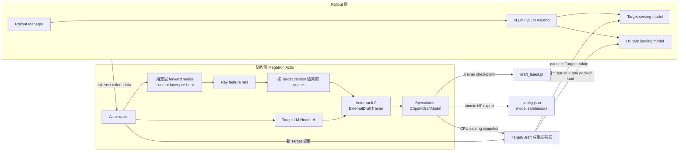
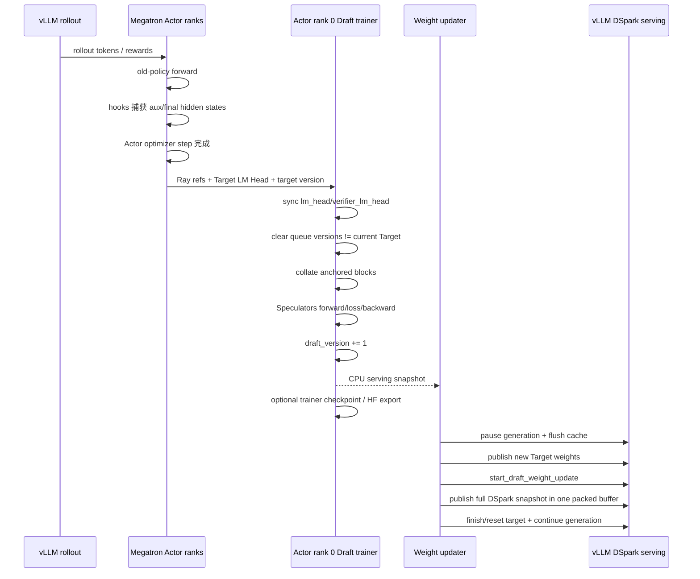
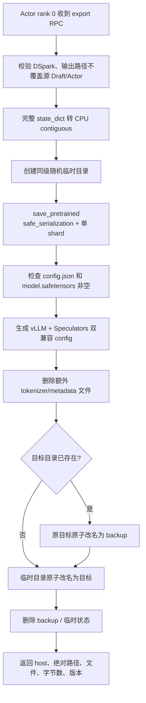

# DSpark 原理与 VIME 在线增量训练适配详解

> 本文面向需要阅读、维护或部署当前 VIME DSpark 实现的开发者。原理部分以 DSpark 论文和
> `vllm-project/speculators` 的公开实现为准；工程部分严格对应 VIME 最近两个提交：
>
> - `9bc3a9e072643b2e1b6ae4a87c938308f942a61e`：`feat: add dspark draft training`
> - `1cb41579514fb2d612022f773ad0ca150869f172`：`feat: add draft model save`
>
> 下文覆盖这两个提交中除测试代码外的全部工程改动。它描述的是当前代码实际已经实现的能力，
> 不把原设计文档中的后续规划误写成已落地功能。

## 1. 结论先行

这两个提交完成的不是一个独立的 DSpark 训练框架，而是把 Speculators 提供的 DSpark 训练模型
接入 VIME 已有的 External Draft 在线训练闭环：

1. vLLM 使用当前 Target/Actor 权重生成 rollout；
2. Megatron Actor 在旧策略前向中捕获指定层 hidden states、最终归一化 hidden states、token 和 loss mask；
3. Actor rank 0 上常驻一个独立的 Speculators `DSparkDraftModel` 训练副本；
4. VIME 将同一 Target 版本的特征打包为 DSpark anchored-block batch，调用 Speculators 原生
   forward 和复合损失；
5. 训练后的 serving-owned Draft 权重与新 Target 权重在同一次 generation pause 内依次发布到
   vLLM/vLLM Ascend；
6. Draft 还可以原子导出成同时可被 Speculators 继续训练、可被 vLLM 直接加载的
   `config.json + model.safetensors` 目录。

当前实现边界如下：

| 维度 | 当前实现 |
| --- | --- |
| Target/Draft 家族 | 稠密 Qwen3、Target hidden size 与 Draft hidden size 相同 |
| Draft checkpoint | Speculators DSpark 格式；兼容并可修复部分旧版 VIME 导出配置 |
| Markov head | serving 路径只允许 `vanilla` |
| Confidence head | 支持；Qwen 路径要求 `confidence_head_with_markov=true` |
| 训练设备 | CUDA 或 Ascend NPU；NPU 使用 eager attention 和 eager TV/NLA loss |
| Draft 训练放置 | Actor rank 0 单设备串行训练，不新建 Ray placement group |
| 特征来源 | Megatron Actor 旧策略前向；PP=1、CP=1、VPP=1 |
| 权重传输 | 非 colocate、full update、NCCL/HCCL packed weight transfer |
| 在线发布 | Target 与 Draft 共用一次 generation pause；DSpark 使用单个 packed buffer |
| 持久化 | trainer checkpoint `draft_latest.pt`；serving/HF export 两文件目录 |
| 未覆盖 | Gemma、DeepSeek-V4 `mtp.*` 内嵌 DSpark、MoE Draft、异步跨 Target 版本训练 |

## 2. 投机解码基础

### 2.1 Target、Draft 与无损验证

普通自回归生成每次 Target 前向只产生一个 token。投机解码引入一个更小、更快的 Draft 模型，
先提出长度为 \(\gamma\) 的候选块：

\[
x_1,x_2,\ldots,x_\gamma \sim p^d
\]

Target 随后用一次并行前向计算这些位置的分布 \(p_k^t\)，并从左向右进行 rejection sampling。
第 \(k\) 个 Draft token 的接受概率为：

\[
A_k=\min\left(1,\frac{p_k^t(x_k)}{p_k^d(x_k)}\right)
\]

一旦第 \(k\) 个 token 被拒绝，后缀 \(x_{k+1:\gamma}\) 全部作废；Target 从修正分布生成替代
token。正确实现的验证过程保持 Target 原始分布不变，因此“Draft 猜错”只影响性能，不改变生成质量。

若一次循环接受 \(\tau\) 个 token，Draft 和 Target 验证耗时分别为
\(T_\text{draft}\) 与 \(T_\text{verify}\)，平均每 token 延迟近似为：

\[
L=\frac{T_\text{draft}+T_\text{verify}}{\tau}
\]

因此 Draft 的优化目标有三类：减少 Draft 延迟、提高接受长度、减少无收益的 Target 验证工作。

### 2.2 自回归 Draft 与并行 Draft 的矛盾

自回归 Draft 逐 token 生成，后一个候选显式依赖前一个候选，候选质量高，但其开销大致随
\(\gamma\) 线性增长。DFlash 一类并行 Draft 则用一次前向同时预测整个 block，Draft 延迟对
block size 不敏感，但 block 内各位置缺少对已采样前驱 token 的条件依赖。

例如上下文允许 `of course` 和 `no problem` 两种延续。完全并行的两个位置分别对边缘分布取样，
可能组合成 `of problem`。越靠后的 token 越容易受这种多模态碰撞影响，表现为 suffix acceptance
快速衰减。

## 3. DFlash：DSpark 的并行骨干

DSpark 的重计算部分继承自 DFlash。设 Target 选择了 \(m\) 层 hidden states：

\[
H^{(l_1)},H^{(l_2)},\ldots,H^{(l_m)}
\]

这些状态在 hidden 维拼接后，经投影和 RMSNorm 得到 Target 上下文特征：

\[
H_\text{ctx}=\operatorname{RMSNorm}
\left(W_c[H^{(l_1)};\ldots;H^{(l_m)}]\right)
\]

Draft layer 把 Target 上下文作为 KV 注入，并对 anchor/mask query 使用非因果 block attention：

\[
K_i=[W_i^K H_\text{ctx};W_i^K H_d],\qquad
V_i=[W_i^V H_\text{ctx};W_i^V H_d]
\]

一次 Draft backbone 前向就能得到全部 block 位置的 hidden states \(h_1,\ldots,h_\gamma\) 和基础
logits \(U_1,\ldots,U_\gamma\)。Target embedding 和 LM Head 在原算法中共享并冻结；VIME 的
实现采用独立训练副本，但会从当前 Target 版本同步这些 frozen 权重，语义上仍然是共享。

### 3.1 Anchor 与两种位置约定

Anchor 是上一次 Target 验证产生的最后一个 token，也是新一轮 Draft 的条件起点。checkpoint
可能采用两种约定：

- `sample_from_anchor=true`：anchor 位置本身产生第一个 Draft prediction；输入是一个 anchor 加
  \(\gamma-1\) 个 mask，共产生 \(\gamma=block\_size\) 个候选；
- `sample_from_anchor=false`：anchor 只提供上下文，后续 mask 位置产生候选，最多产生
  \(block\_size-1\) 个候选。

这不是可随意切换的运行参数，而是 checkpoint 的训练/张量布局语义。VIME 在启动时用它检查
`vllm_speculative_config.num_speculative_tokens` 是否超过 checkpoint 容量。

## 4. DSpark：并行骨干加轻量顺序修正

### 4.1 半自回归两阶段结构

DSpark 把生成拆成两阶段：

1. 重型 DFlash backbone 并行得到所有位置的 \(h_k\) 和 \(U_k\)；
2. 轻量顺序 head 从左到右读取已经采样的前驱 token，向 \(U_k\) 添加条件 bias。

完整 block 分布因此重新获得因果分解：

\[
P(X\mid x_0)=\prod_{k=1}^{\gamma}
p_k(x_k\mid x_0,x_{<k})
\]

\[
p_k(v\mid x_0,x_{<k})=
\operatorname{softmax}\left(U_k(v)+B_k(x_0,x_{<k},v)\right)
\]

绝大多数算力仍在一次并行 backbone 中；顺序部分只操作低秩向量和 vocabulary projection，因而
保留并行 Draft 的低延迟，同时缓解后缀质量衰减。

### 4.2 Vanilla Markov Head

当前 VIME Qwen serving 路径只允许 vanilla Markov head。它仅依赖前一个 token，使用低秩分解
近似完整的 \(|V_t|\times|V_d|\) 转移矩阵：

\[
e_{k-1}=W_1[x_{k-1}]\in\mathbb{R}^{r}
\]

\[
B(x_{k-1},\cdot)=e_{k-1}W_2^T\in\mathbb{R}^{|V_d|}
\]

其中：

- `markov_head.markov_w1.weight` 形状为 `[verifier_vocab_size, markov_rank]`；
- `markov_head.markov_w2.weight` 形状为 `[draft_vocab_size, markov_rank]`；
- 默认 `markov_rank=256`；设为 0 表示禁用 Markov head。

论文还定义了 gated/RNN 变体，但这两个 commit 没有为当前 vLLM Ascend Qwen 发布路径开放它们。

### 4.3 Confidence Head

Confidence head 对每个位置输出一个标量，估计“在前缀已经全部通过的条件下，本位置也能通过
Target 验证”的概率：

\[
c_k=\sigma\left(w^T[h_k;W_1[x_{k-1}]]+b\right)
\]

当 `confidence_head_with_markov=true` 时，其输入宽度为
`hidden_size + markov_rank`；否则仅为 `hidden_size`。当前 Qwen 路径要求前者。vLLM Ascend
使用 FP32 confidence 参数和 logits，因此 VIME 即使以 BF16 训练主体，也会把 confidence head
保持为 FP32，并在在线发布时保留该精度。

Confidence 的软监督标签来自 Draft 与 Target 分布的 total variation distance：

\[
c_k^*=1-\frac{1}{2}\lVert p_k^d-p_k^t\rVert_1
\]

它正好是该位置在 rejection sampling 下的期望接受概率。

### 4.4 Confidence-scheduled Verification

单个位置的 confidence 是条件概率。长度为 \(j\) 的整个前缀存活概率为：

\[
a_{r,j}=\prod_{i\le j}c_{r,i}
\]

论文的 hardware-aware scheduler 针对所有活跃请求，把每个“再延长一个 token”的边际收益
\(a_{r,j}\) 排序，并结合实测的 `SPS(B)` 曲线选择验证 batch size：

\[
B=\sum_r(1+\ell_r)
\]

\[
\tau=\sum_r\left(1+\sum_{j=1}^{\ell_r}a_{r,j}\right)
\]

\[
\Theta=\tau\cdot SPS(B)
\]

调度器沿收益递减路径扩展 prefix，在预期吞吐首次不再提高时停止。这个 early-stop 还承担
non-anticipating 约束：决定是否验证位置 \(k\) 时不能偷看依赖未来候选的信号，否则会引入选择
偏差，破坏无损性。

需要区分职责边界：这两个 VIME commit 训练并发布 confidence head，但没有在 VIME 内实现论文的
SPS profiling 和全局 scheduler；实际推理/调度由安装的 vLLM/vLLM Ascend DSpark 实现负责。

## 5. DSpark 训练目标

Target 全程冻结。可训练部分是 Draft backbone、Markov head 和 confidence head；embedding、
`lm_head`、`verifier_lm_head` 从当前 Target 同步并冻结。

对于 block 内第 \(k\) 个位置，Speculators 支持固定指数衰减或 DPaCE 位置权重。论文中的固定权重为：

\[
w_k=\exp\left(-\frac{k-1}{\gamma}\right)
\]

总损失由三部分组成。

Ground-truth cross entropy：

\[
\mathcal{L}_{ce}=-\sum_{k=1}^{\gamma}w_k\log p_k^d(x_k^*)
\]

Draft/Target 分布匹配：

\[
\mathcal{L}_{tv}=\sum_{k=1}^{\gamma}w_k
\lVert p_k^d-p_k^t\rVert_1
\]

Confidence soft-label BCE：

\[
\mathcal{L}_{conf}=-\sum_{k=1}^{\gamma}w_k
\left[c_k^*\log c_k+(1-c_k^*)\log(1-c_k)\right]
\]

最终目标为：

\[
\mathcal{L}=\alpha_{ce}\mathcal{L}_{ce}+
\alpha_{tv}\mathcal{L}_{tv}+
\alpha_{conf}\mathcal{L}_{conf}
\]

VIME 默认把 `--draft-dspark-loss-fn` 设为 `{"ce": 0.1, "tv": 0.9}`，
`--draft-dspark-confidence-head-alpha=1.0`，与论文默认组合一致。具体 loss 构造和 forward 仍由
Speculators 决定，VIME 只传参、做设备兼容替换，并把指标归一化到自身日志体系。

## 6. VIME 适配的总体架构



三个设计选择最重要：

1. **训练副本与 serving 副本分离。** vLLM 内的 Draft 只推理；反向发生在 Actor rank 0 上的
   Speculators 模型。
2. **Target 版本强绑定。** hidden states、LM Head、队列样本和 Draft 训练结果都带
   `target_weight_version`，不把不同 Target 分布的监督混在一起。
3. **控制面复用 External EAGLE3。** Ray 编排、feature queue、checkpoint、generation pause 和权重
   transport 保留原框架，只在算法边界新增 DSpark 分支。

## 7. 单个 rollout 的完整时序



特征采集发生在 Actor 更新之前，Draft 优化发生在所有 Actor rank 完成当前训练阶段之后。随后，
新 Target 和新 Draft 在同一次 rollout generation pause 内发布。Draft 学到的是采集时 Target 的
分布，而不是把 PPO policy loss 或 reward 直接施加到 Draft 上。

这里存在一个需要明确理解的版本关系。设当前 rollout 开始时 rollout/Actor Target 为 \(T_n\)：

```text
rollout 与 old-policy feature 产生于 T_n
  -> Actor optimizer 得到 T_{n+1}
  -> Draft D_{m+1} 以缓存的 T_n hidden states + T_n LM Head 训练
  -> 一次 pause 中发布 T_{n+1} 与 D_{m+1}
```

也就是说，VIME 严格保证一批 Draft 监督内部都来自同一个 \(T_n\)，并保证 Target/Draft 的 serving
更新位于同一个暂停窗口；但它没有宣称 \(D_{m+1}\) 已经对 \(T_{n+1}\) 重新蒸馏。当前同步流水线
天然是一轮 Actor update 的 teacher lag。这也是 payload 中同时保留 `draft_version` 和
`trained_against_target_version`、而不是把二者合成一个版本号的原因。

## 8. Commit `9bc3a9e`：接入 DSpark 在线训练

### 8.1 参数面与启动校验

`vime/utils/arguments.py` 将 `--draft-algorithm` 从仅允许 `eagle3` 扩为
`eagle3|dspark`，并新增：

| 参数 | 默认值 | 作用 |
| --- | ---: | --- |
| `--draft-dspark-block-size` | checkpoint 推断 | DSpark block 输入宽度，必须至少为 2 |
| `--draft-dspark-max-anchors` | `64` | 每个 optimizer step 最多随机选择的 anchor 数 |
| `--draft-dspark-loss-fn` | `{"ce":0.1,"tv":0.9}` | Speculators 复合分布损失配置 |
| `--draft-dspark-decay-gamma` | `4.0` | 固定位置衰减的 gamma |
| `--draft-dspark-confidence-head-alpha` | `1.0` | confidence BCE 权重 |
| `--draft-dspark-per-position-loss-weight` | `fixed-exp-decay` | `fixed-exp-decay` 或 `dpace` |
| `--draft-dspark-dpace-alpha` | `0.5` | DPaCE 位置加权参数 |

`validate_external_draft_args()` 增加 DSpark 专属约束：

- `vllm_speculative_config.method` 必须是 `dspark`；
- rollout speculative model 与 `--draft-model-path` 必须指向同一 checkpoint；
- checkpoint discriminator 必须是 DSpark；
- 当前仅允许 Qwen3 family 和 `markov_head_type=vanilla`；
- block size、max anchors、loss JSON 必须有效；
- 禁止有损 acceptance method；
- 沿用 External Draft 的 Megatron、非 colocate、full update、PP/CP/VPP=1 等约束。

在第二个 commit 中，这部分又被增强为本地/远程 config 加载、张量布局 preflight 和旧 checkpoint
修复，见第 11 节。

### 8.2 Feature schema 从 EAGLE3 专用变为算法感知

`vime/backends/speculative_training/feature_schema.py` 为 `DraftFeatureSample` 引入严格映射：

| `algorithm` | `hidden_layout` |
| --- | --- |
| `eagle3` | `eagle3_aux_plus_last` |
| `dspark` | `qwen_dspark_aux_plus_last` |

反序列化时旧 payload 仍默认 `eagle3`，但 strict validation 会校验算法、layout、schema version、所有
tensor 维数、每列 row 数、window 边界、连续 position、Target version 和 aux layer ids。这可以在
错误 batch 到达 Speculators 之前给出确定性的边界错误。

`DraftFeatureSample` 的关键字段与形状为：

| 字段 | 单样本形状/类型 | 含义 |
| --- | --- | --- |
| `input_ids` | `[T]`, int64 | Target 生成 token window |
| `loss_mask` | `[T]`, float32 | 只在有效 response token 上监督 |
| `position_ids` | `[T]`, int64 | 原序列绝对位置 |
| `hidden_positions` | `[T]`, int64 | hidden state 对应位置，strict 时必须连续 |
| `aux_hidden_states` | `[T, m*H_t]`, bf16 | 所选 Target 层在 hidden 维拼接 |
| `final_hidden_states` | `[T, H_t]`, bf16 | 进入 Target output layer 前的已归一化状态 |
| `target_weight_version` | string | 产生该特征的 Target 权重版本 |
| `algorithm/layout` | string | 防止 EAGLE3/DSpark 数据串线 |

payload 被显式转成 CPU contiguous tensor，减少 Ray object store 跨进程传输中的设备依赖。

### 8.3 Megatron 特征采集

`vime/backends/speculative_training/feature_collector.py` 复用已有 hook 机制：

- 在 `decoder.layers`、`transformer.layers` 或 `language_model.decoder.layers` 中定位 Target layers；
- 对 `draft_feature_layer_ids` 注册 forward hook；
- 对 output layer 注册 forward pre-hook，捕获最终归一化 hidden state；
- sequence parallel 场景先在 TP group 内 all-gather；
- 仅 TP rank 0 导出，避免重复样本；
- 按 rollout/sample hash 做稳定采样和可复现的随机 window offset。

DSpark 分支把最低样本长度从 EAGLE3 的 3 行提高为：

\[
T_{min}=block\_size+2
\]

最低 response 长度为：

\[
R_{min}=block\_size+1
\]

window 从 `max(prompt_length - 1, 0)` 开始，保留 response 前一个 context/anchor token；随后受
`draft_hidden_window_tokens`、每 rollout token 配额和 front/random window mode 限制。

### 8.4 DSpark batch collator

新文件 `vime/backends/speculative_training/backends/dspark.py` 中的
`collate_dspark_samples()` 把 batch 内多个独立 window 拼成 Speculators 需要的“单 batch、单长序列”格式：

| 输出键 | 输出形状 | dtype |
| --- | --- | --- |
| `input_ids` | `[1, sum(T_i)]` | int64 |
| `hidden_states` | `[1, sum(T_i), m*H_t]` | bf16 |
| `loss_mask` | `[1, sum(T_i)]` | float32 |
| `verifier_last_hidden_states` | `[1, sum(T_i), H_t]` | bf16 |
| `document_ids` | `[1, sum(T_i)]` | int64 |
| `position_ids` | `[1, sum(T_i)]` | int64 |

`document_ids` 标记每个原始样本，attention/anchor 逻辑可据此识别 document 边界。更关键的是，
collator 会把每个 document 的最后 `block_size` 行 `loss_mask` 清零。Speculators 的 anchor selector
只天然排除整条 packed sequence 的尾部；如果不额外处理每个 document 的尾部，前一个样本末端
可能被选为 anchor，预测 block 跨进下一个样本，造成伪监督和上下文泄漏。

示意如下：

```text
sample A: [a0 a1 a2 a3 a4 a5]  block_size=3
mask A:   [ 1  1  1  0  0  0]

sample B: [b0 b1 b2 b3 b4]
mask B:   [ 1  1  0  0  0]

packed document_ids: [0 0 0 0 0 0 | 1 1 1 1 1]
```

这样 A 的任意有效 anchor 都有完整后继 block，永远不会读取 B。

### 8.5 Speculators DSpark 模型工厂

初始 commit 新增
`vime/backends/speculative_training/factories/speculators_dspark.py`，默认导入：

```python
from speculators.models.dspark.config import DSparkSpeculatorConfig
from speculators.models.dspark.core import DSparkDraftModel
```

`draft_trainer._load_draft_model()` 在算法为 DSpark 且用户未提供自定义 factory 时自动选择此工厂，
并检查模型 forward 至少能接收：

```text
input_ids
hidden_states
loss_mask
verifier_last_hidden_states
document_ids
```

工厂承担以下语义转换：

- 从 checkpoint config 精确构造 Speculators 模型；
- 校验 Qwen3、layer ids、block size、Markov/confidence 组合；
- 在 NPU 上设置 `_attn_implementation="eager"`，避开面向 CUDA 的 FlexAttention；
- 把 verifier 路径改为 VIME 当前 Target checkpoint，避免本地 Draft 静默下载旧 verifier；
- VIME 捕获的是进入 Megatron output layer 前的已归一化 hidden，因此把
  `model.verifier_norm` 替换为 `Identity`，避免二次 norm；
- 从当前 Target 初始化/同步 embedding 与 LM heads；
- 模型主体转 BF16，confidence head 单独保留 FP32。

第二个 commit 将工厂扩展为完整的 config/shape 恢复与 preflight 层，见第 12 节。

### 8.6 Target embedding 与 LM Head 同步

`ExternalDraftTrainer` 初始化时从 `--draft-target-embedding-path` 或 `--hf-checkpoint` 读取
`--draft-target-embedding-key`，默认是 `model.embed_tokens.weight`。支持单文件、safetensors/bin shard
index 和远程 Hugging Face snapshot。

每次收集新 Target 版本的 feature manifest 时，Actor rank 0 还接收完整 Target LM Head：

- TP shard 必要时 all-gather；
- 去掉 Megatron padded vocabulary 尾部；
- 如果使用 reduced draft vocabulary，通过 `t2d` 找出 Draft 对应的 Target rows；
- 同时复制到 frozen `lm_head.weight` 和 `verifier_lm_head.weight`；
- 设置新的 `target_weight_version`，并清除 queue 中其他版本的样本。

两个 head 用途不同：`lm_head` 产生 Draft 分布，`verifier_lm_head` 从 Target final hidden states 重建
teacher 分布。两者都必须与采集 hidden states 的 Target 版本一致。

### 8.7 复用 Speculators 原生训练语义

`dspark_trainer_kwargs()` 调用模型的 `get_trainer_kwargs()`，传入 VIME CLI 中的 loss、位置权重、
anchor 和 confidence 参数。`compute_dspark_loss()` 再直接调用：

```python
draft_tokens, loss, raw_metrics = model(**batch, **train_kwargs)
```

VIME 不复制 Speculators 的 anchor sampling、Markov teacher forcing、TV/CE/confidence 实现。它只将
返回指标归一化为：

- `loss_sum` / `token_count`；
- `top1_correct`；
- `accept_rate_sum` / `accept_rate_total`；
- `accept_len_sum` / `accept_len_total`；
- `confidence_loss_sum` / `confidence_loss_total`。

`ExternalDraftTrainer.train()` 对 EAGLE3 和 DSpark 选择不同 collator/loss，但共享 optimizer、scheduler、
finite check、DDP token 加权、gradient clipping 和版本递增逻辑。DDP 中 loss 被缩放为：

\[
L_{local}'=L_{local}\cdot
\frac{N_{local}\cdot world\_size}{N_{global}}
\]

因为 DDP 默认平均各 rank 梯度，这个缩放使最终梯度等价于全局有效 token 的加权平均，而不是
简单平均每个 rank 的 batch loss。

### 8.8 NPU loss 兼容

第二个 commit 进一步修改 `backends/dspark.py`：当模型设备是 NPU 时，把 Speculators 的 fused
`tv`/`nla` loss 替换为 eager 实现。查找顺序兼容不同 Speculators revision：

1. `speculators.losses`；
2. `speculators.models.metrics`。

原因是 fused 实现依赖 CUDA/ROCm Triton kernel；Ascend 不能直接执行。权重值保持不变，只替换
callable，因此损失定义不变，但性能特征会不同。

### 8.9 日志指标

DSpark 训练结果增加：

- `algorithm`、`draft_version`、`target_weight_version`；
- `loss`、`top1_accuracy`、`valid_tokens`；
- `accept_rate`；
- `expected_accept_length`；
- `confidence_loss`；
- `grad_norm`、`optimizer_steps`、`learning_rate`、`queue_samples`。

EAGLE3 保留 `top5_accuracy`；DSpark 不伪造 top-5 指标。`train.py` 会把数值字段以
`draft/collect_*`、`draft/train_*`、`draft/publish_*` 写入现有 tracking。

## 9. 在线 Draft 权重发布

### 9.1 Serving snapshot 的内容选择

`prepare_publish_snapshot()` 优先调用模型自带的 `export_for_vllm()`；否则遍历参数。DSpark fallback
不仅包含可训练参数，还显式包含 frozen `lm_head.weight`，因为它已同步到当前 Target，serving 端也
必须使用同一版本。

第二个 commit 又增加了 serving filter：

- 排除 `verifier_lm_head`；
- 排除 `verifier_norm`；
- 排除 `t2d`；
- 非浮点 buffer 保持原 dtype；
- `confidence_head.*` 强制 FP32；
- 其他浮点权重使用 `--draft-publish-dtype`。

这些被排除的 tensor 是 Speculators 训练专用状态，vLLM Qwen DSpark 模型没有对应参数。发布 payload
还携带 `draft_version`、训练所对应的 Target version、architecture fingerprint 和 `algorithm=dspark`。

### 9.2 为什么 DSpark 必须单次 `model.load_weights`

普通 External Draft 权重可按 `update_weight_buffer_size` 分 bucket 传输。但 vLLM Ascend 的 Qwen
DSpark loader 在一次 `load_weights()` 结束时会处理 confidence head 和 fused KV buffer：

- 某个后续 bucket 不含 confidence 权重时，旧实现可能把 confidence 视为未提供并关闭；
- 每个 bucket 都可能触发派生 buffer 重建；
- 中间时刻会观察到不完整的模型状态。

因此 `UpdateWeightFromDistributed._send_external_draft_weights_to_rollout_engines()` 识别
`algorithm=dspark` 后，先计算整个 snapshot 字节数，再强制：

```text
packed = true
packed_num_buffers = 1
packed_buffer_size_bytes = complete_snapshot_bytes
```

所有 CPU tensor 在发送前复制到当前 CUDA/NPU device，然后由 NCCL/HCCL weight transfer engine
装入一个 packed buffer，使 rollout worker 只执行一次完整 `model.load_weights()`。

代价是发布瞬间训练侧和每个 rollout worker 都必须容纳整个 Draft snapshot 的临时 packed buffer。

### 9.3 Target/Draft 连续更新协议

权重更新器执行：

1. rank 0 暂停所有 engine generation 并 flush cache；
2. 开始普通 Target weight update session；
3. 发布新 Target 权重并结束 session；
4. 调用所有 engine 的 `start_draft_weight_update()`；
5. 切换 weight transfer target 到 Draft model/config；
6. 单 packed buffer 发布 DSpark；
7. `finish_weight_update()`，reset 回 Target；
8. 所有 rank barrier；
9. 恢复 generation。

`vime/backends/vllm_utils/vllm_engine.py` 的 HTTP/Ray 桥接新增
`packed_buffer_size_bytes` 与 `packed_num_buffers` 两个透传字段，使 trainer sender 和 rollout receiver
对 buffer layout 有完全相同的认识。

### 9.4 旧 vLLM Ascend worker 兼容层

`update_weight_from_tensor.py` 的 `_VLLMHijack` 做两类兼容：

第一，检查不同 vLLM 版本的 `start_weight_update` 签名，按实际签名决定是否以关键字、位置参数或
无参数调用 `is_checkpoint_format`。

第二，如果 worker 没有原生 `start_draft_weight_update`，补一个兼容实现：

- 检查 transfer engine 已初始化且当前没有活动 session；
- 检查 engine 声明支持 Draft update；
- 从 `model_runner.drafter.get_model()` 或 `.model` 取 serving Draft；
- 从 speculative config 取 `draft_model_config`；
- `set_weight_update_target(draft_model, draft_model_config)`；
- 启动 weight update，并记录 `_weight_update_is_draft`；
- update 异常或 finish 时保证 `reset_weight_update_target()` 和状态清理。

新版本若已有原生实现则完全保留，不重复 patch。第二个 commit 还把
`vllm_ascend...HCCLWeightTransferEngine` 改为 NPU 分支内延迟导入，避免 CUDA 安装因为没有
`vllm_ascend` 而在 module import 阶段失败。

## 10. Commit `1cb4157`：可保存模型与生产化加固

这个提交标题是“draft model save”，但实际工作远大于增加一个保存函数，主要包括：

1. 增加 DSpark Hugging Face/Speculators serving export；
2. 解决 Speculators 与 vLLM 的 `config.json` schema 不一致；
3. 对旧 checkpoint 做基于真实 tensor shape 的安全恢复和启动前校验；
4. 完善 NPU loss、vLLM Ascend Draft update session 与 CUDA 可选依赖兼容；
5. 把保存操作接入 train loop、Ray group 和 Actor rank 0 RPC。

## 11. 配置归一化与启动前校验

### 11.1 `--draft-save-hf` 的自动激活语义

第二个 commit 在 `vime/utils/arguments.py` 新增：

```text
--draft-save-hf /path/to/dspark-{rollout_id}
```

`_activate_dspark_training_for_export()` 解决一个控制面歧义：
`--vllm-speculative-config method=dspark` 只表示 rollout engine 用 DSpark 推理，并不意味着 VIME 创建
了可训练副本。如果用户同时请求 `--draft-save-hf`，代码会自动：

- 打开 `enable_external_draft_training`；
- 把 `draft_algorithm` 归一化为 `dspark`；
- 未设置 `draft_model_path` 时，从 speculative config 的 `model` 推断。

如果既没有 DSpark inference 配置，也没有显式 external Draft training，则直接报错，避免保存请求
被静默跳过。模板会用 `rollout_id=0` 预格式化验证，并转成 driver 当前工作目录下的绝对路径。

### 11.2 一份 config 同时服务两个消费者

Speculators 训练 checkpoint 的 Qwen 配置主要嵌在 `transformer_layer_config` 中；vLLM 的普通 Qwen
DSpark loader 则期待顶层 `model_type=qwen3`、`architectures=[Qwen3DSparkModel]` 和完整 Qwen layout。

`make_dspark_vllm_compatible_config()` 构造双兼容 schema：

```text
config.json
├── model_type: qwen3                    # vLLM/HF 顶层识别
├── architectures: [Qwen3DSparkModel]    # vLLM model class
├── hidden_size / intermediate_size / ...# 完整 Qwen layout 镜像
├── block_size / markov_rank / ...       # DSpark serving 字段
├── speculators_model_type: dspark       # Speculators discriminator
└── transformer_layer_config             # Speculators 继续训练所需嵌套配置
```

函数拒绝缺失 `hidden_size`、`intermediate_size`、层数、attention heads、KV heads 或 vocab size 的
配置，因为让 Transformers 默认值补齐可能构造出与权重完全不同的模型。

Layer id 还存在一个 off-by-one 语义差异：Speculators 的 `aux_hidden_state_layer_ids` 表示直接捕获
的 hidden 层编号；dense vLLM/DeepSpec 的 `target_layer_ids` 表示该 hidden 之前的 decoder layer。
因此导出时写入：

\[
target\_layer\_ids_i=aux\_hidden\_state\_layer\_ids_i-1
\]

并同时保留 `aux_hidden_state_layer_ids` 与 `eagle_aux_hidden_state_layer_ids`。

### 11.3 本地、远程 checkpoint 与 config cache

`load_draft_checkpoint_config()`：

- 对本地路径严格要求目录存在且含有效 `config.json`；
- 对 Hugging Face model id 使用 `PretrainedConfig.get_config_dict()`；
- 将结果缓存在 args 的 `_vime_draft_checkpoint_config`，保证同一次启动各阶段看到同一对象；
- 支持从顶层以及 `hf_config`、`draft_model_config`、`eagle_config` wrapper 读取字段。

Layer ids 的解析优先级为：显式 CLI、各种 aux layer keys、`target_layer_ids + 1`、最后才是
`[2, num_layers//2, num_layers-3]` 默认。block size 优先 CLI，否则从 checkpoint config 读取。

### 11.4 旧版本地导出的原子升级

`ensure_local_dspark_vllm_config()` 只处理可写的本地 checkpoint。它先确认目录尚不满足新版
vLLM/Speculators schema，再基于已经通过 shape preflight 的 resolved config 生成新 JSON，写入
随机临时文件，最后 `os.replace()` 原子替换 `config.json`。

这是加法升级：Speculators discriminator 与嵌套 config 仍保留，所以同一目录既能 serving，也能
继续训练。如果目录不可写或关键 layout 无法无歧义恢复，会要求用户复制 checkpoint 或恢复匹配的
原始 config，而不是猜测后继续运行。

## 12. 基于 checkpoint 张量形状的安全恢复

`factories/speculators_dspark.py` 从初始的 66 行 loader 扩展为完整兼容层。核心原则是：只有能从
实际权重形状唯一确定的字段才自动恢复；无法从 tensor 推断的语义字段必须由 config/CLI 提供。

### 12.1 零/低分配读取 shape metadata

`_checkpoint_tensor_shapes()`：

- safetensors 使用 `safe_open(...).get_slice(name).get_shape()`，不实例化完整 tensor；
- PyTorch shard 读取 `pytorch_model.bin.index.json`，再用 `torch.load(..., mmap=True, weights_only=True)`；
- 支持前缀参数名，通过 suffix 匹配 `fc.weight` 等 canonical 名称；
- 同名 suffix 出现不一致 shape 时拒绝“任选一个”。

这样 driver 可以在 Ray actor/NPU 资源分配之前发现绝大多数 checkpoint/config 不一致。

### 12.2 可恢复的 architecture 字段

从实际权重可恢复或验证：

| 字段 | 主要证据 |
| --- | --- |
| `num_hidden_layers` | 连续的 `layers.0...layers.N-1` 参数集合 |
| `hidden_size` | norm、fc、embedding、LM head、attention/MLP 输入输出宽度 |
| `intermediate_size` | gate/up/down projection 形状 |
| `head_dim` | q_norm/k_norm 长度 |
| `num_attention_heads` | `q_proj.out / head_dim` |
| `num_key_value_heads` | `k_proj.out / head_dim` |
| verifier vocab | Markov W1、t2d 或非 reduced-vocab LM head |
| draft vocab | LM head、Markov W2、d2t 第一维 |
| `markov_rank` | Markov W1/W2 的 rank 维 |
| confidence 开关/输入模式 | `confidence_head.proj.weight` 是否存在及其宽度 |
| aux hidden 数量 | `fc.in / target_hidden_size` |

层编号必须从 0 连续；同一维度的多个证据必须一致。若旧 config 的 `layer_types` 长度与恢复出的层数
不同，只有所有 layer type 相同才能安全缩放；混合 attention 类型无法恢复原顺序，会报错。

### 12.3 不能猜的字段

权重只能告诉 `fc` 需要几个 Target hidden states，不能告诉它们分别来自 Target 的哪几层。因此当
checkpoint 缺少 layer ids 时，CLI/default 提供的数量必须与 `fc` 形状一致，但具体 id 的正确性仍由
用户/checkpoint 语义负责。

同理，`mask_token_id` 无法从权重形状推断，缺失时必须报错。RoPE 可从 Target config、旧
`rope_scaling`/`rope_theta` 或明确默认规则补齐，但最终必须形成包含非空 `rope_type` 和正数
`rope_theta` 的 `rope_parameters`。

### 12.4 完整 shape validator

恢复后 `_validate_checkpoint_layout()` 构造每个关键 tensor 的期望形状并逐项比对，包括：

- `fc`、hidden norm、final norm；
- 每一 Draft layer 的 Q/K/V/O projection、Q/K norm、MLP 和两个 layer norm；
- Markov W1/W2；
- reduced vocabulary 的 t2d/d2t；
- confidence weight/bias；
- 可选 embedding、verifier norm、verifier LM Head；
- 若 checkpoint 包含 LM Head，则验证其 shape，但允许训练 checkpoint 有意省略共享 LM Head。

最多把前 20 个 mismatch 写进异常，并明确拒绝使用 `ignore_mismatched_sizes=True`。后者会把不匹配
参数随机初始化，在线训练可能看似启动成功，却已经丢失预训练 Draft 能力。

### 12.5 运行时 config 验证

`_validate_dspark_config()` 继续验证非纯 shape 约束：

- 必须是精确的 dense `model_type=qwen3`；
- Target/Draft hidden size 必须相同，并与 Megatron `args.hidden_size` 一致；
- Markov rank 非负；
- confidence-with-Markov 必须有非零 rank；
- mask token 位于 verifier vocabulary；
- `num_speculative_tokens` 不超过由 block size/alignment 决定的容量。

`preflight_dspark_checkpoint()` 在 driver 上导入 Speculators、构造 config、校验 layout。缺少
`speculators` 或 `hs_connectors` 会在 Ray 启动前失败，而不是占用 NPU 后才在 Actor 初始化时报错。

## 13. Draft checkpoint 与 serving export

当前有两种完全不同的保存物，不应混用。

### 13.1 Trainer checkpoint：恢复优化过程

`--draft-checkpoint-path` 写入：

```text
draft_latest.pt
├── model state_dict
├── optimizer state_dict
├── scheduler state_dict
├── optimizer_steps
├── draft_version
├── target_weight_version
├── rollout_id
└── architecture_fingerprint
```

它通过 `.draft_latest.pt.tmp -> draft_latest.pt` 原子替换。恢复时 architecture fingerprint 不匹配会
拒绝加载；该 fingerprint 由 architecture/config 摘要与全部参数名/shape 计算。这个文件面向恢复 VIME
trainer，不是 vLLM serving checkpoint。

### 13.2 HF/Speculators export：部署与继续训练

`--draft-save-hf` 触发 `ExternalDraftTrainer.export_hf_model()`。流程为：



保存前先把完整 state dict 转成 CPU contiguous tensor，原因是 safetensors 不能可靠地直接序列化
Ascend storage，且 CPU tensor 不携带设备依赖。`max_shard_size="100GB"` 强制当前支持范围生成单一
`model.safetensors`。

成功目录被严格收敛为：

```text
dspark-{rollout_id}/
├── config.json
└── model.safetensors
```

导出失败不会破坏旧目录：旧目录先被原子移动到随机 backup，只有新目录 commit 成功才删除 backup；
commit 失败会尝试恢复旧目录。返回结果必须包含 `complete=true`、绝对路径、非空权重文件列表和正的
权重字节数，否则 driver 把保存视为失败。

### 13.3 保存调度

`train.py` 中 Draft save 到期条件为：

```text
draft_save_interval 未设置且 Actor save 到期
或 draft_save_interval 到期
或当前是最后一个 rollout
```

到期时可以同时写 trainer checkpoint 和 HF export。即使 train loop 为空，例如 eval-only 或 resume 后
已经没有剩余 rollout，只要用户显式请求 export，也会执行一次最终同步导出，避免静默无产物。

Ray 调用链为：

```text
train.py
  -> ExternalDraftTrainGroup.save_draft()
    -> Actor rank 0 save_external_draft()       # trainer checkpoint
    -> Actor rank 0 export_external_draft()     # HF/Speculators export
      -> ExternalDraftTrainer.export_hf_model()
```

多机 Ray 环境必须把输出路径放在共享文件系统。导出实际发生在 Actor rank 0 所在 host；返回值中的
`hostname` 就是为定位本地盘产物而加入的。

## 14. NPU Docker 工程改动

`docker/Dockerfile.npu` 新增 `ARG SPECULATORS_REF=main`，clone 同一 revision 的 Speculators repo，
先安装仓库内 `hs_connectors` workspace package，再安装主体：

```text
pip install --no-deps --no-build-isolation /root/speculators/hs_connectors
pip install --no-deps --no-build-isolation /root/speculators
```

`--no-deps` 很关键：Speculators 对通用 PyTorch/Transformers 的依赖解析不能覆盖 Ascend 镜像中已经
匹配好的定制 PyTorch、torch_npu、vLLM/vLLM Ascend 组合。生产构建应把 `SPECULATORS_REF` 固定为
创建 checkpoint 时使用的准确 commit，而不是长期跟随 `main`。

镜像末尾 import smoke check 也增加 `hs_connectors`、`DSparkSpeculatorConfig` 和
`DSparkDraftModel`，确保依赖问题在构建阶段暴露。

## 15. 推荐启动配置

```bash
--enable-external-draft-training \
--draft-algorithm dspark \
--draft-model-path /models/qwen3-dspark-speculators \
--draft-target-embedding-path /models/qwen3-target \
--draft-collect-interval 1 \
--draft-train-interval 1 \
--draft-publish-interval 1 \
--draft-train-steps-per-trigger 10 \
--draft-batch-size-per-gpu 4 \
--draft-hidden-window-tokens 512 \
--draft-dspark-max-anchors 64 \
--draft-dspark-loss-fn '{"ce":0.1,"tv":0.9}' \
--draft-dspark-confidence-head-alpha 1.0 \
--draft-publish-dtype bf16 \
--draft-checkpoint-path /outputs/draft-trainer \
--draft-save-interval 10 \
--draft-save-hf /outputs/dspark-{rollout_id} \
--vllm-speculative-config '{"method":"dspark","model":"/models/qwen3-dspark-speculators"}'
```

本地 checkpoint 一般可自动解析 block size 和 feature layer ids。远程或旧 checkpoint 如果缺少这些
不可安全推断的字段，需要显式设置：

```bash
--draft-dspark-block-size 8 \
--draft-feature-layer-ids 2,14,25
```

仅需要导出且 speculative config 已完整时，也可省略三个显式启用参数：

```bash
--draft-save-hf /outputs/dspark-{rollout_id} \
--vllm-speculative-config '{"method":"dspark","model":"/models/qwen3-dspark-speculators"}'
```

校验阶段会自动启用 external DSpark trainer 并推断 `draft_model_path`。这不代表无需 Target checkpoint；
embedding 初始化仍要求 `--hf-checkpoint` 或 `--draft-target-embedding-path`。

## 16. 参数如何影响显存、吞吐和数据质量

| 参数 | 调大后的主要影响 | 风险/建议 |
| --- | --- | --- |
| `block_size` | 可提出更长 block | 后缀监督和显存增加；必须匹配 checkpoint |
| `max_anchors` | 每步覆盖更多 anchor | logits/teacher distribution 显存近似线性增加；在线先从 64 起 |
| `hidden_window_tokens` | 单样本可选 anchor 更多 | Ray CPU payload 与 Actor hook 输出保留量增大 |
| `batch_size_per_gpu` | 每步拼接更多 documents | packed sequence、更大临时 logits；不等于 anchor 数 |
| `train_steps_per_trigger` | 每次 rollout 适配更充分 | Actor rank 0 串行停留更久，延后权重发布 |
| `publish_interval` | 降低 Draft staleness | 更频繁 generation pause 和全 snapshot buffer |
| `draft_publish_dtype=fp32` | 主体权重精度更高 | snapshot、传输和临时 buffer 约为 BF16 两倍 |
| `collection_sample_rate` | 更多在线分布样本 | Actor/Ray 开销增加；稳定 hash 保证可复现 |

还需额外预算完整 DSpark snapshot 的 CPU 副本、训练设备临时副本、rollout worker 单 packed buffer 和
HF export 时的完整 CPU state dict。它们并不一定同时长期存在，但会形成发布/保存瞬时峰值。

## 17. 失败语义与排障入口

### 17.1 启动前失败

优先检查：

- Speculators 与 `hs_connectors` 是否来自同一 revision；
- checkpoint `config.json` 与所有 weight shards 是否来自同一导出；
- `aux_hidden_state_layer_ids`、`block_size`、`mask_token_id` 是否完整；
- Target/Draft hidden size、vocab mapping 和 Qwen3 layout 是否匹配；
- vLLM `num_speculative_tokens` 是否超过 block capacity；
- 本地 checkpoint 在 driver 与所有 Ray worker 上是否同路径可见。

shape preflight 报错时不应使用 `ignore_mismatched_sizes` 绕过。应修复 config 或换回匹配的
Speculators revision/checkpoint。

### 17.2 特征为空

检查 response 是否至少 `block_size+1`，window 是否至少 `block_size+2`，采样率、每 rollout sample/token
上限、collect interval，以及 Actor 是否实际执行了旧策略 forward。queue 只接受与当前 Target version
完全一致的 payload；Target head 同步会清除其他版本。

### 17.3 loss/gradient 无有效 step

训练会跳过全局有效 token 数为 0、loss 非有限或 gradient norm 非有限的 step。NPU 上若导入不到 eager
TV/NLA loss，说明安装的 Speculators revision 与 VIME 兼容接口不一致。

### 17.4 发布失败

检查 rollout runtime 是否有原生或兼容补丁提供的 `start_draft_weight_update`，transfer engine 是否支持
Draft target，packed buffer 双端参数是否一致，以及显存是否能容纳完整 snapshot。任何异常都会清除
pending payload；兼容 worker 会在异常/finally 中 reset weight-update target。

当前协议可以阻止 driver 把未完成发布标记为成功，但没有实现跨多个 rollout engine 的事务型 rollback。
如果部分 engine 已加载而其他 engine 失败，任务会报错停止，需要外部重启/恢复，而不是继续生成。

### 17.5 导出不可见或不完整

日志中的 `hostname` 和绝对 `path` 用于确认 Actor rank 0 实际写入位置。多机本地盘不共享时，head 节点
看不到是部署问题而非保存函数未执行。有效导出必须正好包含非空 `config.json` 与
`model.safetensors`。

## 18. 两个 commit 的非测试文件覆盖表

下表用于核对本文没有遗漏任何工程实现。

| 文件 | commit | 实现内容 | 本文位置 |
| --- | --- | --- | --- |
| `vime/backends/speculative_training/backends/__init__.py` | `9bc3a9e` | 导出 DSpark collate/loss/head sync API | 8.4、8.7 |
| `vime/backends/speculative_training/backends/dspark.py` | 两者 | batch、trainer kwargs、loss/metric、head sync、NPU eager loss | 8.4、8.6～8.8 |
| `vime/backends/speculative_training/config.py` | 两者 | DSpark 参数校验；双 schema；本地/远程 config；旧导出升级；preflight | 8.1、11 |
| `vime/backends/speculative_training/draft_trainer.py` | 两者 | 算法分派、训练、指标、snapshot filter、trainer save、HF 原子导出 | 8.5～8.9、9.1、13 |
| `vime/backends/speculative_training/draft_group.py` | `1cb4157` | Actor rank 0 save/export RPC 编排及结果完整性检查 | 13.3 |
| `vime/backends/speculative_training/feature_collector.py` | `9bc3a9e` | DSpark 最短 window/response 与算法 layout | 8.3 |
| `vime/backends/speculative_training/feature_schema.py` | `9bc3a9e` | DSpark schema/layout 严格校验 | 8.2 |
| `vime/backends/speculative_training/factories/speculators_dspark.py` | 两者 | 模型工厂；shape 恢复；RoPE；完整 layout 校验；driver preflight | 8.5、12 |
| `vime/backends/megatron_utils/actor.py` | `1cb4157` | `export_external_draft` Actor RPC | 13.3 |
| `vime/backends/megatron_utils/update_weight/update_weight_from_distributed.py` | 两者 | DSpark 单 packed buffer；自定义 buffer 参数；NPU 延迟导入 | 9.2～9.4 |
| `vime/backends/megatron_utils/update_weight/update_weight_from_tensor.py` | 两者 | vLLM 签名兼容与旧 Ascend Draft session shim | 9.4 |
| `vime/backends/vllm_utils/vllm_engine.py` | `9bc3a9e` | packed buffer size/count HTTP 参数透传 | 9.3 |
| `vime/utils/arguments.py` | 两者 | DSpark 训练参数与 `--draft-save-hf` | 8.1、11.1 |
| `train.py` | `1cb4157` | 保存调度、空 loop 最终导出、结果日志与强校验 | 13.3 |
| `docker/Dockerfile.npu` | `1cb4157` | Speculators/hs_connectors 安装和构建期 import check | 14 |
| `docs/zh/advanced/dspark-incremental-training-design.md` | 两者 | 初始设计文档及 save 参数说明 | 本文与其互补；本文聚焦已落地实现 |

格式化调整之外，上述文件的行为性改动均已在本文展开。

## 19. 当前实现刻意没有做什么

- 没有在 vLLM inference model 上 backward；
- 没有让 rollout engine 返回完整 Target logits；teacher logits 由 final hidden state 与同步的
  verifier LM Head 在训练侧重建；
- 没有让 Draft 直接优化 PPO/reward；
- 没有异步消费多个历史 Target 版本的 feature；
- 没有发布 optimizer delta；每次发布完整 serving-owned state；
- 没有实现论文的 calibration 数据流水线和 hardware SPS profiler；
- 没有支持 Gemma、DeepSeek-V4 内嵌 `mtp.*`、MoE 或不同 hidden width 的 Draft；
- 没有跨 engine 两阶段提交和自动 rollback；
- 没有改变 lossless speculative verification 的数学语义。

## 20. 参考资料

- [DSpark 论文：Confidence-Scheduled Speculative Decoding with Semi-Autoregressive Generation](https://arxiv.org/abs/2607.05147)
- [Speculators 官方 DSpark 文档](https://docs.vllm.ai/projects/speculators/en/latest/user_guide/algorithms/dspark/)
- [Speculators 官方 DFlash 文档](https://docs.vllm.ai/projects/speculators/en/latest/user_guide/algorithms/dflash/)
- [vLLM Speculators 官方仓库](https://github.com/vllm-project/speculators)
- [vLLM speculative config 官方实现](https://github.com/vllm-project/vllm/blob/main/vllm/config/speculative.py)
- VIME `docs/zh/advanced/dspark-incremental-training-design.md`
- VIME `docs/zh/advanced/external-draft-training-design.md`
