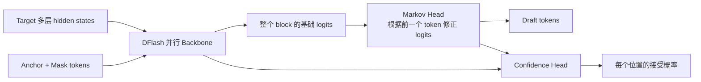
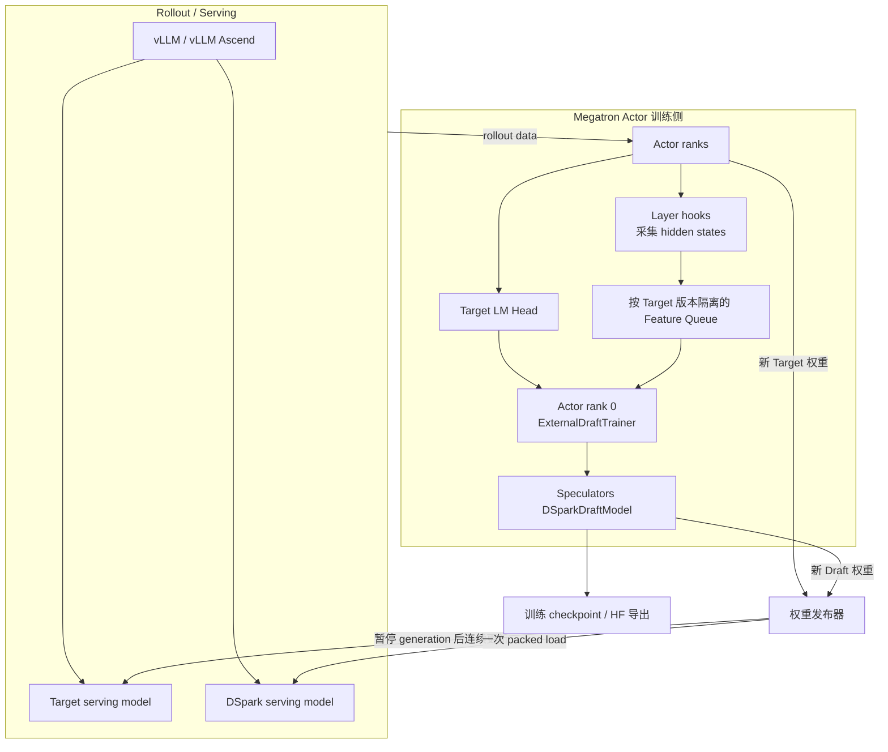
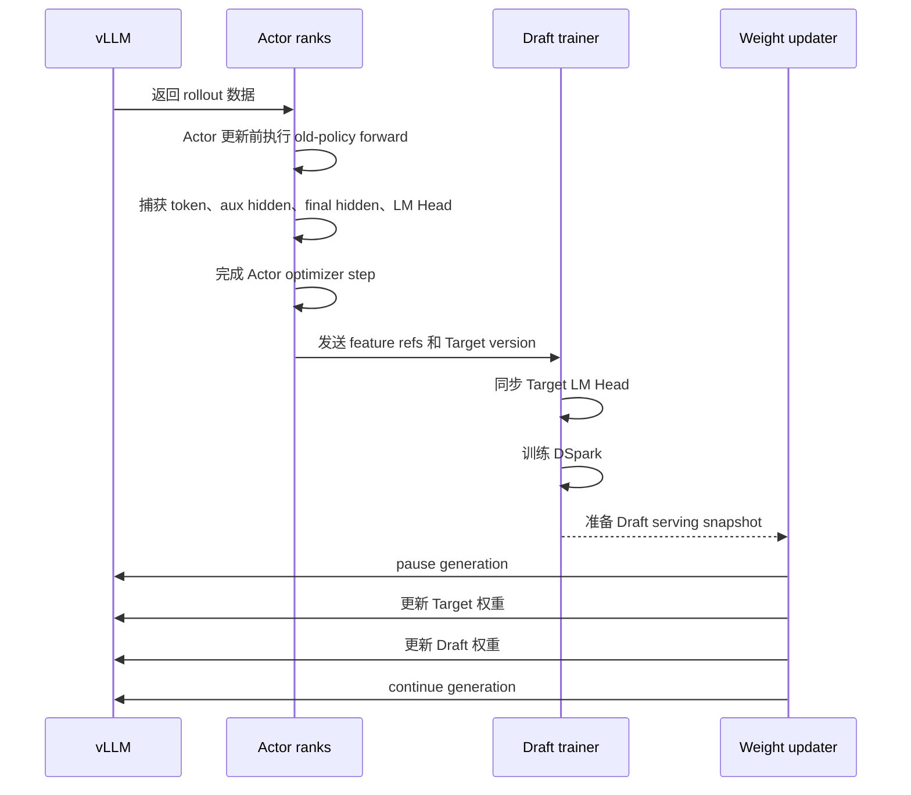
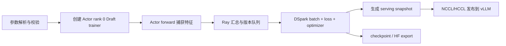

# DSpark 原理与 VIME 实现设计（分层阅读版）

> 阅读目标：先用 10 分钟理解主流程，再按需阅读数学推导和源码调用链。
>
> 本文按主流程组织，并详细展开数学原理与关键调用链。完整设计背景、测试方案和后续规划请参考
> [DSpark 投机模型增量训练设计](./dspark-incremental-training-design.md)。
>
> 快速阅读只看第 1、2、5、6、15 节；需要算法细节时看第 3、4 节；需要改代码时看第 12 节。
> 公式和完整调用链默认折叠：先读例子与类职责，理解后再按需展开。

## 1. 一句话说明

DSpark 是一个用于投机解码的小模型：它一次并行预测多个 token，再用一个很轻的 Markov Head
补充 token 之间的依赖，并用 Confidence Head 判断“后面的 token 还值不值得送给大模型验证”。

VIME 的工作是：在 RL 训练过程中收集最新 Actor 的 hidden states，持续微调 DSpark，然后把新权重
热更新到 vLLM rollout engine。

## 2. 为什么需要 DSpark

普通大模型一次前向只生成一个 token。投机解码先让小模型 Draft 预测多个 token，再让大模型 Target
一次性验证，从而减少昂贵的 Target 前向次数。

关键要求有两个：

1. Draft 必须足够快；
2. Draft 猜中的 token 必须足够多。

常见方案的取舍如下：

| 方案 | 生成方式 | 优点 | 问题 |
| --- | --- | --- | --- |
| EAGLE3 | 逐 token 自回归 | token 依赖强、准确率高 | Draft 延迟随 token 数增加 |
| DFlash | 一次并行生成整个 block | 很快 | block 后部 token 缺少前驱依赖，接受率下降 |
| DSpark | 并行 backbone + 轻量顺序 Head | 兼顾速度和后部接受率 | 模型与 serving 接入更复杂 |

### 2.1 投机解码为什么是无损的

先看一个具体例子。Draft 提议 token `北京`：

| 模型 | 给 `北京` 的概率 |
| --- | ---: |
| Draft | 40% |
| Target | 30% |

Draft 比 Target 更“自信”，所以不能无条件接受。正确做法是以 `30% / 40% = 75%` 的概率接受。
反过来，如果 Draft 给 20%、Target 给 30%，Target 至少和 Draft 一样认可该 token，接受概率就是 100%。

| Draft 概率 | Target 概率 | 接受概率 |
| ---: | ---: | ---: |
| 40% | 30% | 75% |
| 20% | 30% | 100% |

<details>
<summary><strong>展开公式：为什么是 Target 概率除以 Draft 概率</strong></summary>

下面的公式只是把这两个规则合成一行：先算 `Target概率 / Draft概率`，但最大不能超过 1。

设第 \(k\) 个位置上，Draft 和 Target 给候选 token \(x_k\) 的概率分别为
\(p_k^d(x_k)\) 和 \(p_k^t(x_k)\)。标准 rejection sampling 以如下概率接受它：

$$
A_k=\min\left(1,\frac{p_k^t(x_k)}{p_k^d(x_k)}\right)
$$

验证从左向右进行。第一个 token 被拒绝后，后面的 Draft token 全部作废，Target 从修正分布中采样
替代 token。因此 Draft 只决定“能加速多少”，不决定最终生成分布；只要 serving 侧使用正确的验证
算法，换 Draft 或在线更新 Draft 都不会改变 Target 的理论输出分布。

</details>

再看延迟公式。假设 Draft 花 2 ms，Target 一次验证花 8 ms，这一轮最终得到 5 个 token，则平均每个
token 花 `(2 + 8) / 5 = 2 ms`。如果不用投机解码，Target 每次只能得到 1 个 token，近似需要
`8 ms/token`。这里的数字只是帮助理解，不代表实际机器测量值。

<details>
<summary><strong>展开公式：平均每 token 延迟</strong></summary>

一次循环接受 \(\tau\) 个 token 时，平均每 token 延迟可以近似写为：

$$
L=\frac{T_{draft}+T_{verify}}{\tau}
$$

DSpark 同时优化这个式子的三部分：并行 backbone 降低 \(T_{draft}\)，Markov Head 提高 \(\tau\)，
Confidence Head 减少无意义的 Target verification。

</details>

## 3. DSpark 的三个组成部分



### 3.1 并行 Backbone

先用张量例子理解这一段。假设：

- 序列有 100 个 token；
- 从 Target 采集 3 层 hidden states；
- 每层 hidden size 是 4096。

每层数据形状都是 `[100, 4096]`。把 3 层沿最后一维拼接后得到 `[100, 12288]`，再通过 `fc`
投影回 `[100, 4096]`。换句话说，DSpark 为每个 token 同时拿到了 Target 浅层、中层和深层的信息，
再把这三份信息压回 Draft 能处理的宽度。

```text
[100, 4096] ┐
[100, 4096] ├─ 拼接 -> [100, 12288] -> fc -> [100, 4096]
[100, 4096] ┘
```

<details>
<summary><strong>展开公式：多层 hidden 拼接、投影和 K/V 注入</strong></summary>

下面的公式只是上述 shape 变化的一般写法。

先定义本文使用的符号：

| 符号 | 含义 |
| --- | --- |
| \(\gamma\) | 一个 Draft block 预测的 token 数 |
| \(d_t\) | Target hidden size |
| \(d_d\) | Draft hidden size；当前 VIME 要求 \(d_t=d_d\) |
| \(m\) | 采集的 Target hidden layer 数量 |
| \(V_t,V_d\) | Target/Draft vocabulary size |
| \(H^{(l_i)}\) | Target 第 \(l_i\) 个采集层的 hidden states |
| \(h_k,U_k\) | Draft backbone 在位置 \(k\) 的 hidden state 和基础 logits |

Target 提供多个指定层的 hidden states。对于长度为 \(T\) 的序列，每层形状是
`[T, d_t]`。VIME 沿 hidden 维拼接，得到：

$$
H_{cat}=[H^{(l_1)};H^{(l_2)};\ldots;H^{(l_m)}]
\in\mathbb{R}^{T\times(md_t)}
$$

Speculators 中的 `fc.weight` 将其投影到 Draft hidden size，并做归一化：

$$
H_{ctx}=\operatorname{RMSNorm}(H_{cat}W_c^T),
\quad W_c\in\mathbb{R}^{d_d\times(md_t)}
$$

可以把它直接读成：“拼接后的 Target 特征乘一个线性层，再做 RMSNorm”。不需要手工计算矩阵。

`H_ctx` 被作为 Target context 注入每个 Draft Transformer layer 的 K/V。对第 \(i\) 个 Draft layer：

$$
K_i=[W_i^K H_{ctx};W_i^K H_d],\qquad
V_i=[W_i^V H_{ctx};W_i^V H_d]
$$

这里的分号表示沿 sequence 维拼接。Draft query 可以同时看到 Target context 和整个 mask block，
因此所有 block 位置能在一次非因果前向中并行计算。

</details>

Draft 输入由一个 anchor token 和若干 mask token 组成。Backbone 一次前向就为整个 block 产生 hidden
states 和基础 logits，因此 block 变长不会带来等比例的 Draft 前向次数。

两种 checkpoint alignment 不能混用：

- `sample_from_anchor=true`：anchor 位置也产生第一个预测，`block_size` 个输入产生
  \(\gamma=block\_size\) 个 Draft token；
- `sample_from_anchor=false`：anchor 只作为条件，最多产生
  \(\gamma=block\_size-1\) 个 Draft token。

### 3.2 Markov Head

完全并行预测时，每个位置不知道前一个位置最终采样了什么。Markov Head 使用前一个 Draft token
对当前位置 logits 增加一个低秩修正：

例如上下文允许 `New York` 和 `New Jersey`。并行 backbone 在预测第二个词时并不知道第一个位置最终
采样了 `New` 还是其他 token。Markov Head 在第一个位置采样完成后读取这个结果，再提高 `York`、
`Jersey` 等合理后继的 logits。

最直接的实现是保存一个“前词 × 后词”的巨大转移表。若前后词表各有 10 万个 token，需要
`100000 × 100000 = 100 亿`个数。低秩分解把它拆成两张窄表。`markov_rank=256` 时，只需要大约
`100000 × 256 × 2 = 5120 万`个数。

```text
前一个 token
  -> W1 查表得到 256 维向量
  -> W2 把 256 维向量投影到 Draft 词表
  -> 得到对每个候选 token 的加分/减分
```

<details>
<summary><strong>展开公式：Markov Head 的低秩分解</strong></summary>

设 \(x_{k-1}\) 是已经采样出的前一个 token，vanilla Markov Head 先查一个低秩 embedding：

$$
e_{k-1}=W_1[x_{k-1}],
\quad W_1\in\mathbb{R}^{V_t\times r}
$$

再把它投影为 Draft vocabulary 上的 bias：

$$
B(x_{k-1},\cdot)=e_{k-1}W_2^T,
\quad W_2\in\mathbb{R}^{V_d\times r}
$$

最终条件分布是：

$$
p_k^d(v\mid x_0,x_{<k})=
\operatorname{softmax}\left(U_k(v)+B(x_{k-1},v)\right)
$$

这行可以直接读成：`最终概率 = softmax(并行 Backbone 分数 + 前一个 token 给出的修正分数)`。

整个 block 因此重新获得自回归分解：

$$
P(x_{1:\gamma}\mid x_0)=
\prod_{k=1}^{\gamma}p_k^d(x_k\mid x_0,x_{<k})
$$

其中重型 backbone 只执行一次，顺序阶段每个位置只做低秩 embedding 和 vocabulary projection。
对应 checkpoint tensor 为：

```text
markov_head.markov_w1.weight: [V_t, markov_rank]
markov_head.markov_w2.weight: [V_d, markov_rank]
```

</details>

它只做很小的 embedding 和 projection，开销远低于再次执行 Transformer。当前 VIME 的 Qwen3
serving 路径只支持 `markov_head_type=vanilla`。

### 3.3 Confidence Head

Confidence Head 为 block 中每个位置预测一个 0～1 的分数，表示：

> 在前面的 Draft token 都已通过验证的前提下，当前位置也能通过 Target 验证的概率。

先看一个三 token block：

| 位置 | Confidence Head 输出 | 含义 |
| --- | ---: | --- |
| 1 | 0.90 | 第一个 token 有 90% 概率通过 |
| 2 | 0.80 | 在第一个已通过时，第二个有 80% 概率通过 |
| 3 | 0.60 | 在前两个都通过时，第三个有 60% 概率通过 |

第三个 token 真正有机会被接受，需要前三个条件连续成立，因此概率不是 0.60，而是：

```text
位置 1 存活概率 = 0.90
位置 2 存活概率 = 0.90 × 0.80 = 0.72
位置 3 存活概率 = 0.90 × 0.80 × 0.60 = 0.432
```

所以系统繁忙时可能只验证前两个 token，不把只有 43.2% 前缀存活概率的第三个 token 放进 Target
batch。

<details>
<summary><strong>展开公式：Confidence、TV 软标签和调度目标</strong></summary>

当 `confidence_head_with_markov=true` 时，它同时读取 backbone hidden 和前一个 token 的 Markov
embedding：

$$
c_k=\sigma\left(w^T[h_k;e_{k-1}]+b\right)
$$

因此 `confidence_head.proj.weight` 的形状是：

$$
[1,d_d+r]
$$

它的监督标签不是 0/1 的单次采样结果，而是 Draft 与 Target 分布对应的解析接受概率。设两个分布的
total variation distance 为：

用一个只有三个 token 的简化词表说明 TV：

```text
Draft 分布: [0.6, 0.3, 0.1]
Target分布: [0.5, 0.4, 0.1]
逐项差值:  [0.1, 0.1, 0.0]
差值总和:  0.2
TV distance = 0.2 / 2 = 0.1
Confidence 监督标签 = 1 - 0.1 = 0.9
```

直觉是：两个分布越接近，TV 越接近 0，理论接受概率越接近 1。

$$
D_{TV}(p_k^d,p_k^t)=\frac{1}{2}
\lVert p_k^d-p_k^t\rVert_1
$$

则软标签为：

$$
c_k^*=1-D_{TV}(p_k^d,p_k^t)
=1-\frac{1}{2}\lVert p_k^d-p_k^t\rVert_1
$$

这正是 rejection sampling 在该位置的期望接受概率，比一次随机验证得到的 0/1 标签更稳定。

因为 \(c_k\) 是“前缀已接受条件下”的概率，位置 \(j\) 能真正到达 Target 输出的前缀存活概率是：

$$
a_j=\prod_{i=1}^{j}c_i
$$

推理调度器应根据 \(a_j\) 而不是单独的 \(c_j\) 决定验证长度。若系统当前有 \(R\) 个请求，每个
请求选择长度 \(\ell_r\)，Target 验证 batch token 数和期望产出分别为：

$$
B=\sum_{r=1}^{R}(1+\ell_r)
$$

$$
\tau=\sum_{r=1}^{R}\left(1+\sum_{j=1}^{\ell_r}a_{r,j}\right)
$$

结合硬件实测的每秒 step 曲线 `SPS(B)`，目标是最大化：

$$
\Theta=\tau\cdot SPS(B)
$$

这三行调度公式只表达一件事：多验证一个 token 可能增加期望产出，也会扩大 Target batch、降低每秒
step 数。调度器沿 confidence 从高到低加入 token，在“多得到的 token”不再抵消“batch 变慢”的位置
停止。VIME 没有实现这个调度器，只训练它所需的 confidence。

</details>

推理侧可根据 confidence 截断低价值后缀，避免 Target 花算力验证几乎必然被拒绝的 token。

VIME 只负责训练和发布 Confidence Head。具体如何根据系统负载选择验证长度，由 vLLM/vLLM Ascend
的 DSpark 推理实现负责。

## 4. DSpark 如何训练

Target 模型冻结，DSpark 学习逼近 Target 分布。主要损失为：

| 损失 | 作用 |
| --- | --- |
| CE loss | 预测真实的下一个 token |
| TV loss | 缩小 Draft 与 Target 的概率分布差异，直接提高期望接受率 |
| Confidence loss | 让 Confidence Head 预测真实接受概率 |

可以把一次训练理解为老师批改一个长度为 4 的 Draft block：

```text
真实 token:       [A, B, C, D]
Draft 预测:       [A, B, X, D]
Target 概率分布:  [每个位置上的完整词表概率]
Draft 概率分布:   [每个位置上的完整词表概率]
Confidence 预测:  [0.95, 0.82, 0.55, 0.31]
```

- CE 检查 Draft 是否把真实 token 的概率提高；
- TV 不只看 top-1，而是比较整个 Draft/Target 词表分布；
- Confidence loss 检查 `0.95/0.82/...` 是否接近由 TV 算出的真实接受概率。

<details>
<summary><strong>展开公式：位置权重和三项训练损失</strong></summary>

对第 \(k\) 个 Draft 位置，论文默认使用指数衰减位置权重：

$$
w_k=\exp\left(-\frac{k-1}{\gamma}\right)
$$

例如 block 长度 \(\gamma=4\)，四个位置的论文权重大约是：

```text
位置:   1     2     3     4
权重: 1.00  0.78  0.61  0.47
```

越靠前的 token 权重越大，因为它被拒绝会导致整个后缀作废。Speculators 也支持 `dpace` 动态位置
权重，VIME 通过 `--draft-dspark-per-position-loss-weight` 直接传给它。

上式用于解释论文动机；VIME 不硬编码该公式。实际权重由 Speculators 根据
`per_position_loss_weight`、`dflash_decay_gamma` 和 `dpace_alpha` 生成，对应 VIME 参数分别是
`--draft-dspark-per-position-loss-weight`、`--draft-dspark-decay-gamma` 和
`--draft-dspark-dpace-alpha`。

CE loss 训练 Draft 预测真实 token \(x_k^*\)：

$$
\mathcal{L}_{ce}=-\sum_{k=1}^{\gamma}
w_k\log p_k^d(x_k^*)
$$

TV loss 直接缩小 Draft 与 Target 分布差异：

$$
\mathcal{L}_{tv}=\sum_{k=1}^{\gamma}
w_k\lVert p_k^d-p_k^t\rVert_1
$$

由于接受概率为 \(1-\frac{1}{2}\lVert p_k^d-p_k^t\rVert_1\)，最小化 TV loss 与提高期望
接受率直接一致。

Confidence Head 使用软标签 \(c_k^*\) 做 BCE：

$$
\mathcal{L}_{conf}=-\sum_{k=1}^{\gamma}w_k
\left[c_k^*\log c_k+(1-c_k^*)\log(1-c_k)\right]
$$

完整损失为：

$$
\mathcal{L}=\alpha_{ce}\mathcal{L}_{ce}
+\alpha_{tv}\mathcal{L}_{tv}
+\alpha_{conf}\mathcal{L}_{conf}
$$

默认配置是：

```text
总损失 = 0.1 * CE + 0.9 * TV + 1.0 * Confidence
```

例如某一步计算出 `CE=0.8`、`TV=0.3`、`Confidence=0.2`，则总损失为：

```text
0.1 × 0.8 + 0.9 × 0.3 + 1.0 × 0.2 = 0.55
```

这只是演算示例；实际 loss 会先在位置、anchor 和有效 token 上按 Speculators 的实现聚合。

</details>

VIME 不重新实现这些算法，而是直接调用 Speculators 的 `DSparkDraftModel`、`get_trainer_kwargs()`
和模型 `forward()`。

训练时保持冻结的参数包括 Target、Draft embedding、`lm_head` 和 `verifier_lm_head`。实际更新的是
Draft backbone、Markov Head 和 Confidence Head。Target teacher logits 不需要由 rollout engine 传回，
而是在训练侧通过以下方式重建：

$$
Z_k^t=H_{final,k}W_{target\_lm\_head}^T
$$

`final_hidden_states` 和 `Target LM Head` 必须来自同一个 Target version，否则 \(p_k^t\) 就不再是
一致的 teacher 分布。

## 5. VIME 总体架构



核心原则是训练副本与 serving 副本分离：

- vLLM 中的 DSpark 只负责推理；
- Actor rank 0 上的 Speculators DSpark 负责反向训练；
- 训练完成后，通过已有 NCCL/HCCL 权重通道更新 serving 副本。

这样不需要在 vLLM 模型内部执行 backward，也不需要修改 VIME 的主 Actor 优化器。

## 6. 一个 rollout 内发生什么



需要注意：feature 来自 Actor 更新前的 Target `T(n)`，但随后发布的是更新后的 Target `T(n+1)`。
因此当前实现中 Draft 天然落后一个 Actor step：

```text
用 T(n) 的特征训练 D(n+1) -> 同时发布 T(n+1) 和 D(n+1)
```

代码通过 `target_weight_version` 保证一批 hidden states 和 LM Head 一定来自同一个 Target 版本，
但不会让 Draft 在发布前再对 `T(n+1)` 做一次蒸馏。

## 7. 训练数据长什么样

每个 `DraftFeatureSample` 主要包含：

| 数据 | 形状 | 用途 |
| --- | --- | --- |
| `input_ids` | `[T]` | 原始 token |
| `aux_hidden_states` | `[T, 层数 × hidden]` | DSpark backbone 的 Target 上下文 |
| `final_hidden_states` | `[T, hidden]` | 配合 Target LM Head 重建 teacher 分布 |
| `loss_mask` | `[T]` | 只在有效 response token 上训练 |
| `position_ids` | `[T]` | 保留原始位置 |
| `target_weight_version` | 字符串 | 防止不同 Target 版本混合 |

多个样本会拼成一个长序列，并用 `document_ids` 区分：

```text
sample A tokens | sample B tokens | sample C tokens
document id: 0  |       1         |       2
```

每个样本最后 `block_size` 个位置的 loss mask 必须清零。否则这些位置被选为 anchor 时，其预测 block
会跨到下一个样本，形成错误监督。

## 8. Target LM Head 为什么需要同步两份

DSpark 训练模型中有两个相关 Head：

- `lm_head`：产生 Draft 分布；
- `verifier_lm_head`：使用 Target final hidden states 计算 teacher 分布。

它们都必须与产生 hidden states 的 Target 版本一致。因此每次接收新 Target version 时，VIME 会把
Target LM Head 同步到这两个 frozen Head，并清除 Feature Queue 中其他版本的数据。

如果 Draft 使用缩减词表，VIME 会根据 `t2d` mapping 选择对应的 Target vocabulary rows。

## 9. Draft 权重如何热更新

Target 与 Draft 在同一次 generation pause 中连续更新：

```text
pause generation
  -> 更新 Target
  -> start_draft_weight_update
  -> 将 weight transfer target 切换到 Draft
  -> 更新 Draft
  -> reset target
continue generation
```

DSpark 权重必须使用一个完整的 packed buffer 一次发送。原因是部分 vLLM Ascend loader 会在每次
`model.load_weights()` 结束时处理 Confidence Head 和派生 buffer。如果拆成多个 bucket，loader 可能
在中间看到不完整权重，甚至错误关闭 Confidence Head。

代价是发布时需要额外容纳一份完整 Draft snapshot 的临时显存。

对于没有原生 `start_draft_weight_update()` 的旧 vLLM Ascend worker，VIME 提供兼容 patch；新版
runtime 已有原生接口时不会覆盖它。

## 10. 模型保存分为两类

### 10.1 训练恢复 checkpoint

`--draft-checkpoint-path` 生成 `draft_latest.pt`，保存：

- 模型、optimizer、scheduler；
- optimizer step、Draft version、Target version；
- rollout id 和 architecture fingerprint。

它用于恢复 VIME 训练，不用于 vLLM serving。

### 10.2 HF/Speculators 模型导出

`--draft-save-hf /outputs/dspark-{rollout_id}` 生成：

```text
dspark-{rollout_id}/
├── config.json
└── model.safetensors
```

保存过程先把权重转成 CPU contiguous tensor，再写入临时目录，完整性检查通过后原子替换正式目录。
失败时不会覆盖上一个有效目录。

导出的 `config.json` 同时保留：

- vLLM 需要的顶层 Qwen3 architecture 字段；
- Speculators 继续训练需要的 `transformer_layer_config` 和 DSpark 字段。

因此同一目录既能继续训练，也能直接用于 vLLM serving。

## 11. 最近两个 commit 分别做了什么

### `9bc3a9e`：打通在线训练

主要完成：

- 增加 `draft_algorithm=dspark` 和 DSpark 参数；
- 扩展 feature schema 与采集窗口；
- 增加 DSpark batch collator；
- 加载 Speculators `DSparkDraftModel`；
- 接入 CE/TV/Confidence loss 和指标；
- 同步 Target LM Head；
- 支持 DSpark serving snapshot；
- 使用单 packed buffer 热更新 Draft；
- 扩展 vLLM weight-transfer 参数。

### `1cb4157`：补齐保存和兼容能力

主要完成：

- 增加 `--draft-save-hf`；
- 接入 train loop、Draft group 和 Actor rank 0 export RPC；
- 实现 CPU staging、完整性校验和原子目录替换；
- 生成 vLLM/Speculators 双兼容 config；
- 从真实 checkpoint tensor shape 恢复和验证旧配置；
- 在 Ray/NPU 分配前执行 checkpoint preflight；
- NPU 使用 eager TV/NLA loss；
- 补充旧 vLLM Ascend Draft update session；
- NPU Docker 安装同版本 Speculators 和 `hs_connectors`。

## 12. 关键代码位置

建议不要按文件名逐个浏览，而是按下面的运行顺序阅读：



### 12.1 先认识核心类及其状态

#### `DraftFeatureCollector`：在 Actor forward 旁路采集数据

文件：[`feature_collector.py`](../../../vime/backends/speculative_training/feature_collector.py)

这个类不参与模型计算结果，它只通过 PyTorch hooks 观察 Actor forward。核心状态包括：

| 状态 | 含义 |
| --- | --- |
| `layer_ids` | 需要捕获的 Target layer 编号 |
| `_captured_layers` | 当前 microbatch 已捕获的各层 tensor |
| `_captured_final` | 当前 microbatch 的 final normalized hidden |
| `_current_batch` | 正在处理的 Megatron batch |
| `_payloads` | 已转换为 CPU tensor、等待送入 Ray 的样本 |
| `_collected_tokens` | 当前 rollout 已采集 token 数，用于限制内存 |

方法按生命周期排列：

| 方法 | 何时调用 | 实现功能 |
| --- | --- | --- |
| `__init__()` | collector 创建时 | 定位 Transformer layers 和 output layer，注册 hooks |
| `begin_microbatch()` | Megatron forward 前 | 记录 batch，清空上一个 microbatch 的临时 tensor |
| `_make_layer_hook()` | 指定 Target layer forward 后 | 保存该层输出 |
| `_final_hidden_hook()` | output layer forward 前 | 保存最终归一化 hidden |
| `end_microbatch()` | Megatron forward 成功后 | TP gather、拆分样本、拼接多层 hidden、构造 payload |
| `_maybe_collect_sample()` | 每个原始样本 | 执行采样率、长度、窗口和 token 上限判断 |
| `abort_microbatch()` | forward 异常时 | 丢弃不完整临时状态 |
| `pop_payloads()` | 整次 log-prob forward 结束 | 返回 payload 并清空内部列表 |
| `close()` | collector 销毁时 | 移除所有 PyTorch hook handle |

`model.forward_only()` 中的真实控制代码非常直接：

```python
if feature_collector is not None:
    feature_collector.begin_microbatch(batch, original_indices)
try:
    output_tensor = model(**forward_kwargs)
except Exception:
    if feature_collector is not None:
        feature_collector.abort_microbatch()
    raise
if feature_collector is not None:
    feature_collector.end_microbatch()
```

这是 `model.py` 当前的实际控制代码。可以看到 collector 完全包在正常 Actor forward 外围：成功才
`end_microbatch()`，异常就 `abort_microbatch()`，不会把半个 microbatch 放进训练队列。

#### `DraftFeatureSample` 与 `VersionedFeatureQueue`：数据格式和版本隔离

文件：[`feature_schema.py`](../../../vime/backends/speculative_training/feature_schema.py)

`DraftFeatureSample` 是 dataclass，只表示一个训练窗口；它不负责训练。三个方法分别是：

| 方法 | 功能 |
| --- | --- |
| `from_payload()` | 从 Ray payload 恢复 dataclass，并执行校验 |
| `validate()` | 校验算法/layout、tensor 维度、行数、window 和 Target version |
| `to_payload()` | 把 tensor 转为 CPU contiguous 格式，便于 Ray 传输 |

`VersionedFeatureQueue` 是按 Target 版本分桶的有界 FIFO：

| 方法 | 功能 |
| --- | --- |
| `add(samples, expected_version=...)` | 只接收期望 Target version 的样本；超容量时淘汰最旧数据 |
| `take(version, count, repeat=False)` | 从指定版本取样；训练使用 `repeat=True` 循环复用小队列 |
| `clear_except(version)` | Target Head 切换后删除其他版本样本 |
| `count(version)` / `versions()` | 查询队列状态 |

它解决的不是普通数据加载问题，而是防止 `T(n)` 的 hidden state 被 `T(n+1)` 的 LM Head 监督。

#### `ExternalDraftTrainer`：真正拥有 DSpark 模型和 optimizer

文件：[`draft_trainer.py`](../../../vime/backends/speculative_training/draft_trainer.py)

该类只存在于 Actor rank 0，是整个功能的数据面核心。重要状态包括：

| 状态 | 含义 |
| --- | --- |
| `model` | Speculators `DSparkDraftModel`，必要时为 DDP wrapper |
| `optimizer` / `scheduler` | 独立于 Actor 的 Draft optimizer 和 LR scheduler |
| `queue` | `VersionedFeatureQueue` |
| `target_lm_head_weight` | 当前 teacher LM Head 的设备副本 |
| `target_weight_version` | 当前允许训练的 Target version |
| `draft_version` | 每次成功训练 trigger 后递增 |
| `draft_to_target_rows` | reduced vocabulary 时 Draft row 到 Target row 的映射 |
| `algorithm_train_kwargs` | Speculators 解析后的 loss/anchor 参数 |

方法可以分为四组：

| 分组 | 方法 | 功能 |
| --- | --- | --- |
| 初始化 | `__init__()`、`_load_checkpoint_if_present()` | 构造/恢复模型、optimizer、scheduler 和版本 |
| 数据 | `collect()`、`sync_target_lm_head()` | 接收 feature；同步两个 LM Head；清理旧版本队列 |
| 训练 | `train()` | collate、forward、backward、梯度裁剪、optimizer step、指标汇总 |
| 发布 | `prepare_publish_snapshot()` | 生成 vLLM 需要的 CPU named tensors |
| 保存 | `save_checkpoint()` | 保存可恢复 optimizer 的 `draft_latest.pt` |
| 导出 | `export_hf_model()` | 原子导出 `config.json + model.safetensors` |

`train()` 中选择 DSpark 实现的真实代码分支是：

```python
if self.algorithm == "dspark":
    batch = collate_dspark_samples(
        samples,
        self.device,
        block_size=int(self.args.draft_dspark_block_size),
    )
else:
    batch = collate_eagle3_samples(samples, self.device)

with torch.autocast(device_type=self.device_type, dtype=torch.bfloat16):
    if self.algorithm == "dspark":
        loss, metrics = compute_dspark_loss(self.model, batch, self.algorithm_train_kwargs)
```

这说明 VIME 只在“如何组 batch、调用哪个 loss adapter”处分流；optimizer、finite check、梯度裁剪和
版本管理继续复用 External Draft trainer。

#### `ExternalDraftTrainGroup`：driver 到 Actor rank 0 的控制面

文件：[`draft_group.py`](../../../vime/backends/speculative_training/draft_group.py)

它不是训练进程，也不持有模型；`self._draft_actor` 指向已有 Actor group 的 rank 0 Ray actor。

| 方法 | 远程调用目标/功能 |
| --- | --- |
| `create()` | 查询 Draft checkpoint 的下一个 rollout，和 Actor 恢复位置对齐 |
| `collect_actor_results()` | 汇总各 Actor manifest，调用 rank 0 的 feature collect RPC |
| `train_draft()` | 调用 `train_external_draft.remote()` |
| `prepare_publish_snapshot()` | 只为尚未发布的新 Draft version 创建 Ray ObjectRef |
| `mark_published()` | 记录最后成功发布版本，拒绝版本倒退 |
| `save_draft()` | 编排 trainer checkpoint 和 HF export，并检查导出完整性 |
| `release()` | 无独立资源，生命周期跟随 Actor，因此当前为空操作 |

#### `MegatronTrainRayActor`：提供 Draft 所需的 Actor RPC

文件：[`actor.py`](../../../vime/backends/megatron_utils/actor.py)

这是原 Actor 类，DSpark 只增加/复用了以下入口：

| 方法 | 功能 |
| --- | --- |
| `compute_log_prob()` | 可选创建 `DraftFeatureCollector`，把它交给 `forward_only()` |
| `train_actor()` | 安排更新前 feature forward，导出 Target LM Head，返回 Ray refs |
| `_export_draft_target_lm_head()` | TP gather、裁剪 padding vocab、按版本缓存 LM Head |
| `collect_external_draft_features()` | rank 0 解引用并写入本地 trainer queue |
| `train_external_draft()` | 调用本地 `ExternalDraftTrainer.train()` |
| `prepare_external_draft_publish_snapshot()` | 将 CPU snapshot 放入 Ray object store |
| `save_external_draft()` | 保存 trainer checkpoint |
| `export_external_draft()` | 导出 HF/Speculators 模型目录 |

#### `UpdateWeightFromDistributed`：在一次 pause 中发布 Target 和 Draft

文件：[`update_weight_from_distributed.py`](../../../vime/backends/megatron_utils/update_weight/update_weight_from_distributed.py)

该类原本负责 Megatron Target 权重同步，DSpark 复用并增加暂存槽：

| 状态/方法 | 功能 |
| --- | --- |
| `_external_draft_named_tensors` | 等待下一次发布的 CPU Draft snapshot |
| `_external_draft_version` | snapshot 的 Draft version；非空代表有待发布数据 |
| `set_external_draft_weights()` | 写入上述暂存槽 |
| `update_weights()` | pause 后先发布 Target，再启动 Draft session 发布 Draft |
| `_send_external_draft_weights_to_rollout_engines()` | 校验 payload，并决定单 packed buffer 或普通 bucket |

当前代码识别 DSpark 单次加载的关键判断是：

```python
single_load = isinstance(payload, dict) and str(payload.get("algorithm", "")).lower() == "dspark"
```

进入 `single_load` 分支后，它统计完整 snapshot 字节数，并向两端传递：

```python
packed=True,
packed_buffer_size_bytes=max(snapshot_bytes, 1),
packed_num_buffers=1,
```

#### `_VLLMHijack` 与 `VLLMEngine`：兼容旧 worker 并透传请求

文件：[`update_weight_from_tensor.py`](../../../vime/backends/megatron_utils/update_weight/update_weight_from_tensor.py)
与 [`vllm_engine.py`](../../../vime/backends/vllm_utils/vllm_engine.py)

`_VLLMHijack` 不是新的 worker，而是在启动时检查当前 vLLM Ascend worker 能力：

- `_patch_one_worker()` 检查 `start_weight_update()` 的版本签名；
- 若缺少 `start_draft_weight_update()`，注入兼容实现；
- Draft session 开始时把 transfer target 切到 `drafter.model`；
- `update_weights()` 异常或 `finish_weight_update()` 结束时恢复 Target；
- runtime 已有原生方法时不覆盖。

`VLLMEngine` 是 Ray/HTTP 桥接层。DSpark 相关方法只有：

| 方法 | 功能 |
| --- | --- |
| `start_draft_weight_update()` | POST `start_draft_weight_update` endpoint |
| `update_weights_from_distributed()` | 传递 names、dtypes、shapes、group 和 packed buffer 参数 |
| `finish_weight_update()` | 结束 session |
| `pause_generation()` / `continue_generation()` | 控制整个 Target/Draft 更新窗口 |

<details>
<summary><strong>展开：完整启动、采集、训练、发布与保存调用链</strong></summary>

### 12.2.1 启动：参数如何变成训练模型

调用链：

```text
parse_args()
  -> vime_validate_args()
    -> validate_external_draft_args()
      -> preflight_dspark_checkpoint()        # 本地 checkpoint 有权重时
  -> create_placement_groups()
       -> draft placement = None               # 不申请额外设备
  -> create_training_models()
       -> Actor rank 0: ExternalDraftTrainer()
         -> _load_draft_model()
           -> factories.speculators_dspark.build_model()
  -> create_draft_model()
       -> ExternalDraftTrainGroup              # 包装已有 Actor rank 0
       -> 校验 Draft/Actor 恢复的 rollout 位置
```

各层职责如下：

| 代码位置 | 关键函数 | 作用 |
| --- | --- | --- |
| [`vime/utils/arguments.py`](../../../vime/utils/arguments.py) | `add_external_draft_training_arguments()` | 声明 DSpark CLI 参数 |
| [`vime/backends/speculative_training/config.py`](../../../vime/backends/speculative_training/config.py) | `validate_external_draft_args()` | 校验算法、vLLM method、并行方式、interval 和 checkpoint |
| 同上 | `_activate_dspark_training_for_export()` | 使用 `--draft-save-hf` 时自动启用 DSpark 训练副本 |
| 同上 | `resolve_feature_layer_ids()` / `resolve_dspark_block_size()` | 从 CLI 或 checkpoint 解析 layer ids、block size |
| [`vime/ray/placement_group.py`](../../../vime/ray/placement_group.py) | `create_draft_model()` | 创建 driver 控制面；Draft 不申请新的 accelerator bundle |
| [`vime/backends/megatron_utils/actor.py`](../../../vime/backends/megatron_utils/actor.py) | `MegatronTrainRayActor.init()` | 仅在全局 Actor rank 0 构造 `ExternalDraftTrainer` |
| [`vime/backends/speculative_training/draft_trainer.py`](../../../vime/backends/speculative_training/draft_trainer.py) | `ExternalDraftTrainer.__init__()` | 创建模型、optimizer、scheduler、版本队列并恢复 checkpoint |
| [`vime/backends/speculative_training/factories/speculators_dspark.py`](../../../vime/backends/speculative_training/factories/speculators_dspark.py) | `build_model()` | 构造 Speculators `DSparkDraftModel` |

`preflight_dspark_checkpoint()` 会在 Ray 分配设备之前读取本地 tensor shape，完成以下检查：

- config 与真实层数、hidden size、attention heads、vocab size 是否一致；
- `fc.weight` 是否与采集 layer 数和 Target hidden size 一致；
- Markov W1/W2 的 vocab/rank 是否一致；
- Confidence Head 输入宽度是否等于 `hidden_size` 或 `hidden_size + markov_rank`；
- `mask_token_id`、RoPE、block size 和 `num_speculative_tokens` 是否有效。

能从 tensor shape 唯一恢复的旧 config 字段会被补齐；不能恢复的 layer identity 和 mask token 不会
猜测。这样可以避免 `from_pretrained()` 用随机参数静默填补不匹配权重。

`build_model()` 完成几个重要适配：

```text
checkpoint -> DSparkSpeculatorConfig -> DSparkDraftModel
                                  ├── NPU attention 改为 eager
                                  ├── verifier 路径改为当前 Target
                                  ├── verifier_norm = Identity
                                  ├── lm_head/verifier_lm_head 冻结
                                  ├── 主体转 BF16
                                  └── confidence_head 保持 FP32
```

`verifier_norm = Identity` 是因为 VIME 捕获的是进入 Megatron output layer 前的 hidden，已经经过最终
norm；Speculators 离线数据通常保存 pre-norm hidden，再执行一次 norm。若这里不替换，会重复归一化。

### 12.2.2 特征采集：hidden states 从哪里来

调用链：

```text
train.py: actor_model.async_train()
  -> MegatronTrainRayActor.train_actor()
    -> compute_log_prob(collect_draft_features=True)
      -> DraftFeatureCollector(...)
      -> model.forward_only(..., feature_collector=collector)
        -> collector.begin_microbatch()
        -> Megatron forward，layer hooks 自动触发
        -> collector.end_microbatch()
      -> collector.pop_payloads()
    -> _export_draft_target_lm_head()
    -> Ray ObjectRef 返回 driver
```

关键代码位置：

| 代码位置 | 关键函数 | 作用 |
| --- | --- | --- |
| [`vime/backends/megatron_utils/actor.py`](../../../vime/backends/megatron_utils/actor.py) | `train_actor()` | 决定当前 rollout 是否采集；必要时补一次 old-policy forward |
| 同上 | `compute_log_prob()` | 创建 collector，并把它传给 Megatron `forward_only()` |
| [`vime/backends/megatron_utils/model.py`](../../../vime/backends/megatron_utils/model.py) | `forward_only()` | 在每个 microbatch 前后调用 `begin_microbatch/end_microbatch` |
| [`vime/backends/speculative_training/feature_collector.py`](../../../vime/backends/speculative_training/feature_collector.py) | `DraftFeatureCollector.__init__()` | 定位 Transformer layers/output layer 并注册 hooks |
| 同上 | `_make_layer_hook()` | 捕获指定 Target layer 输出 |
| 同上 | `_final_hidden_hook()` | 捕获进入 output layer 的最终归一化 hidden |
| 同上 | `_maybe_collect_sample()` | 按采样率、窗口和 token 配额构造 feature sample |
| [`vime/backends/speculative_training/feature_schema.py`](../../../vime/backends/speculative_training/feature_schema.py) | `DraftFeatureSample` | 校验并序列化 CPU contiguous payload |

单样本的数据变换如下：

```text
第 l1 层: [T, d_t] ┐
第 l2 层: [T, d_t] ├─ cat(dim=-1) -> aux_hidden_states [T, m*d_t]
第 lm 层: [T, d_t] ┘

output layer 输入 -> final_hidden_states [T, d_t]
tokens             -> input_ids          [T]
response mask      -> loss_mask          [T]
```

当 Megatron 开启 sequence parallel 时，collector 先在 TP group 中 all-gather token 维；最终只由 TP
rank 0 导出，避免同一 DP 样本重复进入 Ray object store。

`_export_draft_target_lm_head()` 同样处理 TP shard：必要时 all-gather vocabulary rows，裁掉 Megatron
padding rows，再由全局 Actor rank 0 放入 Ray object store。LM Head 按 Target weight version 缓存，
同一版本不会重复导出。

### 12.2.3 汇总：Ray 引用如何进入版本队列

Driver 在 Actor 训练返回后执行：

```text
train.py: draft_model.collect_actor_results(actor_train_results)
  -> ExternalDraftTrainGroup.collect_actor_results()
    -> 校验所有 Actor manifest 的 target_weight_version 相同
    -> Actor rank 0.collect_external_draft_features.remote()
      -> ray.get(Target LM Head)
      -> trainer.sync_target_lm_head()
      -> ray.get(各 DP feature payload)
      -> trainer.collect()
        -> VersionedFeatureQueue.add()
```

对应代码：

| 代码位置 | 关键函数 | 作用 |
| --- | --- | --- |
| [`vime/backends/speculative_training/draft_group.py`](../../../vime/backends/speculative_training/draft_group.py) | `collect_actor_results()` | 汇总 Actor manifest，只把 Ray refs 发给 rank 0 |
| [`vime/backends/megatron_utils/actor.py`](../../../vime/backends/megatron_utils/actor.py) | `collect_external_draft_features()` | 在 rank 0 解引用并交给 trainer |
| [`vime/backends/speculative_training/draft_trainer.py`](../../../vime/backends/speculative_training/draft_trainer.py) | `sync_target_lm_head()` | 同步两个 LM Head，并切换 Target version |
| [`vime/backends/speculative_training/feature_schema.py`](../../../vime/backends/speculative_training/feature_schema.py) | `VersionedFeatureQueue` | 有界 FIFO；按 Target version 隔离和淘汰 |

`sync_target_lm_head()` 的核心逻辑是：

```text
Target LM Head [V_t, d_t]
  -> 如果有 t2d，则选择 Draft vocabulary 对应 rows
  -> copy 到 DSpark lm_head.weight
  -> copy 到 DSpark verifier_lm_head.weight
  -> target_weight_version = 当前版本
  -> queue.clear_except(当前版本)
```

### 12.2.4 Batch 与训练：Speculators 在哪里被调用

调用链：

```text
train.py: draft_model.train_draft(rollout_id)
  -> ExternalDraftTrainGroup.train_draft()
    -> Actor rank 0.train_external_draft.remote()
      -> ExternalDraftTrainer.train()
        -> queue.take(version, batch_size, repeat=True)
        -> collate_dspark_samples()
        -> compute_dspark_loss()
          -> DSparkDraftModel.forward(**batch, **trainer_kwargs)
        -> backward / clip_grad_norm / optimizer.step / scheduler.step
```

[`vime/backends/speculative_training/backends/dspark.py`](../../../vime/backends/speculative_training/backends/dspark.py)
是 VIME 与 Speculators 的算法适配边界：

- `collate_dspark_samples()`：将多个 document 拼成 `[1, sum(T_i), ...]`；
- `dspark_trainer_kwargs()`：调用模型 `get_trainer_kwargs()` 解析 loss 配置；
- `_replace_fused_losses_for_npu()`：NPU 上把 CUDA/ROCm Triton TV/NLA 换成 eager 版本；
- `compute_dspark_loss()`：调用模型 forward，并把 Speculators metric 转为 VIME metric；
- `sync_dspark_lm_heads()`：同步 frozen `lm_head` 和 `verifier_lm_head`。

送给 `DSparkDraftModel.forward()` 的 batch 为：

```python
{
    "input_ids":                  [1, S],
    "hidden_states":              [1, S, m * d_t],
    "verifier_last_hidden_states":[1, S, d_t],
    "loss_mask":                  [1, S],
    "document_ids":               [1, S],
    "position_ids":               [1, S],
}
```

其中 \(S=\sum_iT_i\)。每个 document 的最后 `block_size` 个位置被清零，保证从任何有效 anchor
出发都能在本 document 内取得完整 block。

`ExternalDraftTrainer.train()` 还负责：

- autocast BF16；
- 检查 loss 和全局有效 token 数是否有限；
- DDP 场景按各 rank 有效 token 数重新缩放 loss；
- gradient clipping；
- 汇总 loss、top-1、acceptance length/rate、confidence loss；
- 成功完成至少一个 optimizer step 后递增 `draft_version`。

### 12.2.5 发布：训练权重怎样进入 vLLM

调用链：

```text
ExternalDraftTrainer.prepare_publish_snapshot()
  -> CPU named_tensors + algorithm/draft_version/target_version
  -> Ray ObjectRef
  -> actor_model.set_external_draft_weights()
  -> UpdateWeightFromDistributed.set_external_draft_weights()
  -> actor_model.update_weights()
    -> pause_generation()
    -> 发布 Target
    -> start_draft_weight_update()
    -> _send_external_draft_weights_to_rollout_engines()
      -> update_weights_from_distributed(packed=True, num_buffers=1)
    -> finish_weight_update()
    -> continue_generation()
```

关键代码位置：

| 代码位置 | 关键函数 | 作用 |
| --- | --- | --- |
| [`vime/backends/speculative_training/draft_trainer.py`](../../../vime/backends/speculative_training/draft_trainer.py) | `prepare_publish_snapshot()` | 筛选 serving tensor，搬到 CPU 并设置发布 dtype |
| [`vime/backends/megatron_utils/actor.py`](../../../vime/backends/megatron_utils/actor.py) | `set_external_draft_weights()` | 在 Actor group 中暂存 snapshot/version |
| [`vime/backends/megatron_utils/update_weight/update_weight_from_distributed.py`](../../../vime/backends/megatron_utils/update_weight/update_weight_from_distributed.py) | `update_weights()` | 在一个 generation pause 中连续更新 Target 和 Draft |
| 同上 | `_send_external_draft_weights_to_rollout_engines()` | DSpark 强制一个完整 packed buffer |
| 同上 | `update_weights_from_distributed()` | Ray 发 metadata，NCCL/HCCL 发 tensor 数据 |
| [`vime/backends/vllm_utils/vllm_engine.py`](../../../vime/backends/vllm_utils/vllm_engine.py) | `start_draft_weight_update()` | 调用 rollout server Draft update endpoint |
| 同上 | `update_weights_from_distributed()` | 透传 tensor metadata 和 packed buffer 参数 |
| [`vime/backends/megatron_utils/update_weight/update_weight_from_tensor.py`](../../../vime/backends/megatron_utils/update_weight/update_weight_from_tensor.py) | `_VLLMHijack._patch_one_worker()` | 给旧 vLLM Ascend 补 Draft target/session 切换 |

Snapshot 会排除 `verifier_lm_head`、`verifier_norm` 和 `t2d`，因为它们只服务 Speculators 训练，
vLLM Qwen DSpark 没有对应参数。`lm_head` 必须发布；Confidence Head 保持 FP32；其他浮点 tensor 使用
`--draft-publish-dtype`。

### 12.2.6 保存：训练恢复与模型导出走不同路径

调用链：

```text
train.py: draft_model.save_draft()
  -> ExternalDraftTrainGroup.save_draft()
    ├── Actor.save_external_draft.remote()
    │     -> ExternalDraftTrainer.save_checkpoint()
    └── Actor.export_external_draft.remote()
          -> ExternalDraftTrainer.export_hf_model()
```

实现集中在
[`vime/backends/speculative_training/draft_trainer.py`](../../../vime/backends/speculative_training/draft_trainer.py)：

- `save_checkpoint()` 保存 optimizer 可恢复的 `draft_latest.pt`；
- `_cpu_contiguous_state_dict()` 避免 safetensors 直接序列化 Ascend storage；
- `export_hf_model()` 调用 `save_pretrained()`，校验两文件产物并原子替换目录；
- `_load_checkpoint_if_present()` 校验 architecture fingerprint 后恢复 model/optimizer/scheduler。

双兼容 `config.json` 由
[`make_dspark_vllm_compatible_config()`](../../../vime/backends/speculative_training/config.py)
生成：顶层 Qwen3 字段供 vLLM 使用，嵌套 `transformer_layer_config` 供 Speculators 继续训练。

</details>

### 12.3 最短源码阅读路径

如果只想快速理解实现，建议依次阅读以下函数：

1. [`train.py`](../../../train.py) 的 `train()`：先看总时序；
2. [`actor.py`](../../../vime/backends/megatron_utils/actor.py) 的 `train_actor()` 和
   `compute_log_prob()`：理解何时采集；
3. [`feature_collector.py`](../../../vime/backends/speculative_training/feature_collector.py) 的
   `end_microbatch()` 与 `_maybe_collect_sample()`：理解特征形状；
4. [`backends/dspark.py`](../../../vime/backends/speculative_training/backends/dspark.py) 的
   `collate_dspark_samples()` 与 `compute_dspark_loss()`：理解算法边界；
5. [`draft_trainer.py`](../../../vime/backends/speculative_training/draft_trainer.py) 的 `train()`、
   `prepare_publish_snapshot()` 和 `export_hf_model()`：理解训练、发布和保存；
6. [`update_weight_from_distributed.py`](../../../vime/backends/megatron_utils/update_weight/update_weight_from_distributed.py)
   的 `update_weights()`：理解 Target/Draft 如何原子暂停后连续更新。

## 13. 最小启动示例

```bash
--enable-external-draft-training \
--draft-algorithm dspark \
--draft-model-path /models/qwen3-dspark \
--draft-target-embedding-path /models/qwen3-target \
--draft-train-interval 1 \
--draft-train-steps-per-trigger 10 \
--draft-batch-size-per-gpu 4 \
--draft-dspark-max-anchors 64 \
--draft-dspark-loss-fn '{"ce":0.1,"tv":0.9}' \
--draft-save-interval 10 \
--draft-save-hf /outputs/dspark-{rollout_id} \
--vllm-speculative-config '{"method":"dspark","model":"/models/qwen3-dspark"}'
```

`block_size` 和 feature layer ids 通常从本地 checkpoint 读取；配置不完整时需要显式传入：

```bash
--draft-dspark-block-size 8 \
--draft-feature-layer-ids 2,14,25
```

## 14. 当前限制

当前实现只支持：

- 稠密 Qwen3 Speculators DSpark checkpoint；
- Target 与 Draft hidden size 相同；
- `markov_head_type=vanilla`；
- Confidence Head 使用 Markov embedding；
- Megatron backend，PP=1、CP=1、VPP=1；
- 非 colocate、full weight update、NCCL/HCCL 传输。

尚不支持 Gemma、DeepSeek-V4 内嵌 `mtp.*` DSpark、MoE Draft、跨 Target 版本异步训练，以及多 rollout
engine 的事务型发布回滚。

## 15. 记住这五点即可

1. DSpark = DFlash 并行 Backbone + Markov Head + Confidence Head。
2. VIME 复用 Actor hidden states，在 Actor rank 0 上训练独立 Draft 副本。
3. Feature、Target LM Head 和队列严格绑定 Target version，但 Draft 会落后 Actor 一个 step。
4. Draft 热更新必须整份 snapshot 单次加载，避免 Ascend loader 看到半套权重。
5. `draft_latest.pt` 用于恢复训练；`config.json + model.safetensors` 用于部署或继续训练。

## 16. 公式与实现参考

- [DSpark 论文](https://arxiv.org/abs/2607.05147)
- [Speculators DSpark 官方文档](https://docs.vllm.ai/projects/speculators/en/latest/user_guide/algorithms/dspark/)
- [Speculators DFlash 官方文档](https://docs.vllm.ai/projects/speculators/en/latest/user_guide/algorithms/dflash/)
- [vLLM Speculators 官方仓库](https://github.com/vllm-project/speculators)
