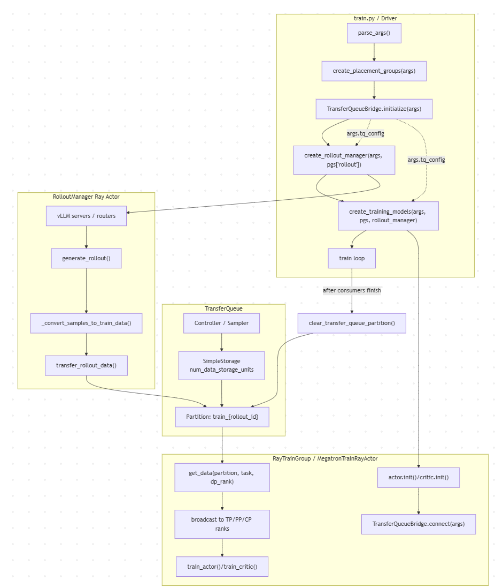

Phase 1: use TransferQueue as an external Data Buffer, replacing only the backfill path for aborted/partial/overflow samples while keeping the training cadence unchanged.
Phase 2: use TransferQueue as a streaming rollout queue. Rollout producers continuously write samples, and the training side reads ready groups by batch.

# TransferQueue Integration for Rollout-to-Training

# 1.设计目标

rollout 侧与训练侧之间的训练样本传输从原来的 Ray ObjectRef 直传路径，改变为通过TransferQueue传输。

# 2.整体架构

# 3.详细设计

vime/utils/transfer_queue.py` 中 `TransferQueueBridge`是 VIME 对外部 TransferQueue 的适配层，主要负责把 rollout 侧生成的训练数据写入 TQ，并让 Megatron actor 训练侧按 DP rank、task name 和fields读取对应数据。

主要包含以下方法:

### `initialize(args)`

driver 侧调用，用于创建 TQ controller/storage 配置，并将配置写回 `args.tq_config`。该方法必须在 Ray actors 创建前执行。

### `connect(args)`

Ray actor 进程侧调用，用于基于 `args.tq_config` 连接已初始化的 TQ，并返回带 client 的 `TransferQueueBridge` 实例。

### `close()`

关闭当前进程中的 TQ runtime，通常在 rollout manager 或 train actor 退出时调用。

## rollout侧写入

### `transfer_rollout_data(rollout_id, train_data)`

rollout 侧主写入入口。它将一个 rollout step 的训练数据写入 `train_{rollout_id}` partition。

该方法负责写入前的数据规范化、格式转换、partition 写入和 metadata 更新。

### `wait_for_staleness()`

它根据当前未消费的 `train_` partition 数量和 `max_staleness` 决定是否等待。

### `clear_partition(rollout_id)`

清理某个 rollout 对应的 TQ partition，用于释放已经消费完成的数据。

### `partition_id(rollout_id)`

统一生成 partition 名称，当前格式为 `train_{rollout_id}`。

## 训练侧读取

### `get_data(rollout_id, task_name, data_fields=None)`

actor/critic 训练侧主读取入口。它根据 rollout id、task name、当前 DP rank 和请求字段，从 TQ 读取本地 batch。

读取后会将数据广播到同一个模型并行组内的其他 rank，并补齐训练侧需要的本地调度字段。

### `_broadcast_payload(payload, device)`

将代表 rank 从 TQ 读取到的数据广播到 TP/PP/CP 并行组内其他 rank，避免所有模型并行 rank 重复访问 TQ。

### `_ensure_schedule_fields(rollout_data)`

读取 TQ 数据后补齐训练侧需要的调度字段，例如 `global_batch_sizes`、`num_microbatches` 和 `micro_batch_indices`。