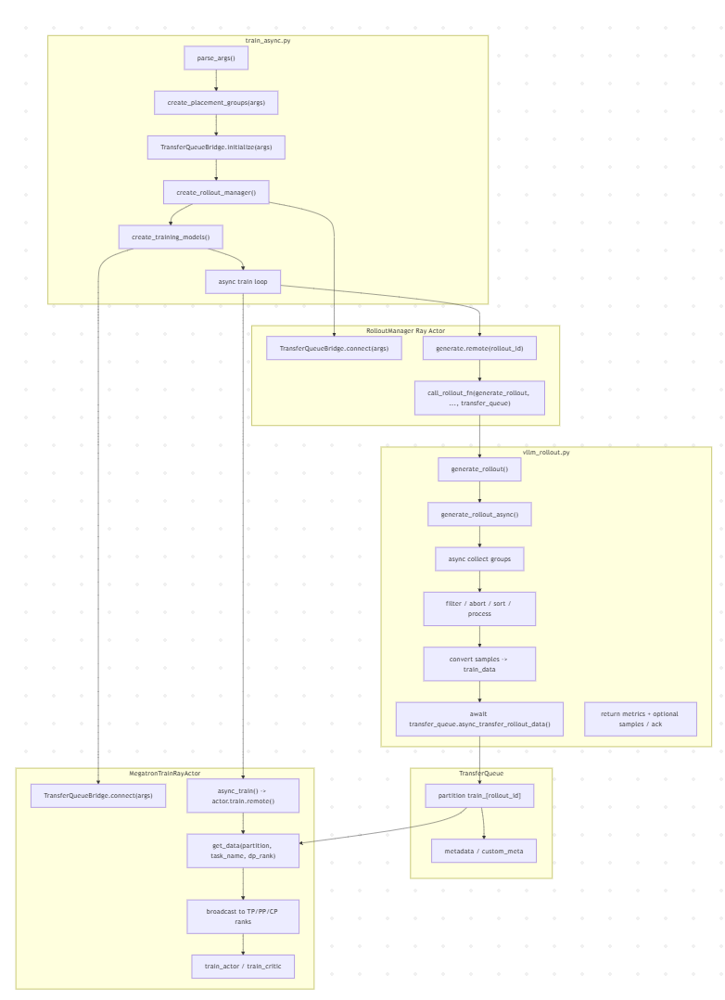

# async_train 接入 TransferQueue 架构设计

# 1.设计目标

使用 TransferQueue作为streaming rollout queue. Rollout 生产者producers 持续地把sample写入TQ, 训练侧按batch消费ready的数据。

# 2.整体架构

# 3.模块职责

| 模块 | 目标职责 | TQ 接入点 |
| --- | --- | --- |
| `train_async.py` | 异步训练编排、rollout prefetch、权重更新边界控制 | 初始化 TQ、启动/等待 rollout future、触发 `async_train()`、清理 partition |
| `RolloutManager` | Ray actor 生命周期、vLLM server 管理、日志/debug 保存、调用 rollout function | 持有 `self.transfer_queue` 并传给默认 rollout function；TQ 模式不再写数据 |
| `vllm_rollout.generate_rollout_async()` | 默认 vLLM 异步采样、动态过滤、partial abort、样本排序、样本级处理 | 在最终 batch 就绪后转换 train data 并写入 TQ |
| `TransferQueueBridge` | 屏蔽外部 package、TensorDict、partition、metadata 细节 | 增加异步写入接口，复用现有读取接口|
| `RayTrainGroup.async_train()` | fan-out 到所有 Megatron train actor | 保持参数兼容，TQ 模式下 `rollout_data_ref` 不承载实际训练数据 |
| `MegatronTrainRayActor` | 真正训练 actor | TQ 模式从 `TransferQueueBridge.get_data()` 拉取数据 | 

# 4.详细设计

1.rollout侧tq写入位置由RolloutManager下沉至vllm_rollout.generate_rollout_async()。

收益：
async_train 的rollout producer 和 train consumer 是解耦的。因此producer 侧应在拥有完整 batch 的第一时间完成入队，train侧拿到数据就可以进行训练，从而掩盖部分耗时。

待解决的问题：
当前 samples -> train_data 的逻辑在 RolloutManager._convert_samples_to_train_data() 中如果 TQ 写入移到 generate_rollout_async()，该函数不能直接调用 RolloutManager 的私有方法。因此train_data 转换职责下沉，抽象成公共方法。

2.async-safe TQ 写入接口

当前 TransferQueueBridge.transfer_rollout_data() 是同步方法。
需要增加async_transfer_rollout_data方法与rollout侧async写入配合。