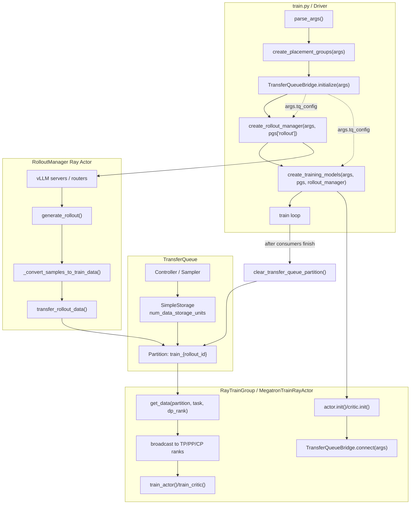
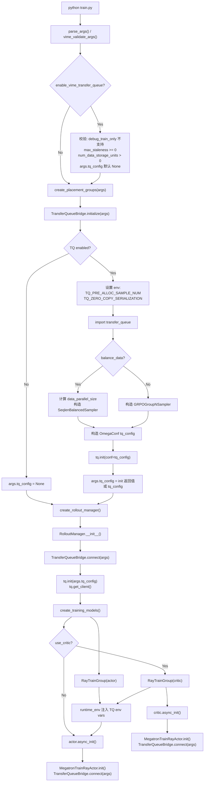
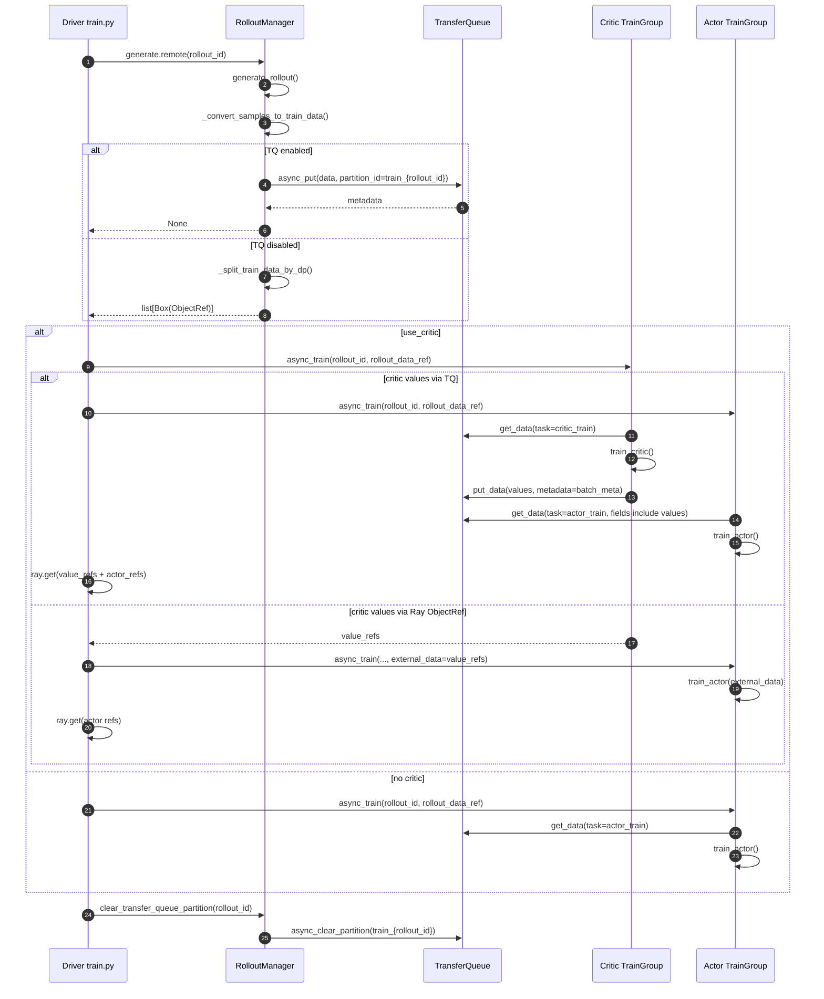
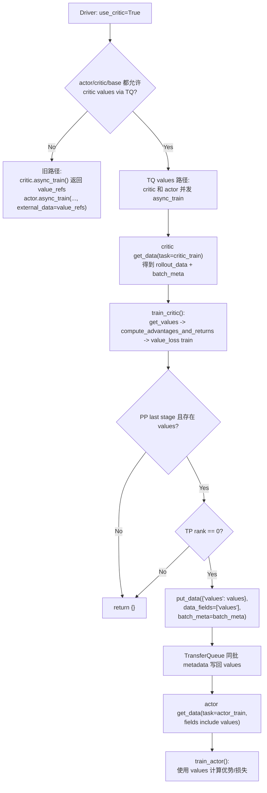
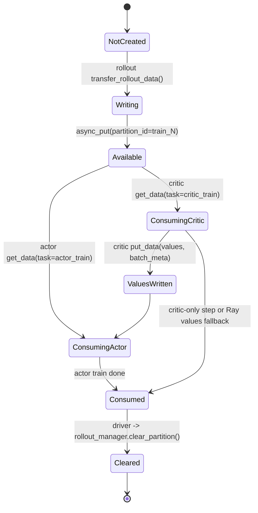

# TransferQueue 外部数据缓冲架构设计

本文基于最近 4 个 commit 对 VIME 中新增的 TransferQueue 外部数据缓冲链路进行架构梳理，覆盖初始化流程、rollout 到训练的数据流、critic values 回写、字段契约、运行参数、资源生命周期与后续维护注意事项。

## 1. 文档范围

### 1.1 覆盖提交

| 顺序 | Commit | 日期 | 标题 | 主要内容 |
| --- | --- | --- | --- | --- |
| 1 | `7e19434c` | 2026-06-11 | `Support TransferQueue as external data buffer` | 新增 `TransferQueueBridge`，将 rollout 训练数据写入 TransferQueue；driver、rollout manager、Megatron train actor 接入可选 TQ 数据面；新增 CLI 参数。 |
| 2 | `1e9cfb61` | 2026-06-12 | `fix bug` | 修复 TensorDict 非 tensor 字段包装、训练端 schedule 字段补齐、TQ 路径 perf 统计所需 `seq_lens`、routing replay shape 兼容等问题。 |
| 3 | `63e5d802` | 2026-06-13 | `add tq test script` | 新增 `scripts/run-qwen3-4B-grpo-tq.sh`，提供 Qwen3-4B + GRPO + TransferQueue 启动样例。 |
| 4 | `4a6fbd00` | 2026-06-16 | `add requirement && fix tq import` | 增加 `TransferQueue>=0.1.8` 依赖，将 async helper import 从 `slime` 改为 `vime` 本地路径。 |

### 1.2 涉及文件

| 文件 | 职责变化 |
| --- | --- |
| `vime/utils/transfer_queue.py` | 新增 TQ 适配层，封装初始化、连接、序列化、分区写入、分区读取、critic 回写、回压和清理。 |
| `vime/utils/arguments.py` | 新增 TQ 相关 CLI 参数与校验。 |
| `train.py` | 在 driver 启动阶段初始化 TQ；训练循环中处理 TQ critic values 分支和分区清理。 |
| `vime/ray/rollout.py` | `RolloutManager` 连接 TQ；生成训练数据后写入 TQ partition；暴露清理 partition 的远程方法。 |
| `vime/ray/actor_group.py` | 将 TQ 环境变量注入 train Ray actors。 |
| `vime/ray/placement_group.py` | 在 actor/critic role args 分离后判断 critic values 是否可以通过 TQ 回写，并在不能使用时告警。 |
| `vime/backends/megatron_utils/actor.py` | Megatron train actor 支持从 TQ 按 DP rank 拉取数据并广播到模型并行组；critic 支持将 values 写回同一批次 metadata。 |
| `vime/utils/train_metric_utils.py` | perf 日志在 `seq_lens` 不存在时安全跳过 tflops/tok/s 计算，适配非标准数据路径。 |
| `requirements.txt` | 新增 `TransferQueue>=0.1.8`。 |
| `scripts/run-qwen3-4B-grpo-tq.sh` | 新增 TQ 模式启动脚本。 |

## 2. 设计目标

TransferQueue 这组改动的核心目标，是把 rollout 侧与训练侧之间的训练样本传输从原来的 Ray ObjectRef 直传路径，抽象为一个可选的外部数据缓冲数据面。

主要目标如下：

1. 解耦 rollout 与 train 的数据传输：rollout manager 只负责把一个 rollout step 的训练数据写入 `train_{rollout_id}` partition；训练 actor 根据自身 DP rank、task name 和请求字段从 TQ 拉取。
2. 支持更灵活的采样：通过 TQ sampler 对 GRPO group 或长度均衡分配进行控制，减少在 driver/rollout 侧预先切分 DP 数据的复杂度。
3. 降低 Ray ObjectRef 压力：启用 TQ 后，`RolloutManager.generate()` 返回 `None`，实际样本通过 TransferQueue 流转，不再把完整 `rollout_data_refs` 交给训练端。
4. 保留旧路径兼容性：默认关闭 TQ；关闭时仍走 `_split_train_data_by_dp()` + Ray ObjectRef 路径。
5. 支持 PPO critic values 的可选回写：当满足约束时，critic 将 `values` 写回 TQ，同一 rollout 的 actor 训练从 TQ 等待并读取 `values`；不满足约束时自动降级为原来的 Ray ObjectRef `external_data`。

## 3. 整体架构



### 3.1 关键对象关系

| 对象 | 生命周期拥有者 | 关键状态 | 关键方法 |
| --- | --- | --- | --- |
| `TransferQueueBridge` | driver、rollout actor、train actor 各自持有 facade | `args`、`client` | `initialize()`、`connect()`、`transfer_rollout_data()`、`get_data()`、`put_data()`、`clear_partition()` |
| `args.tq_config` | driver 初始化后写入 `args`，随后传给 Ray actors | TQ controller/storage 配置对象 | 在 `connect()` 中复用 |
| TQ partition | driver 以 rollout step 为单位间接管理 | `train_{rollout_id}` | rollout 写入，actor/critic 读取，driver 触发清理 |
| `batch_meta` | TQ `get_meta()` 返回，训练端短期持有 | 一批样本的 metadata / row selector | critic values 回写时用于定位同一批样本 |
| `sampling_config` | 训练端每次拉取时构造 | `dp_rank`、`task_name`、`batch_index`、`partition_id` | TQ sampler 根据它给当前 DP rank 分配数据 |

## 4. 初始化流程

### 4.1 初始化流程图



### 4.2 初始化步骤详解

1. 参数解析阶段新增 TQ 参数：
   - `--enable-vime-transfer-queue`
   - `--num-data-storage-units`
   - `--max-staleness`
   - `--polling-mode` / `--no-polling-mode`
   - `--transfer-queue-staleness-poll-interval`
   - `--transfer-queue-extra-data-fields`

2. 参数校验阶段：
   - 启用 TQ 时禁止 `debug_train_only` 和 `load_debug_rollout_data`。
   - `max_staleness` 必须大于等于 0。
   - `num_data_storage_units` 必须大于 0。
   - 若 `args` 没有 `tq_config` 字段，则补为 `None`。

3. driver 阶段：
   - `train.py` 先创建 placement group，再调用 `TransferQueueBridge.initialize(args)`。
   - 这样做保证 TQ 的 `args.tq_config` 在 `RolloutManager` 和 train actors 创建之前已经准备好。

4. TQ 初始化阶段：
   - `total_storage_size = rollout_batch_size * n_samples_per_prompt * (max_staleness + 1)`。
   - `balance_data=True` 时选择 `SeqlenBalancedSampler(n_samples_per_prompt, dp_size)`。
   - 否则选择 `GRPOGroupNSampler(n_samples_per_prompt)`。
   - backend 使用 `SimpleStorage`，并由 `num_data_storage_units` 控制 storage actor 数量。

5. Ray actor 连接阶段：
   - `RolloutManager.__init__()` 中调用 `TransferQueueBridge.connect(args)`，拿到 TQ client。
   - `MegatronTrainRayActor.init()` 中也调用 `TransferQueueBridge.connect(args)`。
   - `RayTrainGroup` 的 `runtime_env` 会注入 TQ 环境变量，确保 train actor 进程继承零拷贝和预分配设置。

## 5. 主训练循环时序



### 5.1 训练循环中的行为差异

| 场景 | `RolloutManager.generate()` 返回值 | actor/critic 数据来源 | values 传递方式 | partition 清理 |
| --- | --- | --- | --- | --- |
| TQ 关闭 | `list[Box(ray.put(rollout_data))]` | Ray ObjectRef | `external_data=value_refs` | 不涉及 |
| TQ 开启，无 critic | `None` | TQ `train_{rollout_id}` | 不涉及 | actor 训练完成后 driver 触发清理 |
| TQ 开启，有 critic，满足 values 回写约束 | `None` | critic 和 actor 都从 TQ 读取 | critic 写回 TQ，actor 从 TQ 等待并读取 `values` | critic 和 actor 都完成后清理 |
| TQ 开启，有 critic，不满足 values 回写约束 | `None` | 训练样本从 TQ 读取 | values 仍通过 Ray ObjectRef 传给 actor | actor/critic 完成后清理 |

## 6. Rollout 到训练的数据流

### 6.1 数据流转图

```mermaid
flowchart LR
    DS["DataSource"] --> RF["rollout_function<br/>generate_rollout()"]
    RF --> SAMPLES["Sample / list[Sample]"]
    SAMPLES --> RM["RolloutManager._convert_samples_to_train_data()"]

    RM --> TD0["train_data: dict[str, list]"]
    TD0 --> NORM["TransferQueueBridge.normalize_train_data()"]
    NORM --> ADD["补齐 total_lengths/raw_reward/truncated/sample_indices"]
    ADD --> TDICT["dict_to_tensordict()"]
    TDICT --> APUT["client.async_put(partition_id=train_{rollout_id})"]
    APUT --> META["metadata + custom_meta(total_lengths)"]
    META --> STORAGE["TransferQueue SimpleStorage"]

    STORAGE --> GMETA["train actor get_meta(data_fields, batch_size, sampling_config)"]
    GMETA --> GDATA["client.get_data(batch_meta)"]
    GDATA --> RTD["tensordict_to_rollout_data()"]
    RTD --> SCHED["_ensure_schedule_fields()"]
    SCHED --> BCAST["broadcast to CP/TP/PP groups"]
    BCAST --> GPU["_postprocess_transfer_queue_rollout_data()"]
    GPU --> TRAIN["train_actor() / train_critic()"]
```



### 6.2 Rollout 侧写入流程

`RolloutManager.generate(rollout_id)` 在完成 rollout 采样后做如下处理：

1. 调用 `_get_rollout_data()` 获取 `Sample` 列表和 rollout metrics。
2. 调用 `_save_debug_rollout_data()` 保存 debug 数据。
3. 调用 `_log_rollout_data()` 记录 rollout 性能和质量指标。
4. 如果是 `debug_rollout_only`，直接返回。
5. 调用 `_convert_samples_to_train_data(samples)` 转为训练所需字段。
6. 如果启用 TQ：
   - 调用 `self.transfer_queue.transfer_rollout_data(rollout_id, data)`。
   - 返回 `None` 给 driver。
7. 如果未启用 TQ：
   - 调用 `_split_train_data_by_dp(data)`。
   - 返回每个 DP rank 的 `Box(ray.put(rollout_data))`。

### 6.3 `train_data` 生成字段

默认 `_convert_samples_to_train_data()` 会生成：

| 字段 | 来源 | 说明 |
| --- | --- | --- |
| `tokens` | `sample.tokens` | prompt + response token 序列。 |
| `response_lengths` | `sample.response_length` | response 长度。 |
| `rewards` | `_post_process_rewards()` | 训练用 reward，GRPO/GSPO 下可做 group normalization。 |
| `raw_reward` | `_post_process_rewards()` 或 `metadata["raw_reward"]` | 原始 reward，用于日志或自定义逻辑。 |
| `truncated` | `sample.status` | 是否被截断，截断为 1，否则为 0。 |
| `sample_indices` | `sample.index` | 样本索引。 |
| `rollout_ids` | `sample.rollout_id` 或 fallback | 用于把多个训练样本聚合为同一 rollout。 |
| `loss_masks` | `sample.loss_mask` | response token 的 loss mask；缺省时全 1，移除样本时全 0。 |
| `rollout_mask_sums` | loss mask 聚合 | 每个 rollout 的 mask 总和，供 loss reducer 使用。 |

可选字段：

| 字段 | 触发条件 | 说明 |
| --- | --- | --- |
| `round_number` | `sample.metadata["round_number"]` 存在 | rollout buffer 场景。 |
| `rollout_log_probs` | `sample.rollout_log_probs` 存在 | off-policy correction 或复用 rollout 侧 logprobs。 |
| `rollout_routed_experts` | `sample.rollout_routed_experts` 存在 | MoE routing replay。 |
| `metadata` | `sample.train_metadata` 存在 | 自定义训练元数据。 |
| `multimodal_train_inputs` | 任一样本存在该字段 | 多模态训练输入。 |
| `teacher_log_probs` | `sample.teacher_log_probs` 存在 | OPD teacher logprobs。 |

### 6.4 TQ 写入前标准化

`TransferQueueBridge.normalize_train_data()` 会强制检查 required fields：

- `tokens`
- `response_lengths`
- `loss_masks`
- `rewards`

并补齐：

- `total_lengths = [len(tokens) for tokens in train_data["tokens"]]`
- `raw_reward = rewards`，当输入未显式提供时
- `truncated = [0] * batch_size`，当输入未显式提供时
- `sample_indices = range(batch_size)`，当输入未显式提供时

### 6.5 TensorDict 序列化规则

`dict_to_tensordict()` 将 VIME 原本 list-based `train_data` 转为 TransferQueue 期望的 TensorDict：

| 输入类型 | 转换策略 |
| --- | --- |
| `list[int/float/bool]` | 转为普通 `torch.Tensor`。 |
| `list[list[number]]` | 转为 `torch.nested.as_nested_tensor(..., layout=torch.jagged)`。 |
| `list[torch.Tensor]` | 先转 CPU，再按标量/非标量转为 stack 或 jagged nested tensor。 |
| `metadata`、`multimodal_train_inputs`、`prompt` | 通过 `NonTensorData` 包装后 stack，避免 TensorDict 误处理 Python 对象。 |
| `rollout_routed_experts` | 拉平为 `[seq, num_layers * topk]` 的 int32 jagged tensor，训练端再 reshape。 |
| 其他无法数值化的一维/二维 list | fallback 到 `NonTensorData`。 |

### 6.6 TQ 读取流程

训练端 `MegatronTrainRayActor.train()` 中：

1. 若 TQ 未启用，调用旧的 `_get_rollout_data(rollout_data_ref)`。
2. 若 TQ 启用，调用 `_get_rollout_data_from_transfer_queue(rollout_id)`。
3. role 为 critic 时，`task_name = "critic_train"`，请求 `default_train_data_fields(args)`。
4. role 为 actor 时，`task_name = "actor_train"`，请求 `actor_train_data_fields(args)`。
5. 循环调用 `transfer_queue.get_data()`，直到返回非空数据。

`TransferQueueBridge.get_data()` 内部计算：

```text
total_batch_size = rollout_batch_size * n_samples_per_prompt
dp_size = mpu.get_data_parallel_world_size(with_context_parallel=False)
batch_size = total_batch_size // dp_size
partition_id = train_{rollout_id}
sampling_config = {
  dp_rank,
  task_name,
  batch_index: 0,
  partition_id,
}
```

只有模型并行组中的主取数 rank 会访问 TQ：

```text
tensor_model_parallel_rank == 0
pipeline_model_parallel_rank == 0
context_parallel_rank == 0
```

主取数 rank 拉到 `[rollout_data, batch_meta]` 后，通过 `broadcast_object_list()` 广播到：

1. context parallel group
2. tensor parallel group
3. pipeline parallel group

这样同一 DP rank 内的 TP/PP/CP 进程共享同一批样本和 metadata。

## 7. 训练端后处理与 schedule 补齐

### 7.1 schedule 字段补齐

旧 Ray ObjectRef 路径在 rollout manager 侧调用 `_split_train_data_by_dp()` 时已经计算了：

- `global_batch_sizes`
- `num_microbatches`
- `micro_batch_indices`

TQ 路径不再由 rollout manager 预切 DP 数据，因此训练端读取后调用 `_ensure_schedule_fields()` 补齐这些字段。

补齐逻辑：

1. 如果三个字段已经存在，则不处理。
2. 使用当前 rank 的 `total_lengths` 作为 local batch。
3. 构造局部 train parallel config：
   - `dp_size = 1`
   - `cp_size = mpu.get_context_parallel_world_size()`
   - `vpp_size = mpu.get_virtual_pipeline_model_parallel_world_size() or 1`
   - `microbatch_group_size_per_vp_stage = 1`
4. 调用 `build_dp_schedule()` 生成本地 micro-batch 计划。

这意味着 TQ sampler 负责跨 DP rank 分配样本，训练端只负责本 DP rank 内的 micro-batch packing。

### 7.2 GPU 化与格式处理

`_postprocess_transfer_queue_rollout_data()` 完成以下处理：

| 字段 | 处理 |
| --- | --- |
| `total_lengths` | 写入 `Timer().seq_lens`，用于 perf 统计。 |
| `tokens` | 转为 `torch.long` CUDA tensor。 |
| `loss_masks` | 转为 `torch.int` CUDA tensor。 |
| `multimodal_train_inputs` | 内部 tensor/ndarray 移动到当前 CUDA device。 |
| `max_seq_lens` | `qkv_format == "bshd"` 时按 TP size 和 pad multiplier 对齐。 |
| `rollout_log_probs` / `teacher_log_probs` | 调用 `slice_log_prob_with_cp()` 处理 CP 切片，再转 float32 CUDA tensor。 |
| `rollout_routed_experts` | 转为 `torch.long`，routing replay 时再 reshape 为 `[seq, num_layers, topk]`。 |
| `values` | critic TQ 回写路径下转为 float32 CUDA tensor。 |

### 7.3 perf 指标适配

`Timer().seq_lens` 在旧路径和 TQ 路径都需要存在，才能计算：

- `perf/log_probs_tflops`
- `perf/ref_log_probs_tflops`
- `perf/actor_train_tflops`
- `perf/actor_train_tok_per_s`

最近修复中：

- TQ 后处理显式设置 `Timer().seq_lens = rollout_data["total_lengths"]`。
- `log_perf_data_raw()` 在 `seq_lens is None` 时跳过上述派生指标，避免 AttributeError。

## 8. critic values 回写路径

### 8.1 回写条件

`TransferQueueBridge.critic_values_via_transfer_queue(args)` 同时要求：

1. `enable_vime_transfer_queue == True`
2. `use_critic == True`
3. `context_parallel_size == 1`

driver 还会同时检查 base args、actor args、critic args：

```text
TransferQueueBridge.critic_values_via_transfer_queue(args)
and TransferQueueBridge.critic_values_via_transfer_queue(actor_model.args)
and TransferQueueBridge.critic_values_via_transfer_queue(critic_model.args)
```

当任一 role 不满足时，critic values 走 Ray ObjectRef fallback。`placement_group.py` 会输出 warning，说明 base/actor/critic 的 `context_parallel_size` 情况。

### 8.2 critic values 回写流程图



### 8.3 并发与等待关系

在 TQ values 路径下，driver 同时发起：

- `critic_model.async_train(rollout_id, rollout_data_ref)`
- `actor_model.async_train(rollout_id, rollout_data_ref)`

actor 请求字段中包含 `values`。如果 critic 尚未完成回写，actor 的 `get_meta()` 会返回空 metadata，`_get_rollout_data_from_transfer_queue()` 会继续轮询，直到拿到完整数据。

这个设计让 driver 不再显式等待 `value_refs` 再启动 actor，而是由 TransferQueue 的 metadata/field 可用性作为同步点。

### 8.4 为什么限制 `context_parallel_size == 1`

当前 values 回写只由：

- pipeline last stage
- tensor parallel rank 0

写入同一份 `batch_meta`。在 context parallel 大于 1 时，values 的切片、聚合和 metadata 对齐会更复杂。当前实现选择保守限制，避免 actor 读取到不完整或错位的 `values`。

## 9. 分区生命周期与回压

### 9.1 分区生命周期图



### 9.2 partition id

每个 rollout step 对应一个 partition：

```text
partition_id = f"train_{rollout_id}"
```

例如：

- rollout 0 -> `train_0`
- rollout 1 -> `train_1`
- rollout 20 -> `train_20`

### 9.3 回压策略

`transfer_rollout_data()` 写入前会调用 `wait_for_staleness()`：

1. 调用 `client.async_get_partition_list()` 获取当前所有 partition。
2. 过滤以 `train_` 开头的训练 partition。
3. 如果数量 `<= max_staleness`，允许写入新 partition。
4. 否则按 `transfer_queue_staleness_poll_interval` sleep 后重试。

含义：

- `max_staleness = 0`：最多允许当前没有未消费训练 partition，最严格，rollout 和 train 更接近同步。
- `max_staleness = N`：允许 rollout 领先 train 最多 N 个未清理 partition，提升流水并发，但占用更多 TQ storage。

### 9.4 清理责任

分区清理由 driver 统一负责：

```text
训练消费者全部完成
-> train.py clear_transfer_queue_partition(rollout_id)
-> rollout_manager.clear_transfer_queue_partition.remote(rollout_id)
-> transfer_queue.clear_partition(rollout_id)
-> client.async_clear_partition(partition_id=train_{rollout_id})
```

集中在 driver 做清理的好处是：actor、critic、rollout manager 不需要互相判断对方是否已经消费完成，避免提前清理造成训练端读取失败。

## 10. 字段请求契约

### 10.1 默认训练字段

`default_train_data_fields(args)` 当前请求：

```text
tokens
total_lengths
response_lengths
loss_masks
rewards
raw_reward
truncated
sample_indices
rollout_log_probs
```

并按功能追加：

| 条件 | 追加字段 |
| --- | --- |
| `use_rollout_logprobs` | `rollout_log_probs` |
| `use_rollout_routing_replay` | `rollout_routed_experts` |
| `multimodal_keys is not None` | `multimodal_train_inputs` |
| `use_opd and opd_type == "sglang"` | `teacher_log_probs` |
| `transfer_queue_extra_data_fields` | 用户显式指定的额外字段 |

注意：当前实现中 `rollout_log_probs` 已经在默认列表中出现，后续条件又可能再次 append。维护时建议确认 TQ 对重复字段和缺失字段的行为，必要时对字段列表去重并按实际启用项请求。

### 10.2 actor 训练字段

`actor_train_data_fields(args)` 基于默认字段，并在 critic values TQ 回写可用时追加：

```text
values
```

这使 actor 的读取请求天然等待 critic 回写的 values。

### 10.3 自定义字段扩展

如果自定义 `custom_convert_samples_to_train_data_path` 产出额外训练字段，需要同步配置：

```bash
--transfer-queue-extra-data-fields field_a field_b
```

字段需要满足 `dict_to_tensordict()` 的序列化约束：

- value 必须是 list。
- 嵌套深度目前支持 0、1、2；更深嵌套会报错。
- Python object 字段建议使用已支持的 non-tensor 路径，或在转换函数里整理成 TensorDict 可表达的格式。

## 11. 启动脚本解读

`scripts/run-qwen3-4B-grpo-tq.sh` 提供了一个 Qwen3-4B + GRPO + Megatron + vLLM + TQ 的样例：

1. 清理已有 Ray/Python 进程。
2. 设置 `PYTHONUNBUFFERED=1`，避免 Ray job 日志缓冲。
3. 通过 `nvidia-smi topo -m` 检测 NVLink，并设置 `NCCL_NVLS_ENABLE`。
4. 自动检测 GPU 数量，默认 fallback 到 8。
5. 加载 `scripts/models/qwen3-4B.sh` 模型参数。
6. 配置 checkpoint、rollout、GRPO、optimizer、Megatron parallel、vLLM 和 misc 参数。
7. 启动 Ray head。
8. 通过 `ray job submit` 提交 `python3 train.py`。
9. 开启 TQ 模式，actor 使用 4 GPU，rollout 使用 4 GPU。

脚本中的关键 TQ 相关参数：

```bash
--enable-vime-transfer-queue
--rollout-batch-size 32
--n-samples-per-prompt 8
--global-batch-size 256
--balance-data
```

注意事项：

- `--enable-vime-transfer-queue` 在参数定义中是 `store_true` flag，推荐不带值使用。脚本当前写成 `--enable-vime-transfer-queue true`，需要与 argparse 实际行为保持一致。
- 脚本定义了 `EVAL_ARGS`，但当前 `ray job submit` 命令没有展开 `${EVAL_ARGS[@]}`。如果希望执行 eval，需要补上。

## 12. 兼容性与降级策略

| 能力 | TQ 开启 | TQ 关闭 | 降级/限制 |
| --- | --- | --- | --- |
| rollout 到 actor 数据传输 | TQ partition | Ray ObjectRef | 默认关闭 TQ 时完全保持旧链路。 |
| 数据均衡 | TQ sampler | `_split_train_data_by_dp()` + `build_dp_schedule()` | `balance_data=True` 时 TQ 使用 `SeqlenBalancedSampler`。 |
| critic values | 可经 TQ 回写 | Ray ObjectRef | TQ 回写要求 `context_parallel_size == 1`。 |
| debug train only | 不支持 | 支持 | 启用 TQ 时直接校验失败。 |
| 多模态字段 | `NonTensorData` 包装 | 原 list/dict 路径 | 训练端会把内部 tensor/ndarray 移到 GPU。 |
| routing replay | 支持 `rollout_routed_experts` | 支持 | TQ 路径先 flatten，训练端 reshape。 |

## 13. 错误处理与可观测性

### 13.1 初始化错误

| 错误 | 触发条件 | 处理方式 |
| --- | --- | --- |
| `ImportError: transfer_queue` | 启用 TQ 但未安装包 | 安装 `TransferQueue>=0.1.8`。 |
| `ImportError: tensordict` | 启用 TQ 但缺少 TensorDict | 通常随 TransferQueue 安装；否则补装依赖。 |
| `args.tq_config is missing` | actor 调 `connect()` 前未执行 `initialize()` | 检查 driver 初始化顺序。 |
| `debug_train_only is not supported` | TQ 与 debug train only 同时启用 | 关闭 TQ 或关闭 debug train only。 |
| `num_data_storage_units <= 0` | 参数非法 | 设置为正整数。 |

### 13.2 运行时错误

| 错误 | 触发条件 | 处理方式 |
| --- | --- | --- |
| required fields missing | rollout 转换结果缺少 `tokens/response_lengths/loss_masks/rewards` | 修复自定义转换函数。 |
| unsupported nesting depth | 字段 list 嵌套超过 2 层 | 预处理为 tensor、jagged tensor 可表达结构，或改为 non-tensor 支持字段。 |
| total batch size 不可整除 DP size | `rollout_batch_size * n_samples_per_prompt % dp_size != 0` | 调整 rollout batch、samples per prompt 或并行配置。 |
| critic write-back missing `batch_meta` | critic values 经 TQ 回写但没有对应 metadata | 检查 `get_data()` 是否成功返回 batch_meta。 |

### 13.3 日志信号

启用 TQ 后应重点观察：

- `Initialized TransferQueue: total_storage_size=...`
- `Using TransferQueue SeqlenBalancedSampler with dp_size=...`
- `Transferred rollout_id=... to TransferQueue partition=train_...`
- `Fetched TransferQueue data: partition=... task=... dp_rank=...`
- `Wrote TransferQueue fields: partition=... fields=['values']`
- `TransferQueue staleness backpressure: ...`
- `Cleared TransferQueue partition train_...`

## 14. 性能与资源设计

### 14.1 storage size 估算

当前预分配样本数：

```text
TQ_PRE_ALLOC_SAMPLE_NUM = rollout_batch_size * n_samples_per_prompt
```

当前 storage 总容量：

```text
total_storage_size = rollout_batch_size * n_samples_per_prompt * (max_staleness + 1)
```

以脚本参数为例：

```text
rollout_batch_size = 32
n_samples_per_prompt = 8
max_staleness = 0
total_storage_size = 32 * 8 * (0 + 1) = 256 samples
```

如果 `max_staleness = 2`：

```text
total_storage_size = 32 * 8 * 3 = 768 samples
```

### 14.2 回压与吞吐权衡

| 参数 | 较小值 | 较大值 |
| --- | --- | --- |
| `max_staleness` | rollout 更容易等待，内存占用低，数据更新鲜 | rollout 可领先训练，吞吐更高，storage 占用增加 |
| `num_data_storage_units` | storage actor 少，资源占用低 | 并发读写能力更强，但 Ray actor 数量和调度开销增加 |
| `transfer_queue_staleness_poll_interval` | 回压恢复更敏感，轮询更频繁 | 轮询开销低，但解除回压后响应更慢 |

### 14.3 数据复制路径

TQ 路径的数据复制大致如下：

1. rollout samples 在 rollout manager 进程内转换为 Python list/dict。
2. `dict_to_tensordict()` 将数值字段转为 CPU tensor 或 jagged nested tensor。
3. `client.async_put()` 写入 TransferQueue storage。
4. train actor 主取数 rank 从 TQ 取出 TensorDict。
5. 同一 DP rank 内通过 torch distributed object broadcast 分发给 TP/PP/CP rank。
6. `_postprocess_transfer_queue_rollout_data()` 将训练必需字段移动到 CUDA。

环境变量 `TQ_ZERO_COPY_SERIALIZATION=true` 用于启用 TQ 支持的零拷贝序列化路径。

## 15. 扩展指南

### 15.1 新增训练字段

推荐步骤：

1. 在 rollout `Sample` 或自定义 `_convert_samples_to_train_data()` 中生成字段。
2. 确保字段 value 是 list，且可被 `dict_to_tensordict()` 表达。
3. 通过 `--transfer-queue-extra-data-fields` 让训练端请求该字段。
4. 在训练 loss 或 data iterator 消费该字段前，确认是否需要 CUDA 化或 CP 切片。

### 15.2 新增 sampler

当前 sampler 选择集中在 `TransferQueueBridge._build_sampler()`：

- `balance_data=True` -> `SeqlenBalancedSampler`
- 否则 -> `GRPOGroupNSampler`

如需新增 sampler，建议：

1. 添加显式 CLI 参数，不复用语义不清的已有开关。
2. 在 `_build_sampler()` 中集中构造。
3. 明确 sampler 所需的 metadata 字段，例如 `total_lengths`。
4. 保证 `sampling_config` 至少包含 `dp_rank/task_name/batch_index/partition_id`。

### 15.3 支持 CP 下的 critic values 回写

当前限制 `context_parallel_size == 1`。若要扩展，需要设计：

1. values 在 CP rank 间的聚合或切片协议。
2. `batch_meta` 与 CP 切片之间的稳定映射。
3. actor 读取 `values` 后的 CP 对齐策略。
4. 多 CP rank 回写时的幂等性与冲突处理。

## 16. 当前注意事项

1. `default_train_data_fields()` 当前默认包含 `rollout_log_probs`，但 rollout 侧只有在 `sample.rollout_log_probs is not None` 时才写入该字段。需要确认 TransferQueue 对缺失字段的行为；更稳妥的实现是仅在 `use_rollout_logprobs` 或实际产出时请求。
2. `--enable-vime-transfer-queue` 是 `store_true`，启动脚本中不应传额外的 `true` 参数，除非后续 argparse 定义改为显式 bool。
3. `RolloutManager.dispose()` 会调用 `self.transfer_queue.close()`；Megatron train actors 当前只 connect，不在 actor 侧显式 close。若 TQ client 持有长期资源，后续可考虑在 train actor dispose/析构路径中补充 close。
4. TQ 路径在训练端本地补齐 schedule，语义上与旧路径略有不同：旧路径由 rollout manager 统一按全局 DP schedule 预切，TQ 路径由 sampler 分配后每个 DP rank 局部 build schedule。调优时应重点对比 micro-batch packing、长度均衡和 loss reducer 行为。
5. 新增脚本定义了 eval 参数但未传入实际 `ray job submit` 命令；如果该脚本作为验收入口，需确认是否预期无 eval。

## 17. 架构小结

这 4 个 commit 将 VIME 的 rollout-to-training 数据面拆成了两条可选链路：

```text
默认链路:
RolloutManager -> _split_train_data_by_dp -> Ray ObjectRef -> MegatronTrainRayActor

TransferQueue 链路:
RolloutManager -> TransferQueue partition train_{rollout_id}
              -> MegatronTrainRayActor 按 task_name/dp_rank 拉取
              -> 必要时 critic 将 values 写回同一 batch_meta
```

从架构上看，`TransferQueueBridge` 是唯一的新边界层：它把外部 TransferQueue 的 controller、storage、sampler、metadata 和 TensorDict 细节隔离在 `vime/utils/transfer_queue.py` 中，其他模块只需要在初始化、写入、读取、清理几个固定点上接入。

该设计目前已经形成了完整闭环：driver 初始化和清理，rollout 写入，train 读取，critic 可选回写，参数校验和依赖声明都已落位。后续最值得补强的是字段请求去重/缺失字段行为、启动脚本参数一致性、TQ 路径单测和 CP 下 critic values 回写能力。
